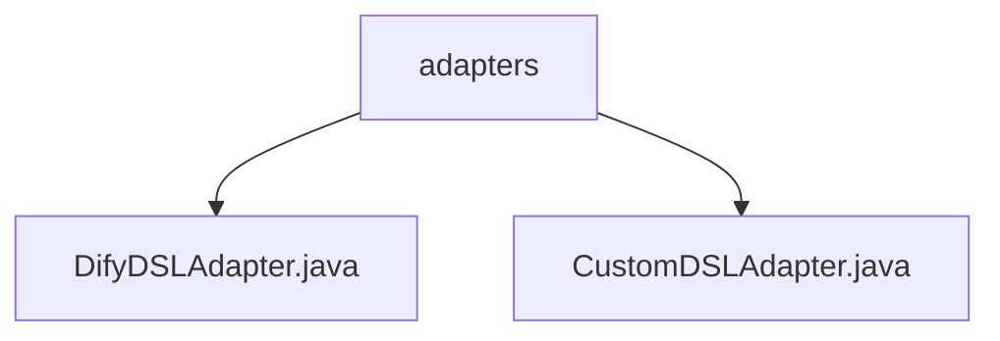

# 基础信息

|      |      |
|------|------|
| 名称 | adapters |
| 编码语言 | .java |
| 代码路径 | spring-ai-alibaba/spring-ai-alibaba-graph/spring-ai-alibaba-graph-studio/src/main/java/com/alibaba/cloud/ai/service/dsl/adapters |
| 包名 | spring-ai-alibaba.spring-ai-alibaba-graph.spring-ai-alibaba-graph-studio.src.main.java.com.alibaba.cloud.ai.service.dsl.adapters |
| 概述说明 | DifyDSLAdapter处理DSL数据转换，支持多模式与元数据映射。CustomDSLAdapter继承AbstractDSLAdapter，提供自定义DSL方言与高度可定制解决方案。 |

# 说明

## 概述
该代码模块主要包含两个核心类：`DifyDSLAdapter` 和 `CustomDSLAdapter`，它们都用于处理数据转换和映射操作，特别是在复杂数据处理场景中。`DifyDSLAdapter` 专门用于处理 Dify DSL 数据转换，支持多种模式和应用元数据的映射，确保数据在转换过程中保持其原始结构和含义。`CustomDSLAdapter` 继承自 `AbstractDSLAdapter`，主要负责元数据、工作流和图的映射与转换，支持自定义 DSL 方言，提供高度可定制的解决方案，增强了系统的扩展性和适应性。

## 主要业务场景
1. **Dify DSL 数据转换**：`DifyDSLAdapter` 用于处理 Dify DSL 数据，支持多种转换模式，确保数据在转换过程中能够准确反映其原始结构和含义。适用于需要处理复杂数据结构且对数据准确性要求较高的场景。
2. **自定义 DSL 方言处理**：`CustomDSLAdapter` 支持自定义 DSL 方言，能够灵活处理不同领域的特定需求，适用于需要高度定制化数据处理的场景，如工作流和图的数据映射与转换。
3. **元数据映射与转换**：两个类都支持元数据的映射与转换，确保在数据处理过程中能够保持数据的完整性和一致性，适用于需要处理元数据的复杂业务场景。

### 包内部结构视图

该流程图展示了`adapters`文件夹与其内部的两个文件`DifyDSLAdapter.java`和`CustomDSLAdapter.java`之间的层级关系。`adapters`作为父节点，包含两个子节点，分别对应两个Java文件，清晰地反映了文件在项目中的组织结构。

# 文件列表 File List

| 名称   | 类型  | 说明 |
|-------|------|-------------|
| [DifyDSLAdapter.java](DifyDSLAdapter.md) | file | DifyDSLAdapter类处理Dify DSL数据转换，支持多模式及元数据映射。 |
| [CustomDSLAdapter.java](CustomDSLAdapter.md) | file | CustomDSLAdapter继承AbstractDSLAdapter，实现元数据、工作流和图的映射转换，支持自定义DSL方言。 |

