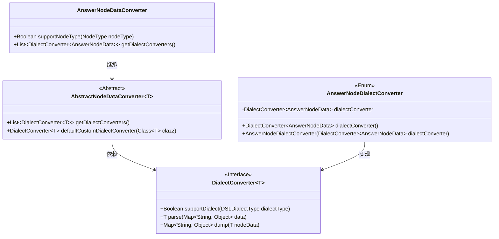
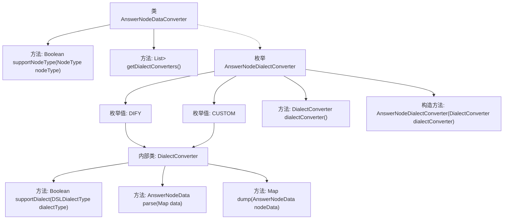

# 基础信息

|      |      |
|------|------|
| 名称 | AnswerNodeDataConverter |
| 编码语言 | .java |
| 代码路径 | spring-ai-alibaba/spring-ai-alibaba-graph/spring-ai-alibaba-graph-studio/src/main/java/com/alibaba/cloud/ai/service/dsl/nodes/AnswerNodeDataConverter.java |
| 包名 | com.alibaba.cloud.ai.service.dsl.nodes |
| 依赖项 | ['com.alibaba.cloud.ai.model.VariableSelector', 'com.alibaba.cloud.ai.model.workflow.NodeType', 'com.alibaba.cloud.ai.model.workflow.nodedata.AnswerNodeData', 'com.alibaba.cloud.ai.service.dsl.AbstractNodeDataConverter', 'com.alibaba.cloud.ai.service.dsl.DSLDialectType', 'com.alibaba.cloud.ai.utils.StringTemplateUtil', 'org.springframework.stereotype.Component', 'java.util', 'java.util.stream.Stream'] |
| 概述说明 | AnswerNodeDataConverter类转换AnswerNodeData，支持DIFY和CUSTOM方言解析存储。 |

# 说明

AnswerNodeDataConverter类主要用于处理AnswerNodeData的转换工作，支持解析和存储两种方言：DIFY和CUSTOM。该类的功能包括将AnswerNodeData从一种格式转换为另一种格式，以适应不同的应用场景和需求。通过支持这两种方言，AnswerNodeDataConverter能够灵活处理多种数据格式，确保数据的兼容性和一致性。

# 类列表 Class Summary

| 名称   | 类型  | 说明 |
|-------|------|-------------|
| AnswerNodeDataConverter | class | AnswerNodeDataConverter类用于转换AnswerNodeData，支持DIFY和CUSTOM方言的解析与存储。 |

## 类 AnswerNodeDataConverter

|      |      |
|------|------|
| 访问范围 | @Component;public |
| 类型 | class |
| 名称 | AnswerNodeDataConverter |
| 说明 | AnswerNodeDataConverter类用于转换AnswerNodeData，支持DIFY和CUSTOM方言的解析与存储。 |

### UML类图

这段代码定义了一个 `AnswerNodeDataConverter` 类，它继承自 `AbstractNodeDataConverter` 并实现了节点数据转换的功能。`AnswerNodeDataConverter` 类通过 `getDialectConverters` 方法获取不同方言的转换器，这些转换器由 `AnswerNodeDialectConverter` 枚举类提供。`AnswerNodeDialectConverter` 枚举类实现了 `DialectConverter` 接口，用于处理特定方言的节点数据解析和转储。整体设计通过抽象类和接口实现了灵活的扩展性和复用性。

### 内部方法调用关系图

这段代码定义了一个`AnswerNodeDataConverter`类，它继承自`AbstractNodeDataConverter`，并实现了两个主要方法：`supportNodeType`和`getDialectConverters`。`getDialectConverters`方法返回一个包含`DialectConverter`实例的列表，这些实例由枚举`AnswerNodeDialectConverter`提供。枚举`AnswerNodeDialectConverter`包含两个枚举值：`DIFY`和`CUSTOM`，每个枚举值都关联了一个`DialectConverter`实例，分别用于处理不同的方言类型。`DialectConverter`接口定义了`supportDialect`、`parse`和`dump`方法，用于支持特定方言的解析和转储操作。

### 字段列表 Field List

| 名称  | 类型  | 说明 |
|-------|-------|------|

### 方法列表 Method List

| 名称  | 类型  | 说明 |
|-------|-------|------|
| supportNodeType | Boolean | 方法检查节点类型是否为ANSWER并返回布尔值。 |
| getDialectConverters | List<DialectConverter<AnswerNodeData>> | 方法返回AnswerNodeDialectConverter枚举值的转换器列表。 |

