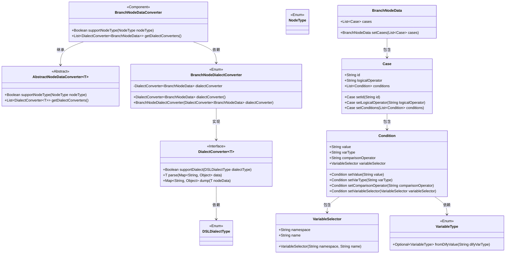
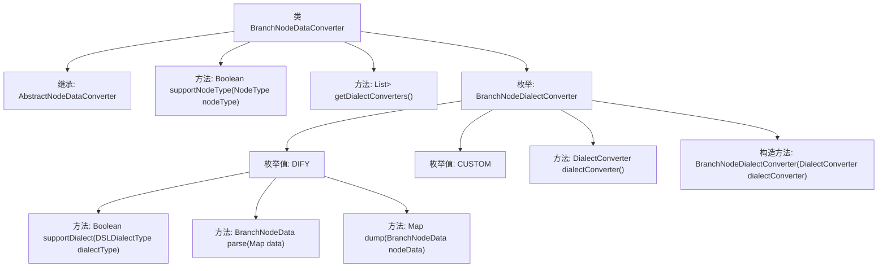

# 基础信息

|      |      |
|------|------|
| 名称 | BranchNodeDataConverter |
| 编码语言 | .java |
| 代码路径 | spring-ai-alibaba/spring-ai-alibaba-graph/spring-ai-alibaba-graph-studio/src/main/java/com/alibaba/cloud/ai/service/dsl/nodes/BranchNodeDataConverter.java |
| 包名 | com.alibaba.cloud.ai.service.dsl.nodes |
| 依赖项 | ['com.alibaba.cloud.ai.model.VariableSelector', 'com.alibaba.cloud.ai.model.VariableType', 'com.alibaba.cloud.ai.model.workflow.Case', 'com.alibaba.cloud.ai.model.workflow.NodeType', 'com.alibaba.cloud.ai.model.workflow.nodedata.BranchNodeData', 'com.alibaba.cloud.ai.service.dsl.AbstractNodeDataConverter', 'com.alibaba.cloud.ai.service.dsl.DSLDialectType', 'org.springframework.stereotype.Component', 'java.util', 'java.util.stream.Collectors', 'java.util.stream.Stream'] |
| 概述说明 | BranchNodeDataConverter类转换分支节点数据，支持特定类型及DIFY、CUSTOM方言。 |

# 说明

BranchNodeDataConverter类是一个用于转换分支节点数据的工具，它支持特定类型的节点，并提供了两种方言转换器，分别是DIFY和CUSTOM。该类的主要功能是将分支节点数据转换为不同的方言格式，以满足不同场景下的需求。通过这种方式，BranchNodeDataConverter类能够灵活处理各种分支节点数据，确保数据在不同系统或平台间的兼容性和一致性。

# 类列表 Class Summary

| 名称   | 类型  | 说明 |
|-------|------|-------------|
| BranchNodeDataConverter | class | BranchNodeDataConverter类用于转换分支节点数据，支持特定节点类型，并提供DIFY和CUSTOM两种方言转换器。 |

## 类 BranchNodeDataConverter

|      |      |
|------|------|
| 访问范围 | @Component;public |
| 类型 | class |
| 名称 | BranchNodeDataConverter |
| 说明 | BranchNodeDataConverter类用于转换分支节点数据，支持特定节点类型，并提供DIFY和CUSTOM两种方言转换器。 |

### UML类图

这段代码定义了一个`BranchNodeDataConverter`类，它继承自`AbstractNodeDataConverter`，用于处理特定类型的节点数据转换。`BranchNodeDialectConverter`枚举类实现了`DialectConverter`接口，提供了对不同方言（如DIFY和CUSTOM）的支持。代码通过解析和转储`BranchNodeData`对象，处理了包含`Case`和`Condition`的复杂数据结构。整个设计通过枚举和接口的组合，实现了灵活的数据转换逻辑。

### 内部方法调用关系图

这段代码定义了一个`BranchNodeDataConverter`类，继承自`AbstractNodeDataConverter<BranchNodeData>`。该类包含两个主要方法：`supportNodeType`用于判断支持的节点类型，`getDialectConverters`用于获取方言转换器列表。内部枚举`BranchNodeDialectConverter`定义了两个枚举值`DIFY`和`CUSTOM`，分别实现了不同的方言转换逻辑。`DIFY`枚举值包含了`supportDialect`、`parse`和`dump`方法，用于处理特定方言的解析和序列化操作。整个类的主要功能是将`BranchNodeData`对象转换为不同方言的格式，并支持特定节点类型的转换。

### 字段列表 Field List

| 名称  | 类型  | 说明 |
|-------|-------|------|

### 方法列表 Method List

| 名称  | 类型  | 说明 |
|-------|-------|------|
| getDialectConverters | List<DialectConverter<BranchNodeData>> | 重写方法返回BranchNodeDialectConverter转换器列表。 |
| supportNodeType | Boolean | 该方法检查节点类型是否为分支类型。 |

