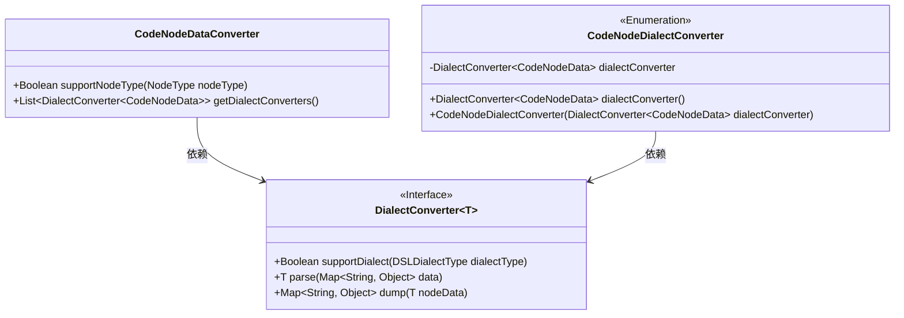
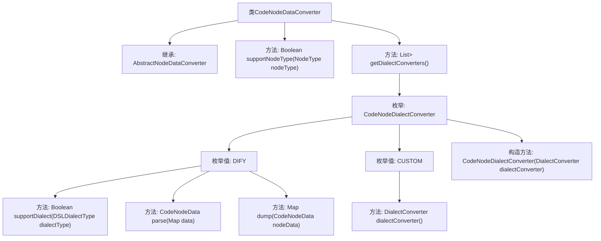

# 基础信息

|      |      |
|------|------|
| 名称 | CodeNodeDataConverter |
| 编码语言 | .java |
| 代码路径 | spring-ai-alibaba/spring-ai-alibaba-graph/spring-ai-alibaba-graph-studio/src/main/java/com/alibaba/cloud/ai/service/dsl/nodes/CodeNodeDataConverter.java |
| 包名 | com.alibaba.cloud.ai.service.dsl.nodes |
| 依赖项 | ['com.alibaba.cloud.ai.model.Variable', 'com.alibaba.cloud.ai.model.VariableSelector', 'com.alibaba.cloud.ai.model.VariableType', 'com.alibaba.cloud.ai.model.workflow.NodeType', 'com.alibaba.cloud.ai.model.workflow.nodedata.CodeNodeData', 'com.alibaba.cloud.ai.service.dsl.AbstractNodeDataConverter', 'com.alibaba.cloud.ai.service.dsl.DSLDialectType', 'org.springframework.stereotype.Component', 'java.util', 'java.util.stream.Stream'] |
| 概述说明 | CodeNodeDataConverter类支持DIFY和CUSTOM方言的CodeNodeData节点转换。 |

# 说明

CodeNodeDataConverter类专门用于处理CodeNodeData类型的节点，具备对DIFY和CUSTOM两种方言的转换支持。该类的核心功能是将CodeNodeData节点在不同方言之间进行转换，确保数据在不同上下文中的兼容性和一致性。通过支持多种方言，CodeNodeDataConverter类能够灵活应对不同场景下的数据处理需求，提升系统的适应性和扩展性。

# 类列表 Class Summary

| 名称   | 类型  | 说明 |
|-------|------|-------------|
| CodeNodeDataConverter | class | CodeNodeDataConverter类处理CodeNodeData类型节点，支持DIFY和CUSTOM方言转换。 |

## 类 CodeNodeDataConverter

|      |      |
|------|------|
| 访问范围 | @Component;public |
| 类型 | class |
| 名称 | CodeNodeDataConverter |
| 说明 | CodeNodeDataConverter类处理CodeNodeData类型节点，支持DIFY和CUSTOM方言转换。 |

### UML类图

这段代码定义了一个 `CodeNodeDataConverter` 类，它继承自 `AbstractNodeDataConverter`，并实现了对特定节点类型 `NodeType.CODE` 的支持。`CodeNodeDataConverter` 通过 `CodeNodeDialectConverter` 枚举类来管理不同方言的转换逻辑，`CodeNodeDialectConverter` 中包含了 `DialectConverter` 接口的实现，用于解析和转储 `CodeNodeData` 数据。整体结构展示了如何通过枚举和接口来实现多方言支持的数据转换。

### 内部方法调用关系图

这段代码定义了一个`CodeNodeDataConverter`类，继承自`AbstractNodeDataConverter`，并实现了`supportNodeType`和`getDialectConverters`方法。`getDialectConverters`方法返回一个包含`CodeNodeDialectConverter`枚举值的`DialectConverter`列表。`CodeNodeDialectConverter`枚举包含`DIFY`和`CUSTOM`两个值，分别实现了`supportDialect`、`parse`和`dump`方法，用于处理不同类型的数据转换。

### 字段列表 Field List

| 名称  | 类型  | 说明 |
|-------|-------|------|

### 方法列表 Method List

| 名称  | 类型  | 说明 |
|-------|-------|------|
| supportNodeType | Boolean | 该方法检查节点类型是否为CODE并返回布尔值。 |
| getDialectConverters | List<DialectConverter<CodeNodeData>> | 重写方法，返回CodeNodeDialectConverter枚举值的转换器列表。 |

