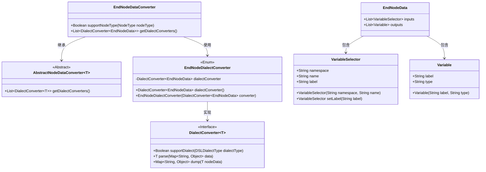
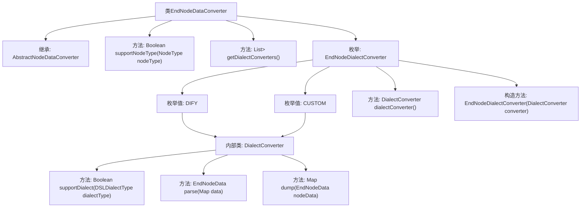

# 基础信息

|      |      |
|------|------|
| 名称 | EndNodeDataConverter |
| 编码语言 | .java |
| 代码路径 | spring-ai-alibaba/spring-ai-alibaba-graph/spring-ai-alibaba-graph-studio/src/main/java/com/alibaba/cloud/ai/service/dsl/nodes/EndNodeDataConverter.java |
| 包名 | com.alibaba.cloud.ai.service.dsl.nodes |
| 依赖项 | ['com.alibaba.cloud.ai.model.Variable', 'com.alibaba.cloud.ai.model.VariableSelector', 'com.alibaba.cloud.ai.model.VariableType', 'com.alibaba.cloud.ai.model.workflow.NodeType', 'com.alibaba.cloud.ai.model.workflow.nodedata.EndNodeData', 'com.alibaba.cloud.ai.service.dsl.AbstractNodeDataConverter', 'com.alibaba.cloud.ai.service.dsl.DSLDialectType', 'org.springframework.stereotype.Component', 'java.util.HashMap', 'java.util.List', 'java.util.Map', 'java.util.stream.Stream'] |
| 概述说明 | EndNodeDataConverter类实现END和DIFY节点数据转换。 |

# 说明

EndNodeDataConverter类设计用于节点数据的转换，主要支持两种数据类型：END类型和DIFY方言。该类的核心功能是将输入的节点数据转换为指定的格式，确保数据在不同系统或平台间的兼容性和一致性。通过实现这一转换功能，EndNodeDataConverter类在数据处理流程中起到了关键的桥梁作用，提升了系统的灵活性和可扩展性。

# 类列表 Class Summary

| 名称   | 类型  | 说明 |
|-------|------|-------------|
| EndNodeDataConverter | class | EndNodeDataConverter类实现节点数据转换，支持END类型和DIFY方言。 |

## 类 EndNodeDataConverter

|      |      |
|------|------|
| 访问范围 | @Component;public |
| 类型 | class |
| 名称 | EndNodeDataConverter |
| 说明 | EndNodeDataConverter类实现节点数据转换，支持END类型和DIFY方言。 |

### UML类图

**描述：**  
`EndNodeDataConverter` 是一个继承自 `AbstractNodeDataConverter` 的类，用于处理特定类型的节点数据转换。它通过 `EndNodeDialectConverter` 枚举类来获取不同方言的转换器，这些转换器实现了 `DialectConverter` 接口。`EndNodeData` 类包含了输入和输出的数据结构，其中输入是 `VariableSelector` 类型的列表，输出是 `Variable` 类型的列表。整体设计实现了对不同方言的支持，并提供了数据解析和序列化的功能。

### 内部方法调用关系图

该流程图展示了`EndNodeDataConverter`类的结构及其内部关系。`EndNodeDataConverter`继承自`AbstractNodeDataConverter<EndNodeData>`，并实现了`supportNodeType`和`getDialectConverters`方法。类内部包含一个枚举`EndNodeDialectConverter`，该枚举有两个值`DIFY`和`CUSTOM`，每个枚举值都包含一个`DialectConverter<EndNodeData>`实例，并实现了`supportDialect`、`parse`和`dump`方法。整体结构清晰地展示了类与枚举之间的依赖关系及其方法调用流程。

### 字段列表 Field List

| 名称  | 类型  | 说明 |
|-------|-------|------|

### 方法列表 Method List

| 名称  | 类型  | 说明 |
|-------|-------|------|
| supportNodeType | Boolean | 该方法检查节点类型是否为END并返回布尔值。 |
| getDialectConverters | List<DialectConverter<EndNodeData>> | 重写方法返回EndNodeDialectConverter转换器列表。 |

