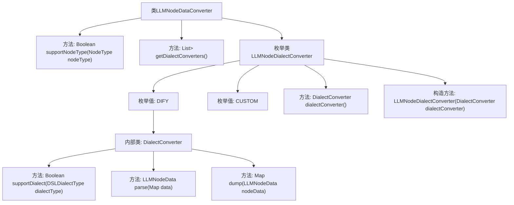

# 基础信息

|      |      |
|------|------|
| 名称 | LLMNodeDataConverter |
| 编码语言 | .java |
| 代码路径 | spring-ai-alibaba/spring-ai-alibaba-graph/spring-ai-alibaba-graph-studio/src/main/java/com/alibaba/cloud/ai/service/dsl/nodes/LLMNodeDataConverter.java |
| 包名 | com.alibaba.cloud.ai.service.dsl.nodes |
| 依赖项 | ['com.alibaba.cloud.ai.model.VariableSelector', 'com.alibaba.cloud.ai.model.workflow.NodeType', 'com.alibaba.cloud.ai.model.workflow.nodedata.LLMNodeData', 'com.alibaba.cloud.ai.service.dsl.AbstractNodeDataConverter', 'com.alibaba.cloud.ai.service.dsl.DSLDialectType', 'com.alibaba.cloud.ai.utils.StringTemplateUtil', 'com.fasterxml.jackson.annotation.JsonInclude', 'com.fasterxml.jackson.databind.DeserializationFeature', 'com.fasterxml.jackson.databind.ObjectMapper', 'com.fasterxml.jackson.databind.PropertyNamingStrategies', 'org.springframework.stereotype.Component', 'java.util.ArrayList', 'java.util.HashMap', 'java.util.List', 'java.util.Map', 'java.util.stream.Stream'] |
| 概述说明 | LLMNodeDataConverter类支持DIFY和CUSTOM方言，用于转换LLM节点数据。 |

# 说明

LLMNodeDataConverter类是一个用于转换LLM节点数据的工具，支持DIFY和CUSTOM两种方言。该类的功能主要是处理不同方言下的数据转换，确保数据在不同系统或平台间的兼容性和一致性。通过支持这两种方言，LLMNodeDataConverter能够灵活应对多种应用场景，提升数据处理效率。

# 类列表 Class Summary

| 名称   | 类型  | 说明 |
|-------|------|-------------|
| LLMNodeDataConverter | class | LLMNodeDataConverter类用于转换LLM节点数据，支持DIFY和CUSTOM两种方言。 |

## 类 LLMNodeDataConverter

|      |      |
|------|------|
| 访问范围 | @Component;public |
| 类型 | class |
| 名称 | LLMNodeDataConverter |
| 说明 | LLMNodeDataConverter类用于转换LLM节点数据，支持DIFY和CUSTOM两种方言。 |

### UML类图

```mermaid
classDiagram
    class LLMNodeDataConverter {
        <<Component>>
        +Boolean supportNodeType(NodeType nodeType)
        +List~DialectConverter~LLMNodeData~~ getDialectConverters()
    }
    class AbstractNodeDataConverter~T~ {
        <<Abstract>>
        +Boolean supportNodeType(NodeType nodeType)
        +List~DialectConverter~T~~ getDialectConverters()
    }
    class DialectConverter~T~ {
        <<Interface>>
        +Boolean supportDialect(DSLDialectType dialectType)
        +T parse(Map~String, Object~ data)
        +Map~String, Object~ dump(T nodeData)
    }
    class LLMNodeDialectConverter {
        <<Enum>>
        -DialectConverter~LLMNodeData~ dialectConverter
        +DialectConverter~LLMNodeData~ dialectConverter()
        +LLMNodeDialectConverter(DialectConverter~LLMNodeData~ dialectConverter)
    }
    class LLMNodeData {
        +ModelConfig model
        +List~PromptTemplate~ promptTemplate
        +MemoryConfig memoryConfig
        +LLMNodeData(List~VariableSelector~ inputs, List~OutputSchema~ outputSchemas)
        +ModelConfig getModel()
        +List~PromptTemplate~ getPromptTemplate()
        +MemoryConfig getMemoryConfig()
    }
    class ModelConfig {
        +String mode
        +String name
        +String provider
        +CompletionParams completionParams
        +ModelConfig setMode(String mode)
        +ModelConfig setName(String name)
        +ModelConfig setProvider(String provider)
        +ModelConfig setCompletionParams(CompletionParams completionParams)
    }
    class MemoryConfig {
        +Boolean enabled
        +Boolean windowEnabled
        +Integer windowSize
        +String lastMessageTemplate
        +Boolean includeLastMessage
        +MemoryConfig setEnabled(Boolean enabled)
        +MemoryConfig setWindowEnabled(Boolean windowEnabled)
        +MemoryConfig setWindowSize(Integer windowSize)
        +MemoryConfig setLastMessageTemplate(String lastMessageTemplate)
        +MemoryConfig setIncludeLastMessage(Boolean includeLastMessage)
    }
    class PromptTemplate {
        +String role
        +String text
        +PromptTemplate(String role, String text)
    }
    class VariableSelector {
        +String source
        +String key
        +VariableSelector(String source, String key)
    }
    class CompletionParams {
        +Map~String, Object~ params
        +CompletionParams setParams(Map~String, Object~ params)
    }
    class OutputSchema {
        +String schema
        +OutputSchema(String schema)
    }

    LLMNodeDataConverter --> AbstractNodeDataConverter~LLMNodeData~ : 继承
    LLMNodeDataConverter --> LLMNodeDialectConverter : 依赖
    LLMNodeDialectConverter --> DialectConverter~LLMNodeData~ : 实现
    LLMNodeData --> ModelConfig : 包含
    LLMNodeData --> MemoryConfig : 包含
    LLMNodeData --> PromptTemplate : 包含
    LLMNodeData --> VariableSelector : 包含
    LLMNodeData --> CompletionParams : 包含
    LLMNodeData --> OutputSchema : 包含
```

这段代码描述了一个名为 `LLMNodeDataConverter` 的组件，它继承自 `AbstractNodeDataConverter`，并实现了对 `LLMNodeData` 类型的节点数据进行转换的功能。`LLMNodeDataConverter` 通过 `LLMNodeDialectConverter` 枚举类来处理不同方言的转换逻辑。`LLMNodeData` 类包含了模型配置、提示模板、内存配置等多个子组件，这些子组件共同构成了一个完整的节点数据结构。

### 内部方法调用关系图

这段代码定义了一个名为`LLMNodeDataConverter`的类，该类继承自`AbstractNodeDataConverter`，并包含两个主要方法：`supportNodeType`和`getDialectConverters`。`getDialectConverters`方法返回一个包含`DialectConverter`实例的列表，这些实例由枚举类`LLMNodeDialectConverter`中的枚举值`DIFY`和`CUSTOM`提供。`DIFY`枚举值包含一个内部类`DialectConverter`，该类实现了`supportDialect`、`parse`和`dump`方法，用于处理特定方言的数据转换。整个类的设计用于支持不同类型和方言的节点数据转换。

### 字段列表 Field List

| 名称  | 类型  | 说明 |
|-------|-------|------|

### 方法列表 Method List

| 名称  | 类型  | 说明 |
|-------|-------|------|
| supportNodeType | Boolean | 该方法检查节点类型是否为LLM并返回布尔值。 |
| getDialectConverters | List<DialectConverter<LLMNodeData>> | 重写方法返回LLMNodeDialectConverter的转换器列表。 |

