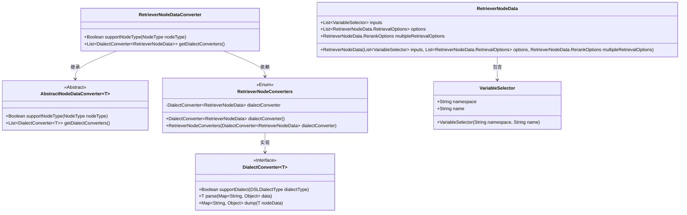
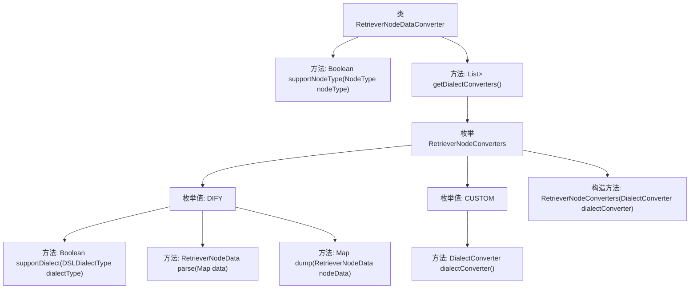

# 基础信息

|      |      |
|------|------|
| 名称 | RetrieverNodeDataConverter |
| 编码语言 | .java |
| 代码路径 | spring-ai-alibaba/spring-ai-alibaba-graph/spring-ai-alibaba-graph-studio/src/main/java/com/alibaba/cloud/ai/service/dsl/nodes/RetrieverNodeDataConverter.java |
| 包名 | com.alibaba.cloud.ai.service.dsl.nodes |
| 依赖项 | ['com.alibaba.cloud.ai.model.VariableSelector', 'com.alibaba.cloud.ai.model.workflow.NodeType', 'com.alibaba.cloud.ai.model.workflow.nodedata.RetrieverNodeData', 'com.alibaba.cloud.ai.service.dsl.AbstractNodeDataConverter', 'com.alibaba.cloud.ai.service.dsl.DSLDialectType', 'org.springframework.stereotype.Component', 'java.util.HashMap', 'java.util.List', 'java.util.Map', 'java.util.Optional', 'java.util.stream.Stream'] |
| 概述说明 | RetrieverNodeDataConverter类转换RetrieverNodeData，支持DIFY和CUSTOM方言。 |

# 说明

RetrieverNodeDataConverter类的主要功能是转换RetrieverNodeData，支持DIFY和CUSTOM两种方言类型。该类旨在处理不同方言类型的数据转换，确保数据在不同系统或平台间的兼容性和一致性。通过支持这两种方言，RetrieverNodeDataConverter能够灵活应对多种数据格式，提升数据处理效率。

# 类列表 Class Summary

| 名称   | 类型  | 说明 |
|-------|------|-------------|
| RetrieverNodeDataConverter | class | RetrieverNodeDataConverter类用于转换RetrieverNodeData，支持DIFY和CUSTOM两种方言类型。 |

## 类 RetrieverNodeDataConverter

|      |      |
|------|------|
| 访问范围 | @Component;public |
| 类型 | class |
| 名称 | RetrieverNodeDataConverter |
| 说明 | RetrieverNodeDataConverter类用于转换RetrieverNodeData，支持DIFY和CUSTOM两种方言类型。 |

### UML类图

这段代码定义了一个`RetrieverNodeDataConverter`类，继承自`AbstractNodeDataConverter`，用于处理`RetrieverNodeData`类型的数据转换。`RetrieverNodeConverters`枚举类实现了`DialectConverter`接口，提供了对不同方言（如DIFY和CUSTOM）的支持。`RetrieverNodeData`类包含了输入数据、检索选项和多重检索选项，并通过`VariableSelector`类管理输入变量。整体设计通过枚举和接口实现灵活的数据转换逻辑。

### 内部方法调用关系图

这段代码定义了一个名为`RetrieverNodeDataConverter`的类，该类继承自`AbstractNodeDataConverter`，并实现了两个方法：`supportNodeType`和`getDialectConverters`。`getDialectConverters`方法返回一个包含`RetrieverNodeConverters`枚举值的流，并将其映射为`DialectConverter`列表。`RetrieverNodeConverters`枚举包含两个值：`DIFY`和`CUSTOM`，每个值都包含一个`DialectConverter`实例。`DIFY`枚举值实现了`supportDialect`、`parse`和`dump`方法，用于支持特定的方言类型、解析数据和转储数据。`CUSTOM`枚举值则使用了默认的`DialectConverter`实现。

### 字段列表 Field List

| 名称  | 类型  | 说明 |
|-------|-------|------|

### 方法列表 Method List

| 名称  | 类型  | 说明 |
|-------|-------|------|
| supportNodeType | Boolean | 该方法检查节点类型是否为RETRIEVER并返回布尔值。 |
| getDialectConverters | List<DialectConverter<RetrieverNodeData>> | 重写方法，返回RetrieverNodeConverters的方言转换器列表。 |

