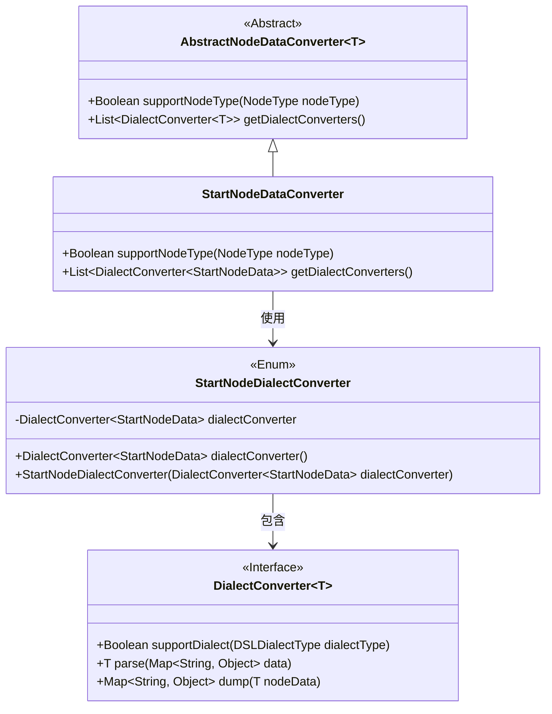
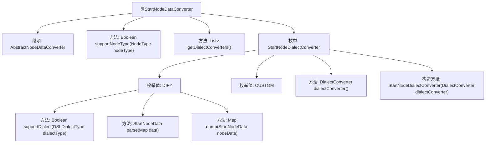

# 基础信息

|      |      |
|------|------|
| 名称 | StartNodeDataConverter |
| 编码语言 | .java |
| 代码路径 | spring-ai-alibaba/spring-ai-alibaba-graph/spring-ai-alibaba-graph-studio/src/main/java/com/alibaba/cloud/ai/service/dsl/nodes/StartNodeDataConverter.java |
| 包名 | com.alibaba.cloud.ai.service.dsl.nodes |
| 依赖项 | ['com.alibaba.cloud.ai.model.Variable', 'com.alibaba.cloud.ai.model.VariableSelector', 'com.alibaba.cloud.ai.model.VariableType', 'com.alibaba.cloud.ai.model.workflow.NodeType', 'com.alibaba.cloud.ai.model.workflow.nodedata.StartNodeData', 'com.alibaba.cloud.ai.service.dsl.AbstractNodeDataConverter', 'com.alibaba.cloud.ai.service.dsl.DSLDialectType', 'com.fasterxml.jackson.databind.DeserializationFeature', 'com.fasterxml.jackson.databind.ObjectMapper', 'com.fasterxml.jackson.databind.PropertyNamingStrategies', 'org.springframework.stereotype.Component', 'java.util', 'java.util.stream.Stream'] |
| 概述说明 | StartNodeDataConverter类转换起始节点数据，支持DIFY和CUSTOM方言，实现解析与转储。 |

# 说明

StartNodeDataConverter类是一个用于处理起始节点数据的工具，支持DIFY和CUSTOM两种方言。该类的核心功能是实现数据的解析与转储，确保不同方言下的数据能够被正确转换和处理。通过这一功能，StartNodeDataConverter类能够在多种应用场景中灵活应对不同的数据格式需求，提升数据处理的效率和准确性。

# 类列表 Class Summary

| 名称   | 类型  | 说明 |
|-------|------|-------------|
| StartNodeDataConverter | class | StartNodeDataConverter类用于转换起始节点数据，支持DIFY和CUSTOM方言，实现数据解析与转储。 |

## 类 StartNodeDataConverter

|      |      |
|------|------|
| 访问范围 | @Component;public |
| 类型 | class |
| 名称 | StartNodeDataConverter |
| 说明 | StartNodeDataConverter类用于转换起始节点数据，支持DIFY和CUSTOM方言，实现数据解析与转储。 |

### UML类图

这段代码定义了一个 `StartNodeDataConverter` 类，它继承自 `AbstractNodeDataConverter`，用于处理特定类型的节点数据转换。`StartNodeDialectConverter` 是一个枚举类，包含两种不同的方言转换器（`DIFY` 和 `CUSTOM`），这些转换器实现了 `DialectConverter` 接口，用于解析和转储节点数据。`StartNodeDataConverter` 通过 `getDialectConverters` 方法获取这些转换器，并在 `supportNodeType` 方法中判断是否支持特定类型的节点。整个设计通过抽象类和接口实现了灵活的扩展性。

### 内部方法调用关系图

这段代码定义了一个`StartNodeDataConverter`类，该类继承自`AbstractNodeDataConverter<StartNodeData>`，并实现了`supportNodeType`和`getDialectConverters`方法。该类还包含一个枚举`StartNodeDialectConverter`，该枚举定义了两个枚举值`DIFY`和`CUSTOM`，并分别实现了`supportDialect`、`parse`和`dump`方法。`parse`方法用于将输入数据解析为`StartNodeData`对象，而`dump`方法则将`StartNodeData`对象转换为Map格式的数据。整体流程展示了类与枚举之间的调用关系及其功能实现。

### 字段列表 Field List

| 名称  | 类型  | 说明 |
|-------|-------|------|

### 方法列表 Method List

| 名称  | 类型  | 说明 |
|-------|-------|------|
| supportNodeType | Boolean | 该方法检查节点类型是否为START，是则返回true。 |
| getDialectConverters | List<DialectConverter<StartNodeData>> | 重写方法返回StartNodeDialectConverter枚举值的转换器列表。 |

