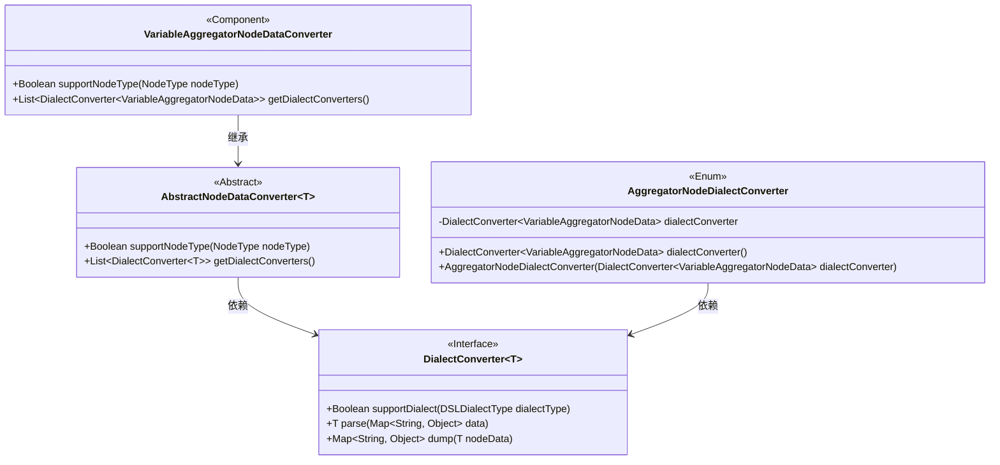
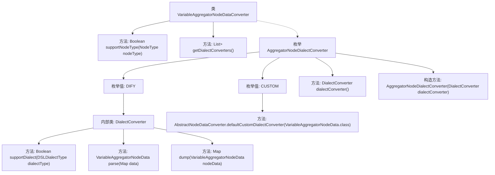

# 基础信息

|      |      |
|------|------|
| 名称 | VariableAggregatorNodeDataConverter |
| 编码语言 | .java |
| 代码路径 | spring-ai-alibaba/spring-ai-alibaba-graph/spring-ai-alibaba-graph-studio/src/main/java/com/alibaba/cloud/ai/service/dsl/nodes/VariableAggregatorNodeDataConverter.java |
| 包名 | com.alibaba.cloud.ai.service.dsl.nodes |
| 依赖项 | ['com.alibaba.cloud.ai.model.workflow.NodeType', 'com.alibaba.cloud.ai.model.workflow.nodedata.AnswerNodeData', 'com.alibaba.cloud.ai.model.workflow.nodedata.VariableAggregatorNodeData', 'com.alibaba.cloud.ai.service.dsl.AbstractNodeDataConverter', 'com.alibaba.cloud.ai.service.dsl.DSLDialectType', 'com.alibaba.cloud.ai.service.dsl.NodeDataConverter', 'com.fasterxml.jackson.core.JsonProcessingException', 'com.fasterxml.jackson.core.type.TypeReference', 'com.fasterxml.jackson.databind.ObjectMapper', 'lombok.SneakyThrows', 'org.springframework.stereotype.Component', 'org.springframework.util.ReflectionUtils', 'java.lang.reflect.Field', 'java.util.ArrayList', 'java.util.HashMap', 'java.util.List', 'java.util.Map', 'java.util.stream.Stream'] |
| 概述说明 | VariableAggregatorNodeDataConverter类转换聚合节点数据，支持DIFY方言，处理变量和高级设置。 |

# 说明

VariableAggregatorNodeDataConverter类主要用于转换聚合节点数据，特别支持DIFY方言。该类能够处理变量相关操作，并支持高级设置功能，确保数据转换的灵活性和高效性。

# 类列表 Class Summary

| 名称   | 类型  | 说明 |
|-------|------|-------------|
| VariableAggregatorNodeDataConverter | class | VariableAggregatorNodeDataConverter类用于转换聚合节点数据，支持DIFY方言，处理变量和高级设置。 |

## 类 VariableAggregatorNodeDataConverter

|      |      |
|------|------|
| 访问范围 | @Component;public |
| 类型 | class |
| 名称 | VariableAggregatorNodeDataConverter |
| 说明 | VariableAggregatorNodeDataConverter类用于转换聚合节点数据，支持DIFY方言，处理变量和高级设置。 |

### UML类图

该代码展示了一个`VariableAggregatorNodeDataConverter`类，它继承自`AbstractNodeDataConverter`，并实现了对`VariableAggregatorNodeData`类型的数据转换。`AggregatorNodeDialectConverter`枚举类包含两种方言转换器（DIFY和CUSTOM），它们实现了`DialectConverter`接口，用于处理不同方言下的数据解析和转储。`VariableAggregatorNodeDataConverter`通过`getDialectConverters`方法获取这些转换器，并根据节点类型支持相应的转换操作。

### 内部方法调用关系图

这段代码展示了一个名为 `VariableAggregatorNodeDataConverter` 的类，该类继承自 `AbstractNodeDataConverter`，并实现了两个关键方法：`supportNodeType` 和 `getDialectConverters`。`getDialectConverters` 方法返回一个包含不同方言转换器的列表，这些转换器由 `AggregatorNodeDialectConverter` 枚举提供。枚举中定义了两个值 `DIFY` 和 `CUSTOM`，分别对应不同的方言转换逻辑。`DIFY` 的转换器实现了 `supportDialect`、`parse` 和 `dump` 方法，用于处理特定方言的数据解析和生成。`CUSTOM` 则使用了默认的转换器。整体结构展示了如何通过枚举和内部类来实现多方言支持的数据转换。

### 字段列表 Field List

| 名称  | 类型  | 说明 |
|-------|-------|------|

### 方法列表 Method List

| 名称  | 类型  | 说明 |
|-------|-------|------|
| supportNodeType | Boolean | 该方法检查节点类型是否为AGGREGATOR并返回布尔值。 |
| getDialectConverters | List<DialectConverter<VariableAggregatorNodeData>> | 重写方法返回方言转换器列表。 |

