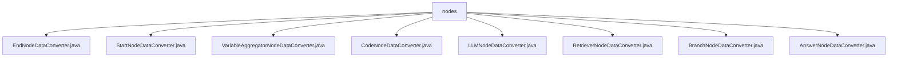

# 基础信息

|      |      |
|------|------|
| 名称 | nodes |
| 编码语言 | .java |
| 代码路径 | spring-ai-alibaba/spring-ai-alibaba-graph/spring-ai-alibaba-graph-studio/src/main/java/com/alibaba/cloud/ai/service/dsl/nodes |
| 包名 | spring-ai-alibaba.spring-ai-alibaba-graph.spring-ai-alibaba-graph-studio.src.main.java.com.alibaba.cloud.ai.service.dsl.nodes |
| 概述说明 | 多个数据转换类支持DIFY和CUSTOM方言，确保数据兼容性和一致性。 |

# 说明

## 概述
该代码模块主要包含多个数据转换器类，这些类用于处理不同类型节点数据的转换，确保数据在不同系统或平台间的兼容性和一致性。每个转换器类都支持特定的节点数据类型，并且通常支持多种方言（如DIFY和CUSTOM），以便在不同应用场景中灵活应对数据格式的需求。通过实现这些转换功能，模块在数据处理流程中起到了关键的桥梁作用，提升了系统的灵活性、可扩展性和数据处理效率。

## 主要业务场景
1. **节点数据转换**：模块中的各个转换器类（如`EndNodeDataConverter`、`StartNodeDataConverter`、`VariableAggregatorNodeDataConverter`等）主要用于将特定类型的节点数据从一种格式转换为另一种格式，确保数据在不同系统或平台间的兼容性。
2. **多方言支持**：大多数转换器类支持多种方言（如DIFY和CUSTOM），能够处理不同方言下的数据转换，适应多种应用场景的需求。
3. **数据处理流程优化**：通过提供高效的数据转换功能，模块能够优化数据处理流程，提升数据处理的效率和准确性。
4. **系统集成与扩展**：模块中的转换器类作为数据处理流程中的关键组件，能够灵活应对不同数据格式的需求，提升系统的适应性和扩展性，便于与其他系统或平台进行集成。

### 包内部结构视图

该流程图展示了`nodes`文件夹下的多个文件，包括`EndNodeDataConverter.java`、`StartNodeDataConverter.java`、`VariableAggregatorNodeDataConverter.java`、`CodeNodeDataConverter.java`、`LLMNodeDataConverter.java`、`RetrieverNodeDataConverter.java`、`BranchNodeDataConverter.java`和`AnswerNodeDataConverter.java`。这些文件都位于同一层级，直接隶属于`nodes`文件夹，反映了它们在同一目录下的并列关系。

# 文件列表 File List

| 名称   | 类型  | 说明 |
|-------|------|-------------|
| [AnswerNodeDataConverter.java](AnswerNodeDataConverter.md) | file | AnswerNodeDataConverter类转换AnswerNodeData，支持DIFY和CUSTOM方言解析存储。 |
| [LLMNodeDataConverter.java](LLMNodeDataConverter.md) | file | LLMNodeDataConverter类支持DIFY和CUSTOM方言，用于转换LLM节点数据。 |
| [VariableAggregatorNodeDataConverter.java](VariableAggregatorNodeDataConverter.md) | file | VariableAggregatorNodeDataConverter类转换聚合节点数据，支持DIFY方言，处理变量和高级设置。 |
| [BranchNodeDataConverter.java](BranchNodeDataConverter.md) | file | BranchNodeDataConverter类转换分支节点数据，支持特定类型及DIFY、CUSTOM方言。 |
| [RetrieverNodeDataConverter.java](RetrieverNodeDataConverter.md) | file | RetrieverNodeDataConverter类转换RetrieverNodeData，支持DIFY和CUSTOM方言。 |
| [CodeNodeDataConverter.java](CodeNodeDataConverter.md) | file | CodeNodeDataConverter类支持DIFY和CUSTOM方言的CodeNodeData节点转换。 |
| [StartNodeDataConverter.java](StartNodeDataConverter.md) | file | StartNodeDataConverter类转换起始节点数据，支持DIFY和CUSTOM方言，实现解析与转储。 |
| [EndNodeDataConverter.java](EndNodeDataConverter.md) | file | EndNodeDataConverter类实现END和DIFY节点数据转换。 |

