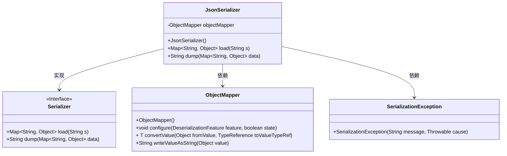
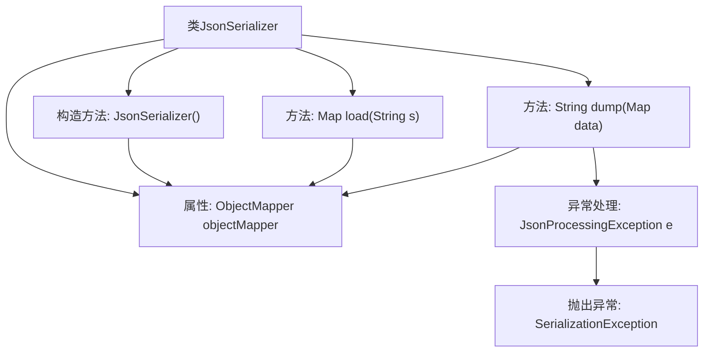

# 基础信息

|      |      |
|------|------|
| 名称 | JsonSerializer |
| 编码语言 | .java |
| 代码路径 | spring-ai-alibaba/spring-ai-alibaba-graph/spring-ai-alibaba-graph-studio/src/main/java/com/alibaba/cloud/ai/service/dsl/serialize/JsonSerializer.java |
| 包名 | com.alibaba.cloud.ai.service.dsl.serialize |
| 依赖项 | ['com.alibaba.cloud.ai.exception.SerializationException', 'com.alibaba.cloud.ai.service.dsl.Serializer', 'com.fasterxml.jackson.core.JsonProcessingException', 'com.fasterxml.jackson.core.type.TypeReference', 'com.fasterxml.jackson.databind.DeserializationFeature', 'com.fasterxml.jackson.databind.ObjectMapper', 'org.springframework.stereotype.Component', 'java.util.Map'] |
| 概述说明 | JsonSerializer类实现Serializer接口，支持JSON数据加载与转储。 |

# 说明

JsonSerializer类实现了Serializer接口，具备JSON数据的加载与转储功能。该类能够将数据结构转换为JSON格式并保存，同时也能将JSON格式的数据加载并还原为相应的数据结构。通过实现Serializer接口，JsonSerializer类确保了与其他序列化工具的兼容性，提供了统一的接口用于数据的序列化与反序列化操作。这使得在处理JSON数据时，能够更加灵活和高效地进行数据交换与存储。

# 类列表 Class Summary

| 名称   | 类型  | 说明 |
|-------|------|-------------|
| JsonSerializer | class | JsonSerializer类实现Serializer接口，支持JSON数据加载与转储。 |

## 类 JsonSerializer

|      |      |
|------|------|
| 访问范围 | @Component("json");public |
| 类型 | class |
| 名称 | JsonSerializer |
| 说明 | JsonSerializer类实现Serializer接口，支持JSON数据加载与转储。 |

### UML类图

这段代码定义了一个 `JsonSerializer` 类，该类实现了 `Serializer` 接口，用于将 `Map<String, Object>` 类型的数据序列化为 JSON 字符串，以及将 JSON 字符串反序列化为 `Map<String, Object>` 类型。`JsonSerializer` 类依赖于 `ObjectMapper` 类来进行实际的序列化和反序列化操作，并在序列化失败时抛出 `SerializationException` 异常。

### 内部方法调用关系图

这段代码定义了一个名为`JsonSerializer`的类，该类实现了`Serializer`接口。类中包含一个`ObjectMapper`对象，用于处理JSON数据的序列化和反序列化。构造函数初始化了`ObjectMapper`对象，并配置了忽略未知属性的选项。`load`方法将字符串转换为`Map<String, Object>`，而`dump`方法将`Map<String, Object>`转换为JSON字符串，并在处理过程中捕获并抛出可能的`JsonProcessingException`异常。

### 字段列表 Field List

| 名称  | 类型  | 说明 |
|-------|-------|------|
| objectMapper | ObjectMapper | 声明一个私有ObjectMapper对象。 |

### 方法列表 Method List

| 名称  | 类型  | 说明 |
|-------|-------|------|
| load | Map<String, Object> | 重写load方法，将字符串转换为Map对象。 |
| dump | String | 方法将Map数据转换为JSON字符串，失败时抛出异常。 |

