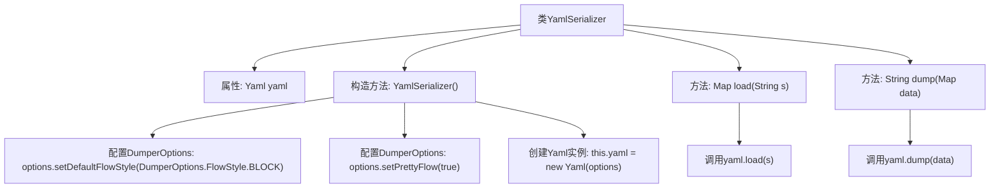

# 基础信息

|      |      |
|------|------|
| 名称 | YamlSerializer |
| 编码语言 | .java |
| 代码路径 | spring-ai-alibaba/spring-ai-alibaba-graph/spring-ai-alibaba-graph-studio/src/main/java/com/alibaba/cloud/ai/service/dsl/serialize/YamlSerializer.java |
| 包名 | com.alibaba.cloud.ai.service.dsl.serialize |
| 依赖项 | ['com.alibaba.cloud.ai.service.dsl.Serializer', 'org.springframework.stereotype.Component', 'org.yaml.snakeyaml.DumperOptions', 'org.yaml.snakeyaml.Yaml', 'java.util.Map'] |
| 概述说明 | YamlSerializer类通过YAML库实现数据的序列化和反序列化。 |

# 说明

YamlSerializer类实现了Serializer接口，利用YAML库来完成数据的序列化和反序列化操作。序列化是将对象转换为YAML格式的字符串，而反序列化则是将YAML格式的字符串还原为对象。该类的核心功能是通过YAML库实现数据的格式转换，确保数据在不同系统或平台间能够高效传输和存储。

# 类列表 Class Summary

| 名称   | 类型  | 说明 |
|-------|------|-------------|
| YamlSerializer | class | YamlSerializer类实现Serializer接口，使用YAML库进行数据序列化和反序列化。 |


## 类 YamlSerializer

|      |      |
|------|------|
| 访问范围 | @Component("yaml");public |
| 类型 | class |
| 名称 | YamlSerializer |
| 说明 | YamlSerializer类实现Serializer接口，使用YAML库进行数据序列化和反序列化。 |


### UML类图

```mermaid
classDiagram
    class YamlSerializer {
        -Yaml yaml
        +YamlSerializer()
        +Map~String, Object~ load(String s)
        +String dump(Map~String, Object~ data)
    }
    <<Interface>> Serializer {
        +Map~String, Object~ load(String s)
        +String dump(Map~String, Object~ data)
    }
    YamlSerializer ..|> Serializer : 实现
```

**描述：**  
`YamlSerializer` 类实现了 `Serializer` 接口，用于将数据序列化为 YAML 格式或从 YAML 格式反序列化数据。该类包含一个私有成员 `yaml`，用于存储 YAML 解析器的实例。构造函数 `YamlSerializer` 初始化 `yaml` 并配置其选项，确保输出格式为块样式且美观。`load` 方法从字符串中加载数据并返回 `Map`，而 `dump` 方法将 `Map` 数据序列化为 YAML 字符串。


### 内部方法调用关系图



该流程图描述了`YamlSerializer`类的结构和主要方法。类中包含一个`Yaml`类型的属性`yaml`，构造方法`YamlSerializer()`用于配置`DumperOptions`并初始化`yaml`实例。类中实现了`load`和`dump`两个方法，分别用于加载和转储YAML数据。`load`方法调用`yaml.load(s)`，而`dump`方法调用`yaml.dump(data)`。

### 字段列表 Field List

| 名称  | 类型  | 说明 |
|-------|-------|------|
| yaml | Yaml | 定义了一个私有且不可变的Yaml类型变量yaml。 |

### 方法列表 Method List

| 名称  | 类型  | 说明 |
|-------|-------|------|
| load | Map<String, Object> | 重写load方法，调用yaml.load解析字符串。 |
| dump | String | 重写dump方法，使用yaml格式输出Map数据。 |


