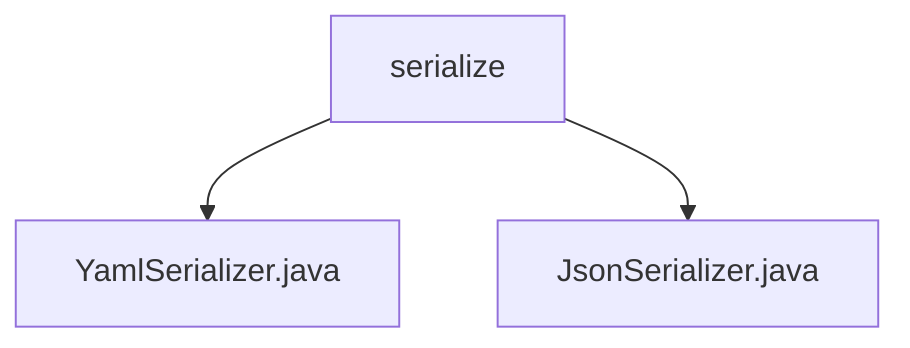

# 基础信息

|      |      |
|------|------|
| 名称 | serialize |
| 编码语言 | .java |
| 代码路径 | spring-ai-alibaba/spring-ai-alibaba-graph/spring-ai-alibaba-graph-studio/src/main/java/com/alibaba/cloud/ai/service/dsl/serialize |
| 包名 | spring-ai-alibaba.spring-ai-alibaba-graph.spring-ai-alibaba-graph-studio.src.main.java.com.alibaba.cloud.ai.service.dsl.serialize |
| 概述说明 | YamlSerializer和JsonSerializer类分别实现Serializer接口，支持YAML和JSON数据的序列化与反序列化。 |

# 说明

## 概述
该代码模块主要包含两个实现了`Serializer`接口的序列化类：`YamlSerializer`和`JsonSerializer`。这两个类分别负责处理YAML和JSON格式的数据序列化与反序列化操作。通过统一的`Serializer`接口，模块提供了对多种数据格式的支持，确保了数据在不同系统或平台间的高效传输和存储。

## 主要业务场景
1. **数据格式转换**：`YamlSerializer`和`JsonSerializer`类分别将对象转换为YAML和JSON格式的字符串，以及将这两种格式的字符串还原为对象。这种转换功能在数据交换和存储中至关重要。
2. **跨平台数据交换**：通过实现`Serializer`接口，这两个类确保了与其他序列化工具的兼容性，使得数据可以在不同平台和系统之间无缝传输。
3. **灵活的数据处理**：在处理JSON和YAML数据时，`JsonSerializer`和`YamlSerializer`类提供了统一的接口，使得开发者能够更加灵活和高效地进行数据交换与存储操作。

### 包内部结构视图

该流程图展示了路径的层级关系，`serialize` 文件夹下包含两个文件：`YamlSerializer.java` 和 `JsonSerializer.java`。这两个文件位于相同的目录层级，且都属于 `serialize` 文件夹的直接子节点。

# 文件列表 File List

| 名称   | 类型  | 说明 |
|-------|------|-------------|
| [JsonSerializer.java](JsonSerializer.md) | file | JsonSerializer类实现Serializer接口，支持JSON数据加载与转储。 |
| [YamlSerializer.java](YamlSerializer.md) | file | YamlSerializer类通过YAML库实现数据的序列化和反序列化。 |

