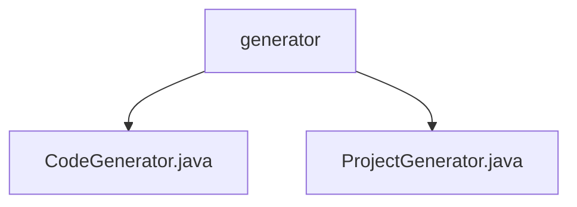

# 基础信息

|      |      |
|------|------|
| 名称 | generator |
| 编码语言 | .java |
| 代码路径 | spring-ai-alibaba/spring-ai-alibaba-graph/spring-ai-alibaba-graph-studio/src/main/java/com/alibaba/cloud/ai/service/generator |
| 包名 | spring-ai-alibaba.spring-ai-alibaba-graph.spring-ai-alibaba-graph-studio.src.main.java.com.alibaba.cloud.ai.service.generator |
| 概述说明 | 内容为空，无法总结。请提供具体信息。 |

# 说明

## 概述
由于提供的描述内容为空，且未包含任何具体信息或细节，因此无法对该代码模块进行有效的总结。描述中提到的文件路径包括 `CodeGenerator.java` 和 `ProjectGenerator.java`，但缺乏对这些文件功能、用途或实现的具体说明。

## 主要业务场景
由于缺乏具体信息，无法确定该代码模块的主要业务场景。通常，`CodeGenerator.java` 和 `ProjectGenerator.java` 可能涉及代码生成或项目生成的相关功能，但需要更多细节来明确其具体应用场景。

请提供更多具体内容以便生成准确的总结描述。

### 包内部结构视图

该流程图展示了在`generator`文件夹下的两个Java文件：`CodeGenerator.java`和`ProjectGenerator.java`。这两个文件位于`spring-ai-alibaba-graph-studio`项目的`generator`目录中，分别用于代码生成和项目生成的逻辑实现。

# 文件列表 File List

| 名称   | 类型  | 说明 |
|-------|------|-------------|
| [ProjectGenerator.java](ProjectGenerator.md) | file | 信息缺失，无法生成概要描述。 |
| [CodeGenerator.java](CodeGenerator.md) | file | 输入为空，无法生成概要描述。 |

