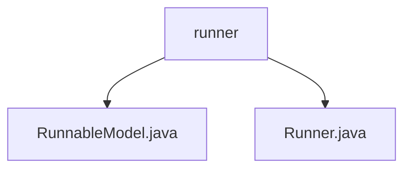

# 基础信息

|      |      |
|------|------|
| 名称 | runner |
| 编码语言 | .java |
| 代码路径 | spring-ai-alibaba/spring-ai-alibaba-graph/spring-ai-alibaba-graph-studio/src/main/java/com/alibaba/cloud/ai/service/runner |
| 包名 | spring-ai-alibaba.spring-ai-alibaba-graph.spring-ai-alibaba-graph-studio.src.main.java.com.alibaba.cloud.ai.service.runner |
| 概述说明 | 输入内容为空，无法生成总结描述。 |

# 说明

## 概述
由于提供的文本内容为空，无法生成具体的总结描述。请提供具体的内容以便进行详细总结。

## 主要业务场景
由于提供的文本内容为空，无法生成具体的总结描述。请提供具体的内容以便进行详细总结。

### 包内部结构视图

该流程图展示了`spring-ai-alibaba-graph-studio`项目中`runner`目录下的文件层级关系。`runner`目录包含两个文件：`RunnableModel.java`和`Runner.java`。这两个文件直接位于`runner`目录下，没有进一步的子目录结构。

# 文件列表 File List

| 名称   | 类型  | 说明 |
|-------|------|-------------|
| [Runner.java](Runner.md) | file | 输入内容为空，无法生成概要描述。 |
| [RunnableModel.java](RunnableModel.md) | file | 输入内容为空，请提供具体信息以便生成概要描述。 |

