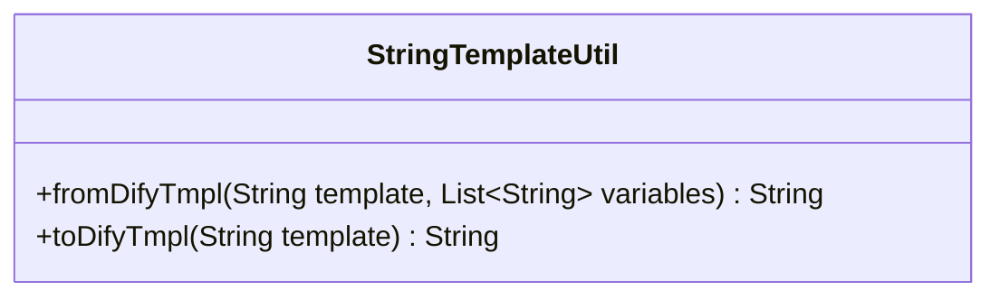
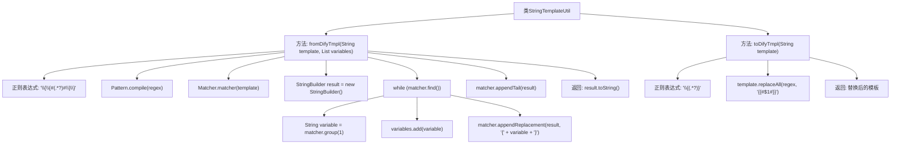

# 基础信息

|      |      |
|------|------|
| 名称 | StringTemplateUtil |
| 编码语言 | .java |
| 代码路径 | spring-ai-alibaba/spring-ai-alibaba-graph/spring-ai-alibaba-graph-studio/src/main/java/com/alibaba/cloud/ai/utils/StringTemplateUtil.java |
| 包名 | com.alibaba.cloud.ai.utils |
| 依赖项 | ['java.util.List', 'java.util.regex.Matcher', 'java.util.regex.Pattern'] |
| 概述说明 | StringTemplateUtil类实现Dify与Spring-AI模板互转。 |

# 说明

StringTemplateUtil类的主要功能是实现Dify与Spring-AI模板之间的相互转换。该类通过特定的逻辑和方法，确保两种不同模板格式能够无缝对接，从而提升系统的兼容性和灵活性。这一转换过程涉及模板结构的解析、格式的适配以及数据的映射，确保转换后的模板在各自系统中能够正常使用。该类的实现为跨平台模板处理提供了便利，简化了开发者在不同框架间切换的工作量。

# 类列表 Class Summary

| 名称   | 类型  | 说明 |
|-------|------|-------------|
| StringTemplateUtil | class | StringTemplateUtil类实现Dify与Spring-AI模板互转。 |

## 类 StringTemplateUtil

|      |      |
|------|------|
| 访问范围 | public |
| 类型 | class |
| 名称 | StringTemplateUtil |
| 说明 | StringTemplateUtil类实现Dify与Spring-AI模板互转。 |

### UML类图

**描述：**  
`StringTemplateUtil` 类提供了两个静态方法，用于在两种不同的字符串模板格式之间进行转换。`fromDifyTmpl` 方法将 Dify 格式的模板转换为 Spring-AI 格式的模板，并提取模板中的变量。`toDifyTmpl` 方法则将 Spring-AI 格式的模板转换回 Dify 格式的模板。这两个方法通过正则表达式匹配和替换来实现模板格式的转换，适用于需要处理不同模板格式的场景。

### 内部方法调用关系图

这段代码定义了一个`StringTemplateUtil`类，包含两个主要方法：`fromDifyTmpl`和`toDifyTmpl`。`fromDifyTmpl`方法将Dify模板转换为Spring-AI模板，通过正则表达式匹配并替换变量格式，同时将变量添加到列表中。`toDifyTmpl`方法则将Spring-AI模板转换回Dify模板，通过正则表达式匹配并替换变量格式。这两个方法都涉及到正则表达式的编译、匹配和替换操作，最终返回转换后的模板字符串。

### 字段列表 Field List

| 名称  | 类型  | 说明 |
|-------|-------|------|

### 方法列表 Method List

| 名称  | 类型  | 说明 |
|-------|-------|------|
| toDifyTmpl | String | 将模板中的“{变量}”替换为“{{#变量#}}”。 |
| fromDifyTmpl | String | 该方法将模板中的占位符替换为变量，并返回结果字符串。 |

