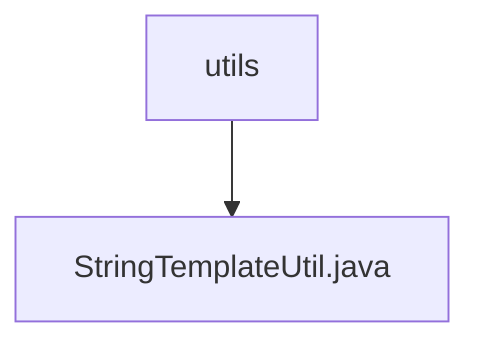

# 基础信息

|      |      |
|------|------|
| 名称 | utils |
| 编码语言 | .java |
| 代码路径 | spring-ai-alibaba/spring-ai-alibaba-graph/spring-ai-alibaba-graph-studio/src/main/java/com/alibaba/cloud/ai/utils |
| 包名 | spring-ai-alibaba.spring-ai-alibaba-graph.spring-ai-alibaba-graph-studio.src.main.java.com.alibaba.cloud.ai.utils |
| 概述说明 | StringTemplateUtil类实现Dify与Spring-AI模板互转。 |

# 说明

StringTemplateUtil类的主要功能是实现Dify与Spring-AI模板之间的相互转换。该类通过特定的逻辑和方法，确保两种不同模板格式能够无缝对接，从而提升系统的兼容性和灵活性。这一转换过程涉及模板结构的解析、格式的适配以及数据的映射，确保转换后的模板在各自系统中能够正常使用。该类的实现为跨平台模板处理提供了便利，简化了开发者在不同框架间切换的工作量。

### 包内部结构视图

该流程图展示了路径中的层级关系，`utils` 文件夹包含一个文件 `StringTemplateUtil.java`。通过简洁的图形表示，清晰地反映了文件与文件夹之间的从属关系。

# 文件列表 File List

| 名称   | 类型  | 说明 |
|-------|------|-------------|
| [StringTemplateUtil.java](StringTemplateUtil.md) | file | StringTemplateUtil类实现Dify与Spring-AI模板互转。 |

