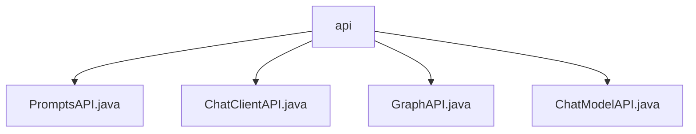

# 基础信息

|      |      |
|------|------|
| 名称 | api |
| 编码语言 | .java |
| 代码路径 | spring-ai-alibaba/spring-ai-alibaba-studio/src/main/java/com/alibaba/cloud/ai/api |
| 包名 | spring-ai-alibaba.spring-ai-alibaba-studio.src.main.java.com.alibaba.cloud.ai.api |
| 概述说明 | 输入内容为空，无法生成总结描述。 |

# 说明

## 概述
该代码模块属于 `spring-ai-alibaba` 项目中的 `spring-ai-alibaba-studio` 子模块，主要包含与人工智能（AI）相关的 API 接口。模块的核心功能集中在处理与 AI 模型的交互，包括聊天模型、提示词管理、图形处理等。尽管当前提供的文件描述为空，但从文件名可以推测，这些 API 接口可能用于与阿里云的 AI 服务进行集成，支持开发者通过 Spring 框架调用阿里云的 AI 能力。

## 主要业务场景
1. **聊天模型交互**：通过 `ChatModelAPI` 和 `ChatClientAPI`，开发者可以实现与 AI 聊天模型的交互，支持自然语言处理、对话生成等功能。
2. **提示词管理**：`PromptsAPI` 可能用于管理和生成提示词，帮助开发者更高效地引导 AI 模型生成特定类型的响应。
3. **图形处理**：`GraphAPI` 可能涉及与图形相关的 AI 功能，如图像识别、图形生成或图形数据分析。

由于具体实现细节未提供，以上总结基于文件名和模块名称的推测，实际功能可能有所不同。

### 包内部结构视图

该流程图展示了`api`文件夹下的四个Java文件：`PromptsAPI.java`、`ChatClientAPI.java`、`GraphAPI.java`和`ChatModelAPI.java`。这些文件均位于`spring-ai-alibaba/spring-ai-alibaba-studio/src/main/java/com/alibaba/cloud/ai/api`路径下，层级关系清晰，`api`作为父节点，四个文件作为子节点。

# 文件列表 File List

| 名称   | 类型  | 说明 |
|-------|------|-------------|
| [ChatModelAPI.java](ChatModelAPI.md) | file | 无内容，无法生成概要描述。 |
| [GraphAPI.java](GraphAPI.md) | file | 信息为空，无法生成概要描述。 |
| [ChatClientAPI.java](ChatClientAPI.md) | file | 输入内容为空，无法生成概要描述。 |
| [PromptsAPI.java](PromptsAPI.md) | file | 无内容可总结。 |

