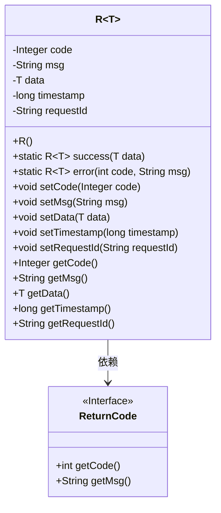
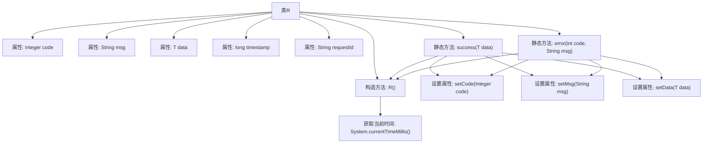

# 基础信息

|      |      |
|------|------|
| 名称 | R |
| 编码语言 | .java |
| 代码路径 | spring-ai-alibaba/spring-ai-alibaba-studio/src/main/java/com/alibaba/cloud/ai/common/R.java |
| 包名 | com.alibaba.cloud.ai.common |
| 依赖项 | ['lombok.Data'] |
| 概述说明 | 通用返回类R含状态码、消息、数据、时间戳和请求ID，支持成功和错误处理。 |

# 说明

通用返回类R是一个用于处理API响应的类，包含五个主要属性：状态码、消息、数据、时间戳和请求ID。状态码用于指示请求的成功或失败状态，消息提供关于响应的详细描述，数据字段用于存储返回的具体内容。时间戳记录响应生成的时间，请求ID用于唯一标识每个请求。该类支持对成功和错误情况的处理，能够有效管理和返回API调用的结果信息。

# 类列表 Class Summary

| 名称   | 类型  | 说明 |
|-------|------|-------------|
| R | class | 通用返回类R包含状态码、消息、数据、时间戳和请求ID，支持成功和错误处理。 |

## 类 R

|      |      |
|------|------|
| 访问范围 | @Data;public |
| 类型 | class |
| 名称 | R |
| 说明 | 通用返回类R包含状态码、消息、数据、时间戳和请求ID，支持成功和错误处理。 |

### UML类图

### 描述：
这段代码定义了一个泛型类 `R<T>`，用于封装响应数据。类中包含状态码、消息、数据、时间戳和请求ID等属性。提供了两个静态方法 `success` 和 `error`，分别用于生成成功和错误的响应对象。`ReturnCode` 是一个接口，提供了获取状态码和消息的方法。`R<T>` 类依赖于 `ReturnCode` 接口来获取状态码和消息信息。

### 内部方法调用关系图

该流程图描述了类`R<T>`的结构及其方法调用关系。类`R<T>`包含多个属性和两个静态方法`success`和`error`，分别用于创建成功和错误的响应对象。构造方法`R()`在初始化时设置`timestamp`为当前时间。`success`方法设置返回码、消息和数据，而`error`方法设置错误码和消息，并将数据置为`null`。

### 字段列表 Field List

| 名称  | 类型  | 说明 |
|-------|-------|------|
| requestId | String | 定义了一个私有字符串变量requestId。 |
| timestamp | long | 定义长整型变量timestamp用于存储时间戳。 |
| code | Integer | 私有整型变量code。 |
| data | T | 私有变量data，类型为泛型T。 |
| msg | String | 声明了一个私有的字符串变量msg。 |

### 方法列表 Method List

| 名称  | 类型  | 说明 |
|-------|-------|------|
| error | R<T> | 静态方法error返回包含错误码和消息的R对象，数据为空。 |
| success | R<T> | 静态方法返回成功响应，包含状态码、消息和数据。 |

