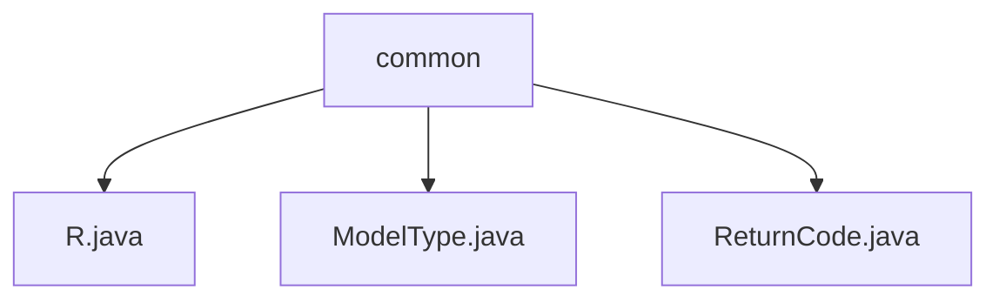

# 基础信息

|      |      |
|------|------|
| 名称 | common |
| 编码语言 | .java |
| 代码路径 | spring-ai-alibaba/spring-ai-alibaba-studio/src/main/java/com/alibaba/cloud/ai/common |
| 包名 | spring-ai-alibaba.spring-ai-alibaba-studio.src.main.java.com.alibaba.cloud.ai.common |
| 概述说明 | 通用返回类R处理API响应，含状态码、消息、数据、时间戳和请求ID。 |

# 说明

## 概述

该代码模块主要围绕API响应的处理和返回逻辑展开，核心功能包括对API调用结果的封装、状态管理以及错误处理。模块中的核心类是`R`，它是一个通用的返回类，用于统一处理API响应的结构，确保每次API调用都能返回一致且规范的响应信息。此外，模块还包含其他辅助类，如`ModelType`和`ReturnCode`，这些类可能用于定义模型类型和返回状态码，但目前提供的描述信息有限，无法详细总结其具体功能。

## 主要业务场景

1. **API响应封装**：`R`类用于封装API调用的返回结果，包含状态码、消息、数据、时间戳和请求ID等属性。这种设计使得API响应结构清晰且易于解析，适用于各种业务场景下的API调用。
2. **状态管理**：通过状态码和消息字段，`R`类能够明确指示请求的成功或失败状态，并提供详细的描述信息，便于开发者和用户快速定位问题。
3. **错误处理**：`R`类支持对错误情况的处理，能够返回统一的错误响应格式，确保错误信息的一致性和可读性。
4. **请求追踪**：通过请求ID和时间戳字段，模块支持对每个API请求的唯一标识和时间记录，便于日志记录和问题排查。

由于部分类（如`ModelType`和`ReturnCode`）的描述信息不足，无法进一步总结其具体业务场景。

### 包内部结构视图

该流程图展示了`common`目录下的文件结构，`common`作为根节点，包含了三个文件：`R.java`、`ModelType.java`和`ReturnCode.java`。这些文件位于`spring-ai-alibaba/spring-ai-alibaba-studio/src/main/java/com/alibaba/cloud/ai/common`路径下，展示了它们之间的层级关系。

# 文件列表 File List

| 名称   | 类型  | 说明 |
|-------|------|-------------|
| [ReturnCode.java](ReturnCode.md) | file | 信息为空，无法生成概要描述。 |
| [ModelType.java](ModelType.md) | file | 信息为空，无法生成概要描述。 |
| [R.java](R.md) | file | 通用返回类R含状态码、消息、数据、时间戳和请求ID，支持成功和错误处理。 |

