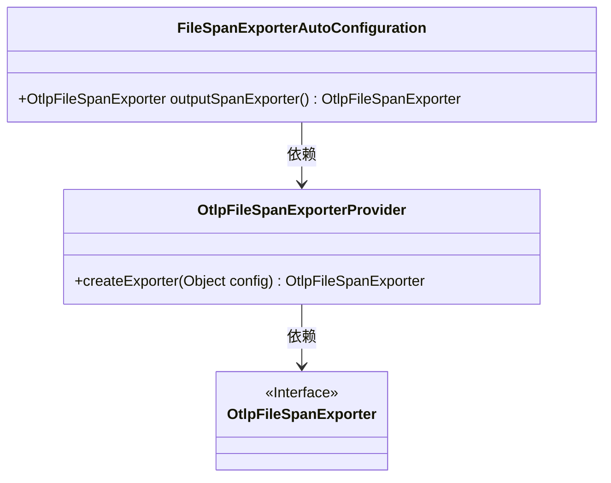
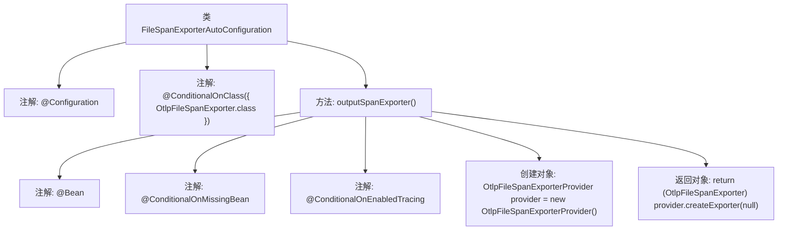

# 基础信息

|      |      |
|------|------|
| 名称 | FileSpanExporterAutoConfiguration |
| 编码语言 | .java |
| 代码路径 | spring-ai-alibaba/spring-ai-alibaba-studio/src/main/java/com/alibaba/cloud/ai/config/FileSpanExporterAutoConfiguration.java |
| 包名 | com.alibaba.cloud.ai.config |
| 依赖项 | ['com.alibaba.cloud.ai.oltp.OtlpFileSpanExporter', 'com.alibaba.cloud.ai.oltp.OtlpFileSpanExporterProvider', 'org.springframework.boot.actuate.autoconfigure.tracing.ConditionalOnEnabledTracing', 'org.springframework.boot.autoconfigure.condition.ConditionalOnClass', 'org.springframework.boot.autoconfigure.condition.ConditionalOnMissingBean', 'org.springframework.context.annotation.Bean', 'org.springframework.context.annotation.Configuration'] |
| 概述说明 | 配置类自动生成OtlpFileSpanExporter实例。 |

# 说明

配置类负责自动创建OtlpFileSpanExporter实例。OtlpFileSpanExporter是一种用于将跟踪数据导出到文件的工具，通常用于分布式系统中的日志记录和监控。通过配置类自动创建该实例，简化了开发者的操作，确保跟踪数据能够高效、准确地存储到指定文件中，便于后续分析和调试。这一过程无需手动干预，提升了系统的可维护性和可扩展性。

# 类列表 Class Summary

| 名称   | 类型  | 说明 |
|-------|------|-------------|
| FileSpanExporterAutoConfiguration | class | 配置类自动创建OtlpFileSpanExporter实例。 |

## 类 FileSpanExporterAutoConfiguration

|      |      |
|------|------|
| 访问范围 | @Configuration;@ConditionalOnClass({ OtlpFileSpanExporter.class });public |
| 类型 | class |
| 名称 | FileSpanExporterAutoConfiguration |
| 说明 | 配置类自动创建OtlpFileSpanExporter实例。 |

### UML类图

**描述：**
`FileSpanExporterAutoConfiguration` 是一个配置类，用于自动配置 `OtlpFileSpanExporter`。它依赖于 `OtlpFileSpanExporterProvider` 来创建 `OtlpFileSpanExporter` 实例。`OtlpFileSpanExporter` 是一个接口，而 `OtlpFileSpanExporterProvider` 负责实现该接口并生成具体的实例。这个配置类在满足特定条件时才会生效，确保在没有其他 `OtlpFileSpanExporter` Bean 存在的情况下，自动提供一个默认的导出器。

### 内部方法调用关系图

这段代码定义了一个名为 `FileSpanExporterAutoConfiguration` 的配置类，该类在 `OtlpFileSpanExporter` 类存在的情况下才会被加载。类中包含一个 `outputSpanExporter` 方法，该方法在 `OtlpFileSpanExporter` 类型的 Bean 缺失且追踪功能启用时，会创建一个 `OtlpFileSpanExporterProvider` 对象，并通过该对象创建一个 `OtlpFileSpanExporter` 实例返回。该配置类主要用于自动配置与文件导出相关的追踪功能。

### 字段列表 Field List

| 名称  | 类型  | 说明 |
|-------|-------|------|

### 方法列表 Method List

| 名称  | 类型  | 说明 |
|-------|-------|------|
| outputSpanExporter | OtlpFileSpanExporter | 在缺少Bean且启用追踪时，创建OtlpFileSpanExporter实例。 |

