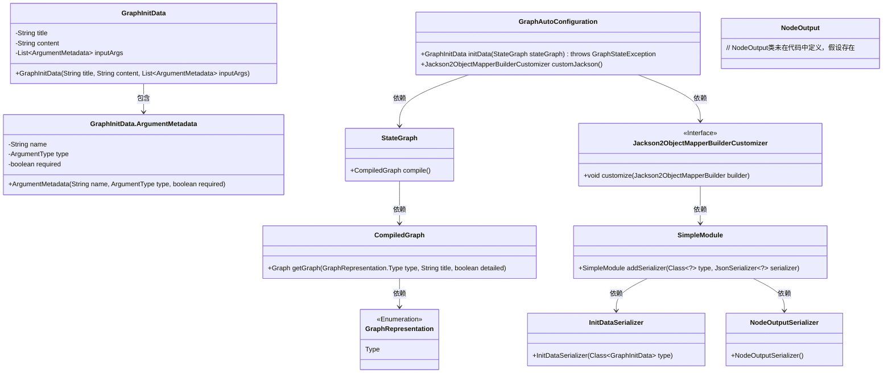
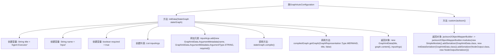

# 基础信息

|      |      |
|------|------|
| 名称 | GraphAutoConfiguration |
| 编码语言 | .java |
| 代码路径 | spring-ai-alibaba/spring-ai-alibaba-studio/src/main/java/com/alibaba/cloud/ai/config/GraphAutoConfiguration.java |
| 包名 | com.alibaba.cloud.ai.config |
| 依赖项 | ['com.alibaba.cloud.ai.graph.CompileConfig', 'com.alibaba.cloud.ai.graph.CompiledGraph', 'com.alibaba.cloud.ai.graph.GraphRepresentation', 'com.alibaba.cloud.ai.graph.GraphStateException', 'com.alibaba.cloud.ai.graph.GraphInitData', 'com.alibaba.cloud.ai.graph.InitDataSerializer', 'com.alibaba.cloud.ai.graph.NodeOutput', 'com.alibaba.cloud.ai.graph.NodeOutputSerializer', 'com.alibaba.cloud.ai.graph.StateGraph', 'com.fasterxml.jackson.databind.module.SimpleModule', 'org.springframework.boot.autoconfigure.jackson.Jackson2ObjectMapperBuilderCustomizer', 'org.springframework.context.annotation.Bean', 'org.springframework.context.annotation.Configuration', 'java.util.ArrayList', 'java.util.List'] |
| 概述说明 | GraphAutoConfiguration类定义了两个Bean：生成GraphInitData和自定义Jackson序列化器。 |

# 说明

GraphAutoConfiguration类主要负责两个Bean的配置：initData用于生成GraphInitData对象，而customJackson则用于自定义Jackson序列化器的行为。

# 类列表 Class Summary

| 名称   | 类型  | 说明 |
|-------|------|-------------|
| GraphAutoConfiguration | class | GraphAutoConfiguration类定义了两个Bean：initData生成GraphInitData对象，customJackson自定义Jackson序列化器。 |

## 类 GraphAutoConfiguration

|      |      |
|------|------|
| 访问范围 | @Configuration;public |
| 类型 | class |
| 名称 | GraphAutoConfiguration |
| 说明 | GraphAutoConfiguration类定义了两个Bean：initData生成GraphInitData对象，customJackson自定义Jackson序列化器。 |

### UML类图

**描述：**  
`GraphAutoConfiguration` 类是一个配置类，负责初始化 `GraphInitData` 和自定义 Jackson 序列化器。`GraphInitData` 包含图表的标题、内容以及输入参数的元数据。`StateGraph` 类用于编译图表，生成 `CompiledGraph` 对象，该对象可以获取不同格式的图表表示。`Jackson2ObjectMapperBuilderCustomizer` 是一个接口，用于自定义 Jackson 的序列化行为，通过 `SimpleModule` 添加了 `GraphInitData` 和 `NodeOutput` 的序列化器。

### 内部方法调用关系图

这段代码是一个Spring配置类，主要用于初始化图数据（GraphInitData）和自定义Jackson序列化器。`initData`方法通过`StateGraph`对象编译图数据，并返回包含图内容、标题和输入参数的`GraphInitData`对象。`customJackson`方法则通过自定义Jackson模块来序列化`GraphInitData`和`NodeOutput`对象。整个流程展示了如何通过Spring的配置类来初始化和管理复杂的对象。

### 字段列表 Field List

| 名称  | 类型  | 说明 |
|-------|-------|------|

### 方法列表 Method List

| 名称  | 类型  | 说明 |
|-------|-------|------|
| customJackson | Jackson2ObjectMapperBuilderCustomizer | 自定义Jackson对象映射器，添加GraphInitData和NodeOutput的序列化模块。 |
| initData | GraphInitData | 方法initData初始化GraphInitData对象，包含标题、图表内容和输入参数列表。 |

