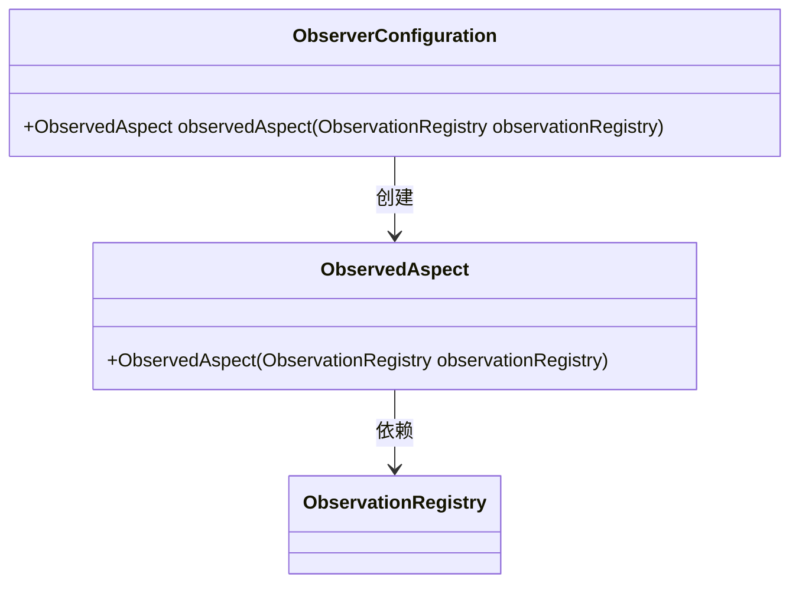
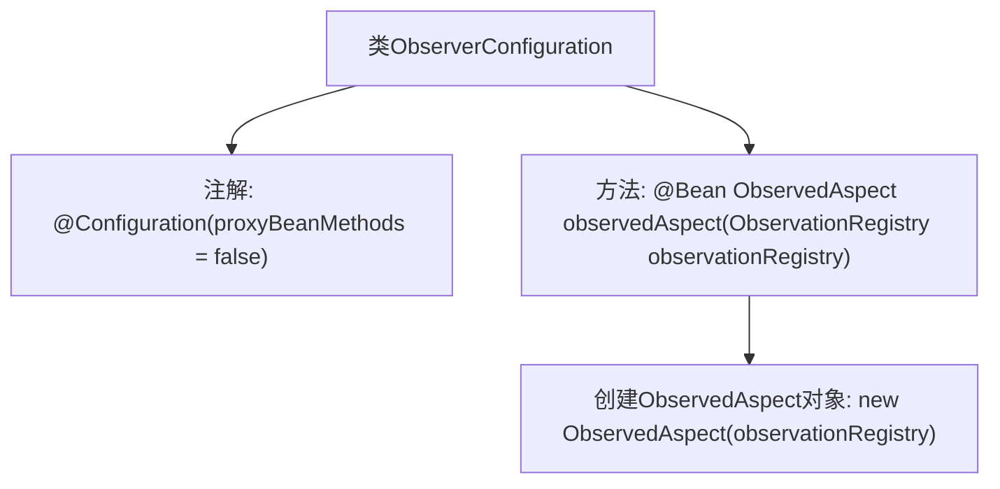

# 基础信息

|      |      |
|------|------|
| 名称 | ObserverConfiguration |
| 编码语言 | .java |
| 代码路径 | spring-ai-alibaba/spring-ai-alibaba-studio/src/main/java/com/alibaba/cloud/ai/config/ObserverConfiguration.java |
| 包名 | com.alibaba.cloud.ai.config |
| 依赖项 | ['io.micrometer.observation.ObservationRegistry', 'io.micrometer.observation.aop.ObservedAspect', 'org.springframework.context.annotation.Bean', 'org.springframework.context.annotation.Configuration'] |
| 概述说明 | ObserverConfiguration类通过@Bean注册ObservedAspect，支持@Observed功能。 |

# 说明

ObserverConfiguration类使用@Bean注解注册了一个名为ObservedAspect的组件，该组件支持@Observed功能。这一配置使得在应用程序中可以方便地使用@Observed注解来实现观察者模式或监控相关功能。通过这种方式，开发者可以在代码中轻松地标记需要被观察的类或方法，从而实现对特定行为的监控或处理。

# 类列表 Class Summary

| 名称   | 类型  | 说明 |
|-------|------|-------------|
| ObserverConfiguration | class | ObserverConfiguration类通过@Bean注解注册ObservedAspect，支持@Observed功能。 |

## 类 ObserverConfiguration

|      |      |
|------|------|
| 访问范围 | @Configuration(proxyBeanMethods = false);public |
| 类型 | class |
| 名称 | ObserverConfiguration |
| 说明 | ObserverConfiguration类通过@Bean注解注册ObservedAspect，支持@Observed功能。 |

### UML类图

这段代码定义了一个配置类 `ObserverConfiguration`，其中包含一个 `@Bean` 注解的方法 `observedAspect`，用于创建 `ObservedAspect` 实例。`ObservedAspect` 类依赖于 `ObservationRegistry` 类，通过构造函数注入。`ObserverConfiguration` 类负责管理 `ObservedAspect` 的创建和配置，确保在应用启动时正确初始化相关组件。

### 内部方法调用关系图

这段代码定义了一个名为 `ObserverConfiguration` 的配置类，使用了 `@Configuration` 注解，并设置了 `proxyBeanMethods` 为 `false`。类中包含一个 `@Bean` 注解的方法 `observedAspect`，该方法接收一个 `ObservationRegistry` 参数，并返回一个 `ObservedAspect` 对象。该方法的主要作用是注册一个观察切面，以支持 `@Observed` 注解的功能。

### 字段列表 Field List

| 名称  | 类型  | 说明 |
|-------|-------|------|

### 方法列表 Method List

| 名称  | 类型  | 说明 |
|-------|-------|------|
| observedAspect | ObservedAspect | 创建ObservedAspect实例，依赖ObservationRegistry。 |

