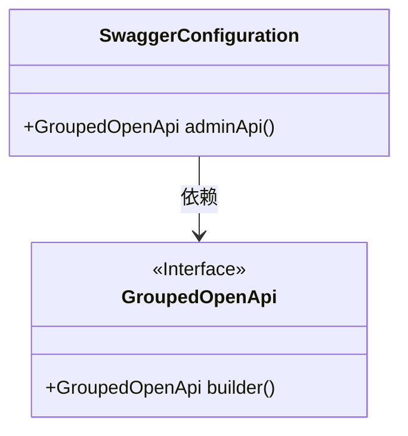
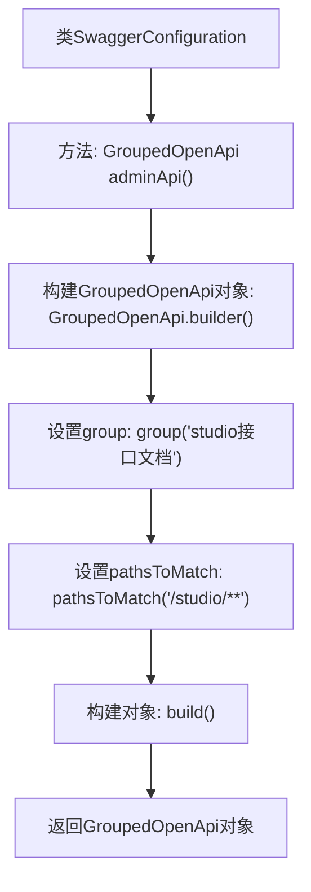

# 基础信息

|      |      |
|------|------|
| 名称 | SwaggerConfiguration |
| 编码语言 | .java |
| 代码路径 | spring-ai-alibaba/spring-ai-alibaba-studio/src/main/java/com/alibaba/cloud/ai/config/SwaggerConfiguration.java |
| 包名 | com.alibaba.cloud.ai.config |
| 依赖项 | ['org.springdoc.core.models.GroupedOpenApi', 'org.springframework.context.annotation.Bean', 'org.springframework.context.annotation.Configuration'] |
| 概述说明 | Swagger配置类用于定义studio接口文档分组。 |

# 说明

Swagger配置类用于定义studio接口文档的分组。该类的主要功能是组织和分类studio相关的API文档，使其在Swagger UI中清晰展示。通过配置分组，开发者可以更方便地查找和管理studio模块的接口文档，提升开发效率和文档的可读性。

# 类列表 Class Summary

| 名称   | 类型  | 说明 |
|-------|------|-------------|
| SwaggerConfiguration | class | Swagger配置类，定义studio接口文档分组。 |

## 类 SwaggerConfiguration

|      |      |
|------|------|
| 访问范围 | @Configuration;public |
| 类型 | class |
| 名称 | SwaggerConfiguration |
| 说明 | Swagger配置类，定义studio接口文档分组。 |

### UML类图

这段代码定义了一个名为 `SwaggerConfiguration` 的配置类，其中包含一个名为 `adminApi` 的公共方法。该方法返回一个 `GroupedOpenApi` 对象，该对象通过 `GroupedOpenApi.builder()` 方法构建，并设置了分组名称为 "studio接口文档" 和路径匹配规则为 "/studio/**"。`GroupedOpenApi` 是一个接口，`SwaggerConfiguration` 类依赖于该接口来生成 API 文档的分组配置。

### 内部方法调用关系图

这段代码定义了一个名为`SwaggerConfiguration`的配置类，其中包含一个`adminApi`方法。该方法通过`GroupedOpenApi.builder()`构建一个`GroupedOpenApi`对象，并设置其`group`为“studio接口文档”，`pathsToMatch`为“/studio/**”，最后通过`build()`方法构建并返回该对象。该配置类通常用于Swagger API文档的分组配置。

### 字段列表 Field List

| 名称  | 类型  | 说明 |
|-------|-------|------|

### 方法列表 Method List

| 名称  | 类型  | 说明 |
|-------|-------|------|
| adminApi | GroupedOpenApi | 创建名为“adminApi”的Bean，用于生成“studio接口文档”分组，匹配路径“/studio/**”。 |

