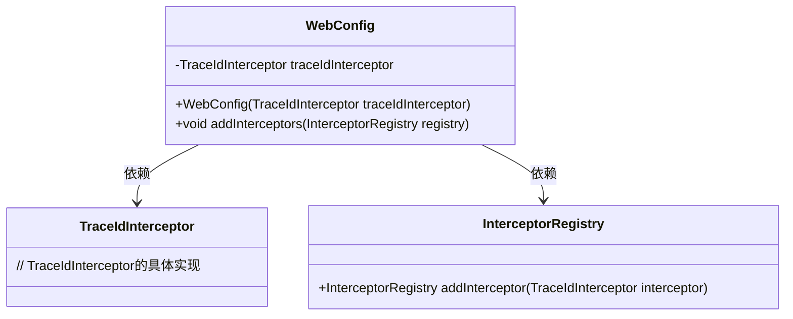
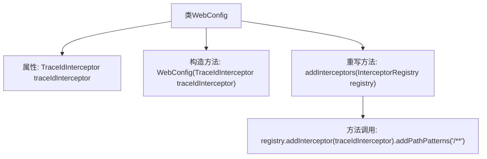

# 基础信息

|      |      |
|------|------|
| 名称 | WebConfig |
| 编码语言 | .java |
| 代码路径 | spring-ai-alibaba/spring-ai-alibaba-studio/src/main/java/com/alibaba/cloud/ai/config/WebConfig.java |
| 包名 | com.alibaba.cloud.ai.config |
| 依赖项 | ['com.alibaba.cloud.ai.tracing.TraceIdInterceptor', 'org.springframework.context.annotation.Configuration', 'org.springframework.web.servlet.config.annotation.InterceptorRegistry', 'org.springframework.web.servlet.config.annotation.WebMvcConfigurer'] |
| 概述说明 | WebConfig类配置拦截器，traceIdInterceptor应用于所有路径。 |

# 说明

WebConfig类用于配置拦截器，将traceIdInterceptor添加到所有路径中。通过这种方式，系统可以在所有请求路径中应用traceIdInterceptor，确保每个请求都带有唯一的跟踪标识，便于后续的日志记录和请求追踪。这种配置有助于提升系统的可观测性和调试效率。

# 类列表 Class Summary

| 名称   | 类型  | 说明 |
|-------|------|-------------|
| WebConfig | class | WebConfig类配置拦截器，添加traceIdInterceptor到所有路径。 |

## 类 WebConfig

|      |      |
|------|------|
| 访问范围 | @Configuration;public |
| 类型 | class |
| 名称 | WebConfig |
| 说明 | WebConfig类配置拦截器，添加traceIdInterceptor到所有路径。 |

### UML类图

这段代码描述了一个Spring配置类 `WebConfig`，它实现了 `WebMvcConfigurer` 接口，用于配置拦截器。`WebConfig` 类依赖于 `TraceIdInterceptor` 和 `InterceptorRegistry`，其中 `TraceIdInterceptor` 是一个自定义的拦截器，用于在处理请求时添加跟踪ID。`WebConfig` 通过 `addInterceptors` 方法将 `TraceIdInterceptor` 注册到 `InterceptorRegistry` 中，使其对所有路径的请求生效。

### 内部方法调用关系图

该流程图展示了`WebConfig`类的结构及其方法调用关系。`WebConfig`类包含一个`TraceIdInterceptor`类型的属性，并通过构造函数进行初始化。该类重写了`addInterceptors`方法，在该方法中调用了`registry.addInterceptor`并添加了路径模式`/**`。整个流程清晰地展示了类的属性和方法之间的调用关系。

### 字段列表 Field List

| 名称  | 类型  | 说明 |
|-------|-------|------|
| traceIdInterceptor | TraceIdInterceptor | 私有且不可变的TraceIdInterceptor实例。 |

### 方法列表 Method List

| 名称  | 类型  | 说明 |
|-------|-------|------|
| addInterceptors | void | 重写方法，添加拦截器，拦截所有路径。 |

