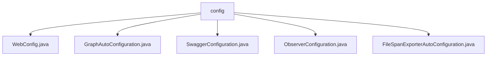

# 基础信息

|      |      |
|------|------|
| 名称 | config |
| 编码语言 | .java |
| 代码路径 | spring-ai-alibaba/spring-ai-alibaba-studio/src/main/java/com/alibaba/cloud/ai/config |
| 包名 | spring-ai-alibaba.spring-ai-alibaba-studio.src.main.java.com.alibaba.cloud.ai.config |
| 概述说明 | WebConfig配置拦截器，GraphAutoConfiguration管理Bean，Swagger配置API分组，ObserverConfiguration注册观察组件，FileSpanExporterAutoConfiguration自动创建跟踪数据导出实例。 |

# 说明

## 概述
该代码模块主要用于配置和管理Spring AI Alibaba Studio应用中的各种功能，包括请求跟踪、数据初始化、API文档管理、观察者模式支持以及跟踪数据导出。通过这些配置类，开发者可以轻松地集成和扩展系统功能，提升系统的可观测性、调试效率以及开发体验。

## 主要业务场景
1. **请求跟踪与日志记录**：通过`WebConfig`类配置拦截器，确保每个请求都带有唯一的跟踪标识（traceId），便于日志记录和请求追踪，提升系统的可观测性和调试效率。
2. **数据初始化与序列化配置**：`GraphAutoConfiguration`类负责生成`GraphInitData`对象并自定义Jackson序列化器的行为，确保数据初始化和序列化过程符合业务需求。
3. **API文档管理**：`SwaggerConfiguration`类用于定义和分组Studio接口文档，使其在Swagger UI中清晰展示，方便开发者查找和管理API文档，提升开发效率和文档可读性。
4. **观察者模式支持**：`ObserverConfiguration`类注册`ObservedAspect`组件，支持使用`@Observed`注解实现观察者模式或监控功能，便于开发者标记需要被观察的类或方法。
5. **跟踪数据导出**：`FileSpanExporterAutoConfiguration`类自动创建`OtlpFileSpanExporter`实例，用于将跟踪数据导出到文件，简化开发者的操作，确保跟踪数据能够高效、准确地存储，便于后续分析和调试。

### 包内部结构视图

该流程图展示了`config`文件夹下的五个配置文件之间的层级关系。`config`作为根节点，包含`WebConfig.java`、`GraphAutoConfiguration.java`、`SwaggerConfiguration.java`、`ObserverConfiguration.java`和`FileSpanExporterAutoConfiguration.java`五个子节点，每个子节点代表一个具体的配置文件。这种结构清晰地展示了配置文件的组织方式，便于理解和维护。

# 文件列表 File List

| 名称   | 类型  | 说明 |
|-------|------|-------------|
| [GraphAutoConfiguration.java](GraphAutoConfiguration.md) | file | GraphAutoConfiguration类定义了两个Bean：生成GraphInitData和自定义Jackson序列化器。 |
| [FileSpanExporterAutoConfiguration.java](FileSpanExporterAutoConfiguration.md) | file | 配置类自动生成OtlpFileSpanExporter实例。 |
| [ObserverConfiguration.java](ObserverConfiguration.md) | file | ObserverConfiguration类通过@Bean注册ObservedAspect，支持@Observed功能。 |
| [SwaggerConfiguration.java](SwaggerConfiguration.md) | file | Swagger配置类用于定义studio接口文档分组。 |
| [WebConfig.java](WebConfig.md) | file | WebConfig类配置拦截器，traceIdInterceptor应用于所有路径。 |

