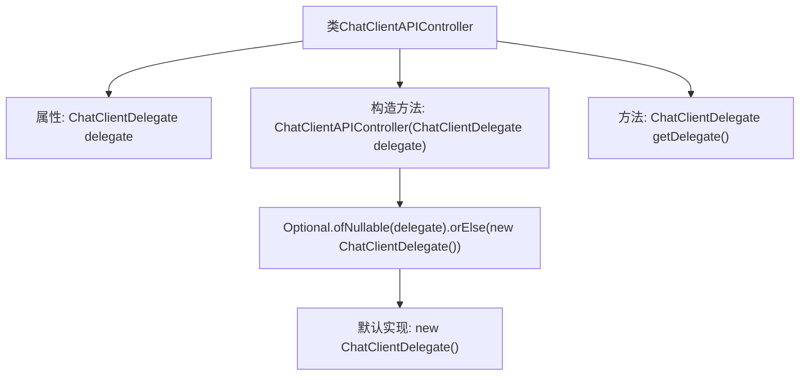

# 基础信息

|      |      |
|------|------|
| 名称 | ChatClientAPIController |
| 编码语言 | .java |
| 代码路径 | spring-ai-alibaba/spring-ai-alibaba-studio/src/main/java/com/alibaba/cloud/ai/controller/ChatClientAPIController.java |
| 包名 | com.alibaba.cloud.ai.controller |
| 依赖项 | ['com.alibaba.cloud.ai.api.ChatClientAPI', 'com.alibaba.cloud.ai.service.ChatClientDelegate', 'java.util.Optional', 'org.springframework.beans.factory.annotation.Autowired', 'org.springframework.web.bind.annotation.CrossOrigin', 'org.springframework.web.bind.annotation.RequestMapping', 'org.springframework.web.bind.annotation.RestController'] |
| 概述说明 | 跨域控制器实现聊天客户端API接口。 |

# 说明

跨域控制器实现聊天客户端API接口，主要功能是处理不同域之间的通信请求，确保数据的安全传输和跨域访问的合法性。通过配置CORS策略，允许指定域名的客户端访问API资源，防止未经授权的跨域请求。该控制器还负责验证请求头信息，确保请求来源的合法性，并处理预检请求，优化跨域通信效率。同时，提供错误处理机制，返回适当的HTTP状态码和错误信息，确保接口的稳定性和安全性。

# 类列表 Class Summary

| 名称   | 类型  | 说明 |
|-------|------|-------------|
| ChatClientAPIController | class | 跨域控制器实现聊天客户端API接口。 |


## 类 ChatClientAPIController

|      |      |
|------|------|
| 访问范围 | @CrossOrigin;@RestController;@RequestMapping("studio/api/chat-clients");public |
| 类型 | class |
| 名称 | ChatClientAPIController |
| 说明 | 跨域控制器实现聊天客户端API接口。 |


### UML类图

```mermaid
classDiagram
    class ChatClientAPIController {
        -ChatClientDelegate delegate
        +ChatClientAPIController(ChatClientDelegate delegate)
        +ChatClientDelegate getDelegate()
    }
    <<Interface>> ChatClientAPI {
        +ChatClientDelegate getDelegate()
    }
    ChatClientAPIController --> ChatClientAPI : 实现
    ChatClientAPIController --> ChatClientDelegate : 依赖
```

**描述：**  
`ChatClientAPIController` 是一个实现了 `ChatClientAPI` 接口的控制器类，用于处理与聊天客户端相关的API请求。它依赖于 `ChatClientDelegate` 类，后者通过构造函数注入，如果没有提供，则会创建一个默认的 `ChatClientDelegate` 实例。`ChatClientAPI` 接口定义了 `getDelegate` 方法，`ChatClientAPIController` 实现了该方法以返回其内部的 `ChatClientDelegate` 实例。


### 内部方法调用关系图



这段代码定义了一个名为 `ChatClientAPIController` 的类，该类实现了 `ChatClientAPI` 接口。类中包含一个 `ChatClientDelegate` 类型的属性 `delegate`，并通过构造函数进行初始化。如果传入的 `delegate` 为 `null`，则使用默认的 `ChatClientDelegate` 实现。类中还提供了一个 `getDelegate` 方法，用于返回 `delegate` 对象。这段代码主要用于处理与聊天客户端相关的 API 请求，并提供了灵活的委托机制。

### 字段列表 Field List

| 名称  | 类型  | 说明 |
|-------|-------|------|
| delegate | ChatClientDelegate | 私有且不可变的ChatClientDelegate代理实例。 |

### 方法列表 Method List

| 名称  | 类型  | 说明 |
|-------|-------|------|
| getDelegate | ChatClientDelegate | 方法返回ChatClientDelegate类型的delegate对象。 |


