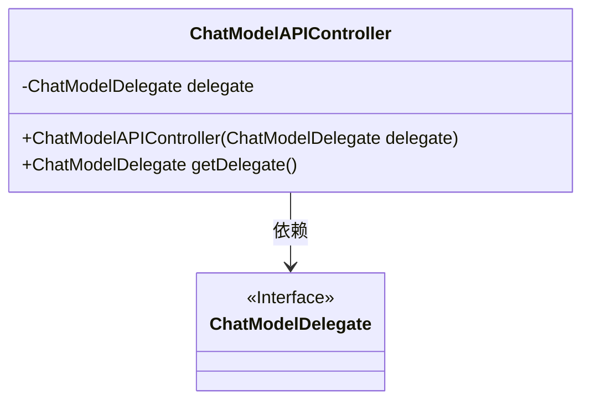
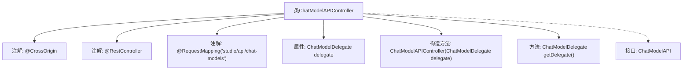

# 基础信息

|      |      |
|------|------|
| 名称 | ChatModelAPIController |
| 编码语言 | .java |
| 代码路径 | spring-ai-alibaba/spring-ai-alibaba-studio/src/main/java/com/alibaba/cloud/ai/controller/ChatModelAPIController.java |
| 包名 | com.alibaba.cloud.ai.controller |
| 依赖项 | ['com.alibaba.cloud.ai.api.ChatModelAPI', 'com.alibaba.cloud.ai.service.ChatModelDelegate', 'java.util.Optional', 'org.springframework.beans.factory.annotation.Autowired', 'org.springframework.web.bind.annotation.CrossOrigin', 'org.springframework.web.bind.annotation.RequestMapping', 'org.springframework.web.bind.annotation.RestController'] |
| 概述说明 | ChatModelAPIController实现ChatModelAPI，通过ChatModelDelegate处理请求。 |

# 说明

ChatModelAPIController实现了ChatModelAPI接口，并利用ChatModelDelegate来处理相关请求。该控制器负责管理与ChatModelAPI相关的操作，确保请求能够通过ChatModelDelegate进行有效的处理和响应。通过这种设计，ChatModelAPIController将API的具体实现与请求处理逻辑分离，提高了代码的模块化和可维护性。

# 类列表 Class Summary

| 名称   | 类型  | 说明 |
|-------|------|-------------|
| ChatModelAPIController | class | ChatModelAPIController实现ChatModelAPI，使用ChatModelDelegate处理请求。 |

## 类 ChatModelAPIController

|      |      |
|------|------|
| 访问范围 | @CrossOrigin;@RestController;@RequestMapping("studio/api/chat-models");public |
| 类型 | class |
| 名称 | ChatModelAPIController |
| 说明 | ChatModelAPIController实现ChatModelAPI，使用ChatModelDelegate处理请求。 |

### UML类图

这段代码定义了一个名为 `ChatModelAPIController` 的类，它实现了 `ChatModelAPI` 接口。`ChatModelAPIController` 类包含一个私有的 `ChatModelDelegate` 类型的成员变量 `delegate`，并通过构造函数进行初始化。如果构造函数传入的 `delegate` 为 `null`，则会创建一个默认的 `ChatModelDelegate` 实例。`ChatModelAPIController` 类还提供了一个公有方法 `getDelegate()`，用于返回当前的 `delegate` 实例。`ChatModelDelegate` 是一个接口，`ChatModelAPIController` 依赖于该接口来实现其功能。

### 内部方法调用关系图

这段代码定义了一个名为 `ChatModelAPIController` 的类，该类使用了 `@CrossOrigin`、`@RestController` 和 `@RequestMapping` 注解，表明它是一个 REST 控制器，并指定了请求路径。类中包含一个 `ChatModelDelegate` 类型的属性 `delegate`，并通过构造函数进行初始化。如果构造函数传入的 `delegate` 为 `null`，则使用一个匿名内部类作为默认值。类还实现了 `ChatModelAPI` 接口，并提供了 `getDelegate` 方法用于获取 `delegate` 属性。

### 字段列表 Field List

| 名称  | 类型  | 说明 |
|-------|-------|------|
| delegate | ChatModelDelegate | 私有且不可变的ChatModelDelegate实例。 |

### 方法列表 Method List

| 名称  | 类型  | 说明 |
|-------|-------|------|
| getDelegate | ChatModelDelegate | 重写方法，返回ChatModelDelegate类型的delegate实例。 |

