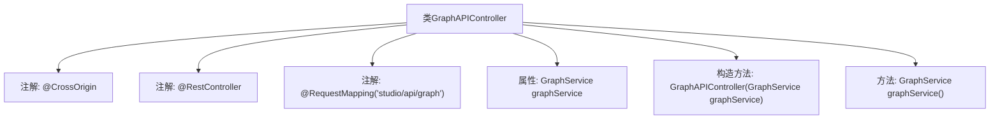

# 基础信息

|      |      |
|------|------|
| 名称 | GraphAPIController |
| 编码语言 | .java |
| 代码路径 | spring-ai-alibaba/spring-ai-alibaba-studio/src/main/java/com/alibaba/cloud/ai/controller/GraphAPIController.java |
| 包名 | com.alibaba.cloud.ai.controller |
| 依赖项 | ['com.alibaba.cloud.ai.api.GraphAPI', 'com.alibaba.cloud.ai.service.GraphService', 'org.springframework.web.bind.annotation.CrossOrigin', 'org.springframework.web.bind.annotation.RequestMapping', 'org.springframework.web.bind.annotation.RestController'] |
| 概述说明 | GraphAPIController实现GraphAPI接口，依赖GraphService提供服务。 |

# 说明

GraphAPIController是一个实现了GraphAPI接口的控制器，其主要功能是处理与GraphAPI相关的请求和操作。该控制器依赖于GraphService来提供具体的服务实现，GraphService负责处理业务逻辑和数据操作。通过这种依赖关系，GraphAPIController能够将API请求转发给GraphService，并获取相应的处理结果，从而实现与GraphAPI接口的交互。这种设计模式使得控制器与服务层职责分明，便于维护和扩展。

# 类列表 Class Summary

| 名称   | 类型  | 说明 |
|-------|------|-------------|
| GraphAPIController | class | GraphAPIController实现GraphAPI接口，依赖GraphService提供服务。 |


## 类 GraphAPIController

|      |      |
|------|------|
| 访问范围 | @CrossOrigin;@RestController;@RequestMapping("studio/api/graph");public |
| 类型 | class |
| 名称 | GraphAPIController |
| 说明 | GraphAPIController实现GraphAPI接口，依赖GraphService提供服务。 |


### UML类图

```mermaid
classDiagram
    class GraphAPIController {
        -GraphService graphService
        +GraphAPIController(GraphService graphService)
        +GraphService graphService()
    }
    <<Interface>> GraphAPI {
        +GraphService graphService()
    }
    GraphAPIController --> GraphAPI : 实现
    GraphAPIController --> GraphService : 依赖
```

类图描述：`GraphAPIController` 类实现了 `GraphAPI` 接口，并依赖于 `GraphService` 类。`GraphAPIController` 包含一个私有的 `GraphService` 实例，并通过构造函数注入。`GraphAPI` 接口定义了一个 `graphService()` 方法，`GraphAPIController` 实现了该方法，返回 `GraphService` 实例。


### 内部方法调用关系图



这段代码定义了一个名为 `GraphAPIController` 的类，它是一个 Spring Boot 的 REST 控制器，用于处理与图形相关的 API 请求。类上使用了 `@CrossOrigin`、`@RestController` 和 `@RequestMapping` 注解，分别用于跨域支持、标识 REST 控制器和指定请求路径。类中包含一个 `GraphService` 类型的属性 `graphService`，并通过构造函数注入。`graphService()` 方法返回 `graphService` 实例，用于获取服务对象。

### 字段列表 Field List

| 名称  | 类型  | 说明 |
|-------|-------|------|
| graphService | GraphService | GraphService私有实例变量graphService。 |

### 方法列表 Method List

| 名称  | 类型  | 说明 |
|-------|-------|------|
| graphService | GraphService | 重写GraphService方法，返回graphService实例。 |


