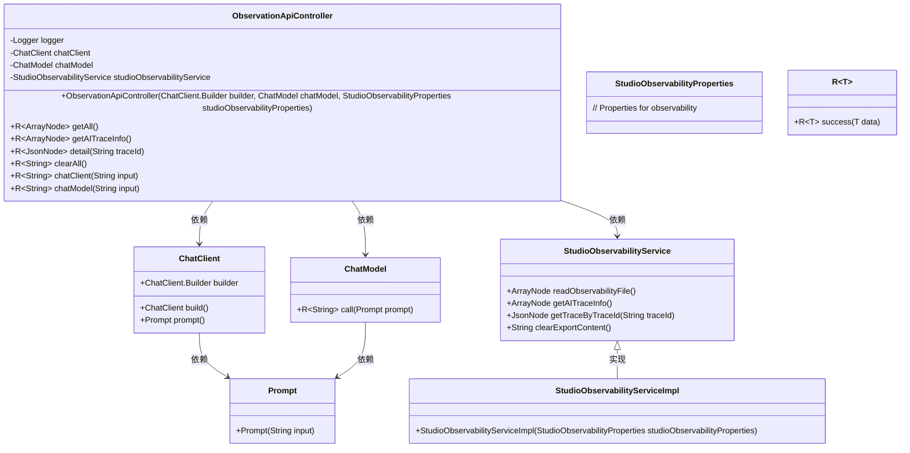

# 基础信息

|      |      |
|------|------|
| 名称 | ObservationApiController |
| 编码语言 | .java |
| 代码路径 | spring-ai-alibaba/spring-ai-alibaba-studio/src/main/java/com/alibaba/cloud/ai/controller/ObservationApiController.java |
| 包名 | com.alibaba.cloud.ai.controller |
| 依赖项 | ['com.alibaba.cloud.ai.common.R', 'com.alibaba.cloud.ai.oltp.StudioObservabilityProperties', 'com.alibaba.cloud.ai.service.StudioObservabilityService', 'com.alibaba.cloud.ai.service.impl.StudioObservabilityServiceImpl', 'com.fasterxml.jackson.databind.JsonNode', 'com.fasterxml.jackson.databind.node.ArrayNode', 'java.util.logging.Logger', 'org.springframework.ai.chat.client.ChatClient', 'org.springframework.ai.chat.model.ChatModel', 'org.springframework.ai.chat.prompt.Prompt', 'org.springframework.web.bind.annotation.CrossOrigin', 'org.springframework.web.bind.annotation.GetMapping', 'org.springframework.web.bind.annotation.RequestMapping', 'org.springframework.web.bind.annotation.RestController'] |
| 概述说明 | 控制器管理观测数据，提供获取、清理及AI聊天API。 |

# 说明

该控制器主要负责处理观测数据，提供了一系列API接口，用于数据的获取、清理以及与AI聊天相关的功能。通过这些API，用户可以方便地获取所需数据，进行必要的清理操作，并实现与AI的交互。该控制器集成了数据处理和AI交互的核心功能，为用户提供了一个高效、便捷的操作平台。

# 类列表 Class Summary

| 名称   | 类型  | 说明 |
|-------|------|-------------|
| ObservationApiController | class | 该控制器处理观测数据，提供获取、清理及与AI聊天相关的API。 |

## 类 ObservationApiController

|      |      |
|------|------|
| 访问范围 | @CrossOrigin;@RestController;@RequestMapping("studio/api/observation");public |
| 类型 | class |
| 名称 | ObservationApiController |
| 说明 | 该控制器处理观测数据，提供获取、清理及与AI聊天相关的API。 |

### UML类图

**描述：**  
`ObservationApiController` 是一个 REST 控制器，负责处理与观测性相关的 API 请求。它依赖于 `ChatClient`、`ChatModel` 和 `StudioObservabilityService` 来完成不同的任务。`StudioObservabilityService` 由 `StudioObservabilityServiceImpl` 实现，负责读取观测性文件、获取 AI 跟踪信息、清除导出内容等操作。`ChatClient` 和 `ChatModel` 分别用于处理聊天相关的请求，并通过 `Prompt` 类生成提示信息。`R~T~` 是一个泛型类，用于封装 API 的响应结果。

### 内部方法调用关系图

```mermaid
graph TD
    A["类ObservationApiController"]
    B["属性: Logger logger"]
    C["属性: ChatClient chatClient"]
    D["属性: ChatModel chatModel"]
    E["属性: StudioObservabilityService studioObservabilityService"]
    F["构造方法: ObservationApiController(ChatClient.Builder builder, ChatModel chatModel, StudioObservabilityProperties studioObservabilityProperties)"]
    G["方法: R<ArrayNode> getAll()"]
    H["方法: R<ArrayNode> getAITraceInfo()"]
    I["方法: R<JsonNode> detail(String traceId)"]
    J["方法: R<String> clearAll()"]
    K["方法: R<String> chatClient(String input)"]
    L["方法: R<String> chatModel(String input)"]
    M["调用: studioObservabilityService.readObservabilityFile()"]
    N["调用: studioObservabilityService.getAITraceInfo()"]
    O["调用: studioObservabilityService.getTraceByTraceId(traceId)"]
    P["调用: studioObservabilityService.clearExportContent()"]
    Q["调用: chatClient.prompt().user(input).call().content()"]
    R["调用: chatModel.call(new Prompt(input)).getResult().getOutput().getText()"]
    S["返回: R.success(res)"]
    T["返回: R.success(reply)"]

    A --> B
    A --> C
    A --> D
    A --> E
    A --> F
    A --> G
    A --> H
    A --> I
    A --> J
    A --> K
    A --> L
    G --> M
    G --> S
    H --> N
    H --> S
    I --> O
    I --> S
    J --> P
    J --> S
    K --> Q
    K --> T
    L --> R
    L --> T
```

**描述：**
该流程图展示了`ObservationApiController`类的结构及其内部方法的调用关系。类中包含多个属性、一个构造方法和六个`@GetMapping`注解的请求处理方法。每个方法通过调用`studioObservabilityService`或`chatClient`、`chatModel`的相关方法获取数据，并返回`R.success`封装的结果。流程图清晰地展示了方法之间的调用链和返回路径。

### 字段列表 Field List

| 名称  | 类型  | 说明 |
|-------|-------|------|
| chatModel | ChatModel | 私有且不可变的聊天模型实例。 |
| chatClient | ChatClient | 私有且不可变的ChatClient实例。 |
| studioObservabilityService | StudioObservabilityService | 私有且不可变的StudioObservabilityService实例。 |
| logger = Logger.getLogger(ObservationApiController.class.getName()) | Logger | ObservationApiController类中定义了一个私有静态日志记录器。 |

### 方法列表 Method List

| 名称  | 类型  | 说明 |
|-------|-------|------|
| chatClient | R<String> | GET请求处理聊天客户端输入并返回响应。 |
| getAll | R<ArrayNode> | 通过GET请求获取所有观测数据并返回成功结果。 |
| getAITraceInfo | R<ArrayNode> | 通过GET请求获取AI追踪信息并返回成功响应。 |
| detail | R<JsonNode> | 通过traceId查询跟踪详情并返回JSON格式结果。 |
| chatModel | R<String> | 通过GET请求调用chatModel接口，返回处理后的文本结果。 |
| clearAll | R<String> | 通过GET请求清除所有导出内容并返回结果。 |

