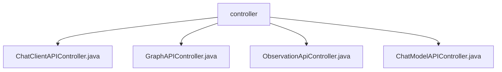

# 基础信息

|      |      |
|------|------|
| 名称 | controller |
| 编码语言 | .java |
| 代码路径 | spring-ai-alibaba/spring-ai-alibaba-studio/src/main/java/com/alibaba/cloud/ai/controller |
| 包名 | spring-ai-alibaba.spring-ai-alibaba-studio.src.main.java.com.alibaba.cloud.ai.controller |
| 概述说明 | 跨域控制器处理通信请求，Graph控制器管理GraphAPI，观测控制器提供数据接口，ChatModel控制器分离请求处理逻辑。 |

# 说明

## 概述

该代码模块是一个基于Spring框架的AI聊天客户端API接口实现，主要包含四个控制器：`ChatClientAPIController`、`GraphAPIController`、`ObservationApiController`和`ChatModelAPIController`。这些控制器分别负责处理不同的业务场景，包括跨域通信、GraphAPI请求、观测数据处理以及ChatModelAPI操作。模块通过依赖注入和服务层的分离，实现了职责分明、易于维护和扩展的设计模式，同时确保了接口的稳定性、安全性和高效性。

## 主要业务场景

1. **跨域通信处理**：`ChatClientAPIController`负责处理不同域之间的通信请求，通过配置CORS策略确保数据的安全传输和跨域访问的合法性。该控制器验证请求头信息，处理预检请求，并提供错误处理机制，返回适当的HTTP状态码和错误信息，确保接口的稳定性和安全性。

2. **GraphAPI请求处理**：`GraphAPIController`实现了与GraphAPI相关的请求和操作，依赖于`GraphService`来处理业务逻辑和数据操作。该控制器将API请求转发给`GraphService`，并获取相应的处理结果，实现了与GraphAPI接口的交互，确保控制器与服务层职责分明，便于维护和扩展。

3. **观测数据处理**：`ObservationApiController`负责处理观测数据，提供了一系列API接口，用于数据的获取、清理以及与AI聊天相关的功能。该控制器集成了数据处理和AI交互的核心功能，为用户提供了一个高效、便捷的操作平台。

4. **ChatModelAPI操作**：`ChatModelAPIController`实现了`ChatModelAPI`接口，并利用`ChatModelDelegate`来处理相关请求。该控制器负责管理与`ChatModelAPI`相关的操作，确保请求能够通过`ChatModelDelegate`进行有效的处理和响应，提高了代码的模块化和可维护性。

通过这些控制器的协同工作，该模块为用户提供了一个功能丰富、安全可靠的AI聊天客户端API接口。

### 包内部结构视图

该流程图展示了 `controller` 文件夹与其内部文件的层级关系。`controller` 文件夹包含四个 Java 文件，分别是 `ChatClientAPIController.java`、`GraphAPIController.java`、`ObservationApiController.java` 和 `ChatModelAPIController.java`。每个文件都直接隶属于 `controller` 文件夹，没有进一步的子文件夹结构。

# 文件列表 File List

| 名称   | 类型  | 说明 |
|-------|------|-------------|
| [ChatModelAPIController.java](ChatModelAPIController.md) | file | ChatModelAPIController实现ChatModelAPI，通过ChatModelDelegate处理请求。 |
| [ObservationApiController.java](ObservationApiController.md) | file | 控制器管理观测数据，提供获取、清理及AI聊天API。 |
| [GraphAPIController.java](GraphAPIController.md) | file | GraphAPIController实现GraphAPI接口，依赖GraphService提供服务。 |
| [ChatClientAPIController.java](ChatClientAPIController.md) | file | 跨域控制器实现聊天客户端API接口。 |

