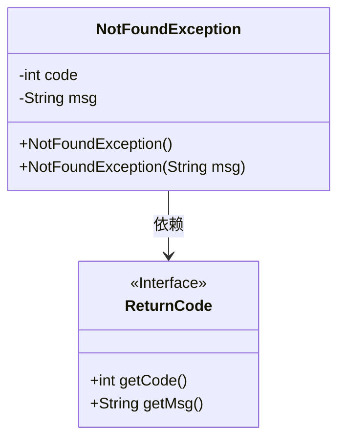
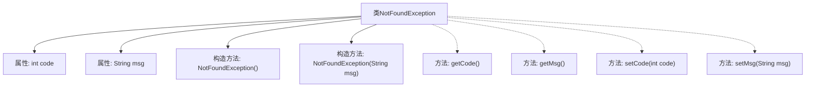

# 基础信息

|      |      |
|------|------|
| 名称 | NotFoundException |
| 编码语言 | .java |
| 代码路径 | spring-ai-alibaba/spring-ai-alibaba-studio/src/main/java/com/alibaba/cloud/ai/exception/NotFoundException.java |
| 包名 | com.alibaba.cloud.ai.exception |
| 依赖项 | ['com.alibaba.cloud.ai.common.ReturnCode', 'lombok.Getter', 'lombok.Setter'] |
| 概述说明 | NotFoundException继承RuntimeException，含code和msg，默认404状态码和消息。 |

# 说明

NotFoundException类继承自RuntimeException，具有code和msg两个属性。默认情况下，该类会返回404状态码和相应的消息。

# 类列表 Class Summary

| 名称   | 类型  | 说明 |
|-------|------|-------------|
| NotFoundException | class | NotFoundException类继承RuntimeException，包含code和msg属性，默认返回404状态码和消息。 |

## 类 NotFoundException

|      |      |
|------|------|
| 访问范围 | @Getter;@Setter;public |
| 类型 | class |
| 名称 | NotFoundException |
| 说明 | NotFoundException类继承RuntimeException，包含code和msg属性，默认返回404状态码和消息。 |

### UML类图

**描述：**  
`NotFoundException` 是一个继承自 `RuntimeException` 的自定义异常类，用于表示资源未找到的情况。它包含两个私有成员变量：`code` 和 `msg`，分别表示错误代码和错误信息。该类提供了两个构造函数：一个默认构造函数，使用 `ReturnCode.RC404` 的默认代码和消息；另一个构造函数允许自定义错误信息。`NotFoundException` 依赖于 `ReturnCode` 接口来获取错误代码和消息。

### 内部方法调用关系图

这段代码定义了一个名为 `NotFoundException` 的异常类，继承自 `RuntimeException`。该类包含两个属性：`code` 和 `msg`，分别表示错误代码和错误信息。类中有两个构造方法：一个无参构造方法，默认使用 `ReturnCode.RC404` 的代码和消息；另一个构造方法允许自定义错误消息。类还通过 `@Getter` 和 `@Setter` 注解自动生成了属性的 getter 和 setter 方法。

### 字段列表 Field List

| 名称  | 类型  | 说明 |
|-------|-------|------|
| msg | String | 定义私有字符串变量msg。 |
| code | int | 定义一个私有的整型变量code。 |

### 方法列表 Method List

| 名称  | 类型  | 说明 |
|-------|-------|------|

