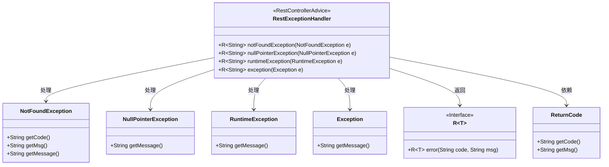
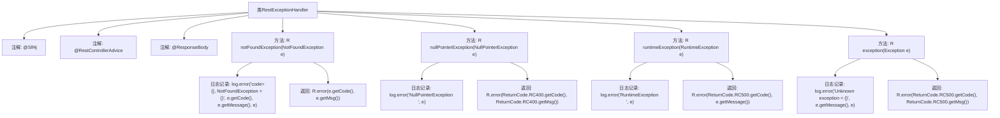

# 基础信息

|      |      |
|------|------|
| 名称 | RestExceptionHandler |
| 编码语言 | .java |
| 代码路径 | spring-ai-alibaba/spring-ai-alibaba-studio/src/main/java/com/alibaba/cloud/ai/exception/RestExceptionHandler.java |
| 包名 | com.alibaba.cloud.ai.exception |
| 依赖项 | ['com.alibaba.cloud.ai.common.R', 'com.alibaba.cloud.ai.common.ReturnCode', 'lombok.extern.slf4j.Slf4j', 'org.springframework.web.bind.annotation.ExceptionHandler', 'org.springframework.web.bind.annotation.ResponseBody', 'org.springframework.web.bind.annotation.RestControllerAdvice'] |
| 概述说明 | 统一控制器捕获并处理NotFound、NullPointer、Runtime及未知异常，返回对应错误信息。 |

# 说明

处理异常的统一控制器负责捕获并记录多种异常类型，包括NotFound、NullPointer、Runtime及未知异常。该控制器能够识别这些异常，并根据异常类型返回相应的错误信息，确保系统在遇到问题时能够提供明确的反馈，便于后续的调试和处理。通过统一管理异常处理，提高了代码的健壮性和可维护性。

# 类列表 Class Summary

| 名称   | 类型  | 说明 |
|-------|------|-------------|
| RestExceptionHandler | class | 处理异常的统一控制器，捕获并记录NotFound、NullPointer、Runtime及未知异常，返回相应错误信息。 |

## 类 RestExceptionHandler

|      |      |
|------|------|
| 访问范围 | @Slf4j;@RestControllerAdvice;@ResponseBody;public |
| 类型 | class |
| 名称 | RestExceptionHandler |
| 说明 | 处理异常的统一控制器，捕获并记录NotFound、NullPointer、Runtime及未知异常，返回相应错误信息。 |

### UML类图

这段代码定义了一个全局异常处理类 `RestExceptionHandler`，用于捕获和处理不同类型的异常。它通过 `@ExceptionHandler` 注解分别处理 `NotFoundException`、`NullPointerException`、`RuntimeException` 和 `Exception` 异常，并返回相应的错误信息。类 `R~String~` 是一个泛型接口，用于封装错误信息，而 `ReturnCode` 类则提供了错误码和错误消息的获取方法。

### 内部方法调用关系图

这段代码定义了一个`RestExceptionHandler`类，用于处理不同类型的异常。通过`@ExceptionHandler`注解，类中的方法分别处理`NotFoundException`、`NullPointerException`、`RuntimeException`和`Exception`。每个方法在捕获到相应异常时，会记录错误日志并返回一个包含错误代码和消息的`R`对象。该类的设计旨在统一处理异常，确保在发生错误时能够提供一致的响应格式。

### 字段列表 Field List

| 名称  | 类型  | 说明 |
|-------|-------|------|

### 方法列表 Method List

| 名称  | 类型  | 说明 |
|-------|-------|------|
| nullPointerException | R<String> | 处理空指针异常，记录错误并返回400状态码及信息。 |
| notFoundException | R<String> | 处理NotFoundException异常，记录错误并返回错误信息。 |
| runtimeException | R<String> | 处理RuntimeException异常，记录错误并返回500状态码和错误信息。 |
| exception | R<String> | 异常处理方法，记录未知异常并返回错误码RC500。 |

