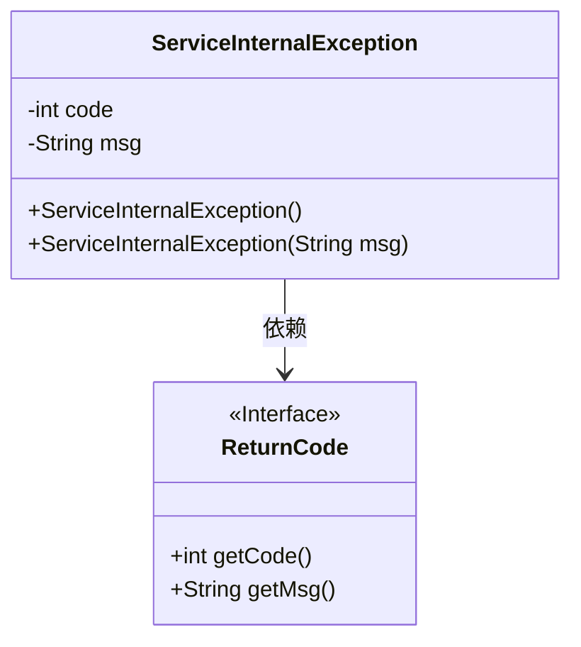
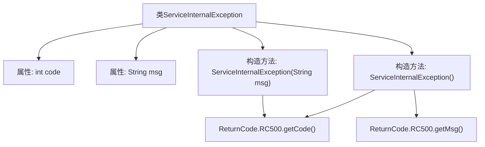

# 基础信息

|      |      |
|------|------|
| 名称 | ServiceInternalException |
| 编码语言 | .java |
| 代码路径 | spring-ai-alibaba/spring-ai-alibaba-studio/src/main/java/com/alibaba/cloud/ai/exception/ServiceInternalException.java |
| 包名 | com.alibaba.cloud.ai.exception |
| 依赖项 | ['com.alibaba.cloud.ai.common.ReturnCode', 'lombok.Getter', 'lombok.Setter'] |
| 概述说明 | ServiceInternalException继承RuntimeException，含code和msg属性，默认值RC500。 |

# 说明

ServiceInternalException继承自RuntimeException，表示服务内部异常。该异常包含两个属性：code和msg，分别用于表示异常代码和异常信息。默认情况下，code属性的值为RC500，表示服务内部错误。这种设计有助于在发生异常时，快速识别问题类型并提供相应的错误信息。

# 类列表 Class Summary

| 名称   | 类型  | 说明 |
|-------|------|-------------|
| ServiceInternalException | class | ServiceInternalException继承RuntimeException，包含code和msg属性，默认值为RC500。 |

## 类 ServiceInternalException

|      |      |
|------|------|
| 访问范围 | @Getter;@Setter;public |
| 类型 | class |
| 名称 | ServiceInternalException |
| 说明 | ServiceInternalException继承RuntimeException，包含code和msg属性，默认值为RC500。 |

### UML类图

**描述：**  
`ServiceInternalException` 是一个继承自 `RuntimeException` 的自定义异常类，用于处理服务内部异常。它包含两个私有成员变量 `code` 和 `msg`，分别表示异常代码和异常信息。该类提供了两个构造函数：一个无参构造函数，默认使用 `ReturnCode.RC500` 的代码和信息；另一个构造函数允许自定义异常信息。`ReturnCode` 是一个接口，提供了获取代码和信息的抽象方法。`ServiceInternalException` 依赖于 `ReturnCode` 来获取默认的异常代码和信息。

### 内部方法调用关系图

这段代码定义了一个名为 `ServiceInternalException` 的类，该类继承自 `RuntimeException`。它包含两个属性：`code` 和 `msg`，分别表示异常代码和异常信息。类中有两个构造方法：一个无参构造方法，默认使用 `ReturnCode.RC500` 的代码和消息；另一个构造方法接受一个字符串参数，用于自定义异常信息，但仍然使用 `ReturnCode.RC500` 的代码。流程图展示了类的属性、构造方法以及构造方法中调用的外部方法。

### 字段列表 Field List

| 名称  | 类型  | 说明 |
|-------|-------|------|
| msg | String | 声明了一个私有的字符串类型变量msg。 |
| code | int | 定义了一个私有的整型变量code。 |

### 方法列表 Method List

| 名称  | 类型  | 说明 |
|-------|-------|------|

