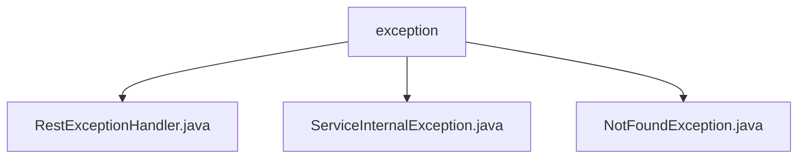

# 基础信息

|      |      |
|------|------|
| 名称 | exception |
| 编码语言 | .java |
| 代码路径 | spring-ai-alibaba/spring-ai-alibaba-studio/src/main/java/com/alibaba/cloud/ai/exception |
| 包名 | spring-ai-alibaba.spring-ai-alibaba-studio.src.main.java.com.alibaba.cloud.ai.exception |
| 概述说明 | 统一控制器捕获并处理多种异常，返回明确错误信息，提升系统健壮性和可维护性。 |

# 说明

## 概述
该代码模块主要负责异常处理，通过统一的异常控制器和自定义异常类，确保系统在遇到问题时能够提供明确的反馈，便于后续的调试和处理。模块中包含多个异常类，分别用于处理不同类型的异常，如服务内部异常、资源未找到异常等。通过统一管理异常处理，提高了代码的健壮性和可维护性。

## 主要业务场景
1. **异常捕获与处理**：通过`RestExceptionHandler`控制器，捕获并记录多种异常类型，包括`NotFound`、`NullPointer`、`Runtime`及未知异常。控制器能够识别这些异常，并根据异常类型返回相应的错误信息，确保系统在遇到问题时能够提供明确的反馈。
2. **服务内部异常处理**：`ServiceInternalException`继承自`RuntimeException`，表示服务内部异常。该异常包含`code`和`msg`两个属性，分别用于表示异常代码和异常信息。默认情况下，`code`属性的值为`RC500`，表示服务内部错误。
3. **资源未找到异常处理**：`NotFoundException`类继承自`RuntimeException`，具有`code`和`msg`两个属性。默认情况下，该类会返回404状态码和相应的消息，用于处理资源未找到的情况。

### 包内部结构视图

该流程图展示了 `exception` 文件夹与其内部文件的层级关系。`exception` 是根节点，包含了三个子节点：`RestExceptionHandler.java`、`ServiceInternalException.java` 和 `NotFoundException.java`。这些文件均位于 `exception` 目录下，表示它们属于同一类别的异常处理文件。

# 文件列表 File List

| 名称   | 类型  | 说明 |
|-------|------|-------------|
| [RestExceptionHandler.java](RestExceptionHandler.md) | file | 统一控制器捕获并处理NotFound、NullPointer、Runtime及未知异常，返回对应错误信息。 |
| [NotFoundException.java](NotFoundException.md) | file | NotFoundException继承RuntimeException，含code和msg，默认404状态码和消息。 |
| [ServiceInternalException.java](ServiceInternalException.md) | file | ServiceInternalException继承RuntimeException，含code和msg属性，默认值RC500。 |

