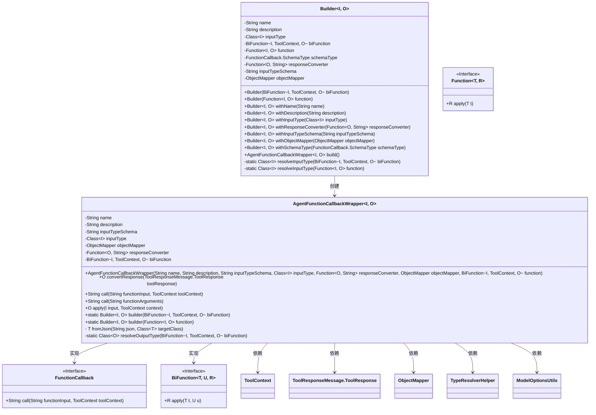

# 基础信息

|      |      |
|------|------|
| 名称 | AgentFunctionCallbackWrapper |
| 编码语言 | .java |
| 代码路径 | spring-ai-alibaba/spring-ai-alibaba-studio/src/main/java/com/alibaba/cloud/ai/function/AgentFunctionCallbackWrapper.java |
| 包名 | com.alibaba.cloud.ai.function |
| 依赖项 | ['com.fasterxml.jackson.core.JsonProcessingException', 'com.fasterxml.jackson.databind.DeserializationFeature', 'com.fasterxml.jackson.databind.ObjectMapper', 'com.fasterxml.jackson.databind.SerializationFeature', 'com.fasterxml.jackson.datatype.jsr310.JavaTimeModule', 'lombok.EqualsAndHashCode', 'lombok.Getter', 'org.springframework.ai.chat.messages.ToolResponseMessage', 'org.springframework.ai.chat.model.ToolContext', 'org.springframework.ai.model.ModelOptionsUtils', 'org.springframework.ai.model.function.FunctionCallback', 'org.springframework.ai.tool.resolution.TypeResolverHelper', 'org.springframework.util.Assert', 'java.util.function.BiFunction', 'java.util.function.Function'] |
| 概述说明 | AgentFunctionCallbackWrapper类封装函数回调，支持类型转换和JSON处理。 |

# 说明

AgentFunctionCallbackWrapper类是一个用于封装函数回调的工具，主要功能包括支持输入输出类型的转换以及JSON数据的处理。通过该类，用户可以更方便地管理和调用函数，同时确保数据类型的一致性和兼容性。该类特别适用于需要处理复杂数据转换和JSON格式的场景，提升了代码的可维护性和灵活性。

# 类列表 Class Summary

| 名称   | 类型  | 说明 |
|-------|------|-------------|
| AgentFunctionCallbackWrapper | class | AgentFunctionCallbackWrapper类封装函数回调，支持输入输出类型转换及JSON处理。 |

## 类 AgentFunctionCallbackWrapper

|      |      |
|------|------|
| 访问范围 | @EqualsAndHashCode;public |
| 类型 | class |
| 名称 | AgentFunctionCallbackWrapper |
| 说明 | AgentFunctionCallbackWrapper类封装函数回调，支持输入输出类型转换及JSON处理。 |

### UML类图

### 描述
`AgentFunctionCallbackWrapper` 是一个泛型类，实现了 `FunctionCallback` 和 `BiFunction` 接口，用于封装回调函数并处理输入输出类型转换。它包含多个私有字段，如 `name`、`description`、`inputTypeSchema` 等，并通过 `Builder` 模式进行构建。`Builder` 类负责设置这些字段并最终构建 `AgentFunctionCallbackWrapper` 实例。该类依赖于 `ToolContext`、`ToolResponseMessage.ToolResponse`、`ObjectMapper` 等外部类，并使用 `TypeResolverHelper` 和 `ModelOptionsUtils` 进行类型解析和 JSON 处理。

### 内部方法调用关系图

```mermaid
graph TD
    A["类AgentFunctionCallbackWrapper<I, O>"]
    B["属性: String name"]
    C["属性: String description"]
    D["属性: String inputTypeSchema"]
    E["属性: Class<I> inputType"]
    F["属性: ObjectMapper objectMapper"]
    G["属性: Function<O, String> responseConverter"]
    H["属性: BiFunction<I, ToolContext, O> biFunction"]
    I["构造方法: AgentFunctionCallbackWrapper(String name, String description, String inputTypeSchema, Class<I> inputType, Function<O, String> responseConverter, ObjectMapper objectMapper, BiFunction<I, ToolContext, O> function)"]
    J["方法: O convertResponse(ToolResponseMessage.ToolResponse toolResponse)"]
    K["方法: String call(String functionInput, ToolContext toolContext)"]
    L["方法: String call(String functionArguments)"]
    M["方法: O apply(I input, ToolContext context)"]
    N["方法: static <I, O> Builder<I, O> builder(BiFunction<I, ToolContext, O> biFunction)"]
    O["方法: static <I, O> Builder<I, O> builder(Function<I, O> function)"]
    P["内部类: Builder<I, O>"]
    Q["属性: String name"]
    R["属性: String description"]
    S["属性: Class<I> inputType"]
    T["属性: BiFunction<I, ToolContext, O> biFunction"]
    U["属性: Function<I, O> function"]
    V["属性: FunctionCallback.SchemaType schemaType"]
    W["属性: Function<O, String> responseConverter"]
    X["属性: String inputTypeSchema"]
    Y["属性: ObjectMapper objectMapper"]
    Z["构造方法: Builder(BiFunction<I, ToolContext, O> biFunction)"]
    AA["构造方法: Builder(Function<I, O> function)"]
    AB["方法: Builder<I, O> withName(String name)"]
    AC["方法: Builder<I, O> withDescription(String description)"]
    AD["方法: Builder<I, O> withInputType(Class<I> inputType)"]
    AE["方法: Builder<I, O> withResponseConverter(Function<O, String> responseConverter)"]
    AF["方法: Builder<I, O> withInputTypeSchema(String inputTypeSchema)"]
    AG["方法: Builder<I, O> withObjectMapper(ObjectMapper objectMapper)"]
    AH["方法: Builder<I, O> withSchemaType(FunctionCallback.SchemaType schemaType)"]
    AI["方法: AgentFunctionCallbackWrapper<I, O> build()"]
    AJ["方法: static <I, O> Class<I> resolveInputType(BiFunction<I, ToolContext, O> biFunction)"]
    AK["方法: static <I, O> Class<I> resolveInputType(Function<I, O> function)"]

    A --> B
    A --> C
    A --> D
    A --> E
    A --> F
    A --> G
    A --> H
    A --> I
    A --> J
    A --> K
    A --> L
    A --> M
    A --> N
    A --> O
    A -.-> P
    P --> Q
    P --> R
    P --> S
    P --> T
    P --> U
    P --> V
    P --> W
    P --> X
    P --> Y
    P --> Z
    P --> AA
    P --> AB
    P --> AC
    P --> AD
    P --> AE
    P --> AF
    P --> AG
    P --> AH
    P --> AI
    P --> AJ
    P --> AK
```

这段代码定义了一个名为 `AgentFunctionCallbackWrapper` 的类，该类实现了 `BiFunction` 和 `FunctionCallback` 接口，用于包装函数调用并处理输入输出的转换。类中包含多个属性和方法，用于管理函数的名称、描述、输入类型、输出转换器等。内部类 `Builder` 提供了构建 `AgentFunctionCallbackWrapper` 实例的链式方法，支持灵活的配置和初始化。

### 字段列表 Field List

| 名称  | 类型  | 说明 |
|-------|-------|------|
| objectMapper | ObjectMapper | 私有且不可变的对象映射器实例。 |
| responseConverter | Function<O, String> | 私有最终函数用于将对象转换为字符串。 |
| name | String | 使用@Getter注解生成私有最终字符串name的getter方法。 |
| inputType | Class<I> | 私有且不可变的Class<I>类型变量inputType。 |
| inputTypeSchema | String | 获取私有字符串类型变量inputTypeSchema的值。 |
| biFunction | BiFunction<I, ToolContext, O> | 私有BiFunction接口实例，用于处理输入和上下文并返回输出。 |
| description | String | 该代码定义了一个私有且不可变的字符串类型字段description，并为其生成了getter方法。 |

### 方法列表 Method List

| 名称  | 类型  | 说明 |
|-------|-------|------|
| builder | Builder<I, O> | 静态方法返回Builder实例，接收BiFunction参数。 |
| resolveOutputType | Class<O> | 解析BiFunction输出类型的静态方法。 |
| call | String | 重写call方法，处理输入并返回转换后的响应。 |
| apply | O | 该方法接受输入和上下文，调用函数并返回结果。 |
| convertResponse | O | 将工具响应数据转换为目标类对象，处理JSON异常。 |
| call | String | 将JSON参数转换为请求对象并处理返回响应。 |
| fromJson | T | 将JSON字符串转换为指定类的实例，处理异常。 |
| builder | Builder<I, O> | 静态方法`builder`返回`Builder`实例，接受`Function`参数。 |

