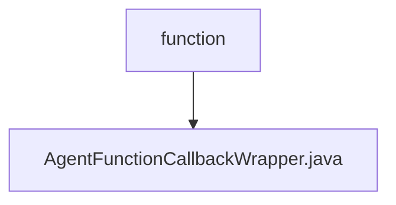

# 基础信息

|      |      |
|------|------|
| 名称 | function |
| 编码语言 | .java |
| 代码路径 | spring-ai-alibaba/spring-ai-alibaba-studio/src/main/java/com/alibaba/cloud/ai/function |
| 包名 | spring-ai-alibaba.spring-ai-alibaba-studio.src.main.java.com.alibaba.cloud.ai.function |
| 概述说明 | AgentFunctionCallbackWrapper类封装函数回调，支持类型转换和JSON处理。 |

# 说明

AgentFunctionCallbackWrapper类是一个用于封装函数回调的工具，主要功能包括支持输入输出类型的转换以及JSON数据的处理。通过该类，用户可以更方便地管理和调用函数，同时确保数据类型的一致性和兼容性。该类特别适用于需要处理复杂数据转换和JSON格式的场景，提升了代码的可维护性和灵活性。

### 包内部结构视图

该流程图展示了`spring-ai-alibaba-studio`项目中的`function`目录与`AgentFunctionCallbackWrapper.java`文件之间的层级关系。`function`目录包含了一个名为`AgentFunctionCallbackWrapper.java`的Java文件，表示该文件位于`function`目录下。

# 文件列表 File List

| 名称   | 类型  | 说明 |
|-------|------|-------------|
| [AgentFunctionCallbackWrapper.java](AgentFunctionCallbackWrapper.md) | file | AgentFunctionCallbackWrapper类封装函数回调，支持类型转换和JSON处理。 |

