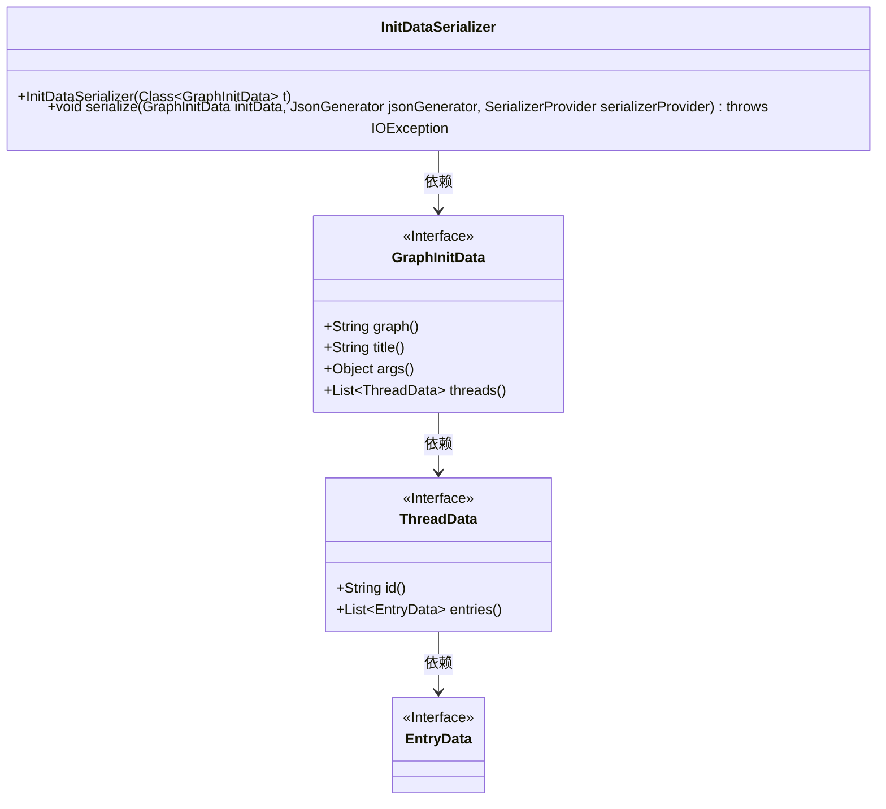
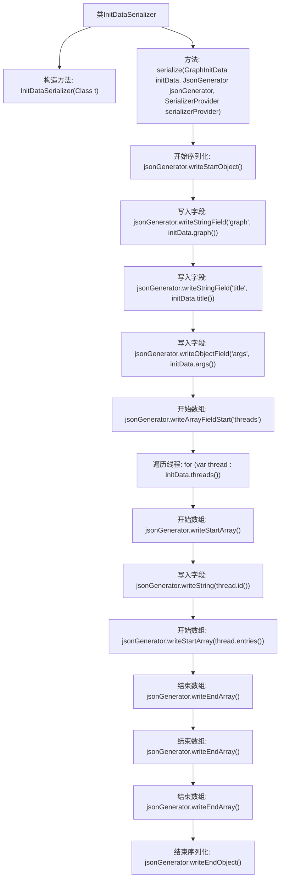

# 基础信息

|      |      |
|------|------|
| 名称 | InitDataSerializer |
| 编码语言 | .java |
| 代码路径 | spring-ai-alibaba/spring-ai-alibaba-studio/src/main/java/com/alibaba/cloud/ai/graph/InitDataSerializer.java |
| 包名 | com.alibaba.cloud.ai.graph |
| 依赖项 | ['com.fasterxml.jackson.core.JsonGenerator', 'com.fasterxml.jackson.databind.SerializerProvider', 'com.fasterxml.jackson.databind.ser.std.StdSerializer', 'java.io.IOException'] |
| 概述说明 | InitDataSerializer类将GraphInitData对象转换为JSON格式。 |

# 说明

InitDataSerializer类的主要功能是将GraphInitData对象转换为JSON格式。该类的核心任务是实现对象的序列化过程，确保GraphInitData中的数据能够以JSON的形式准确表示。通过这一过程，GraphInitData对象的结构和内容被转换为标准的JSON格式，便于存储、传输或进一步处理。

# 类列表 Class Summary

| 名称   | 类型  | 说明 |
|-------|------|-------------|
| InitDataSerializer | class | InitDataSerializer类将GraphInitData对象序列化为JSON格式。 |

## 类 InitDataSerializer

|      |      |
|------|------|
| 访问范围 | public |
| 类型 | class |
| 名称 | InitDataSerializer |
| 说明 | InitDataSerializer类将GraphInitData对象序列化为JSON格式。 |

### UML类图

**描述：**  
`InitDataSerializer` 是一个用于序列化 `GraphInitData` 对象的类，继承自 `StdSerializer`。`GraphInitData` 是一个接口，包含图数据、标题、参数和线程列表等信息。`ThreadData` 接口表示线程数据，包含线程ID和条目列表。`EntryData` 接口表示条目的具体内容。`InitDataSerializer` 通过 `serialize` 方法将 `GraphInitData` 对象序列化为JSON格式，并处理其中的线程和条目数据。

### 内部方法调用关系图

这段代码定义了一个`InitDataSerializer`类，用于将`GraphInitData`对象序列化为JSON格式。流程图中展示了序列化的详细步骤，包括开始对象、写入各个字段、遍历线程数组并写入相关信息，最后结束对象。整个过程确保了数据的完整性和正确性，适用于复杂的JSON结构生成。

### 字段列表 Field List

| 名称  | 类型  | 说明 |
|-------|-------|------|

### 方法列表 Method List

| 名称  | 类型  | 说明 |
|-------|-------|------|
| serialize | void | 将GraphInitData对象序列化为JSON，包含graph、title、args和threads字段。 |

