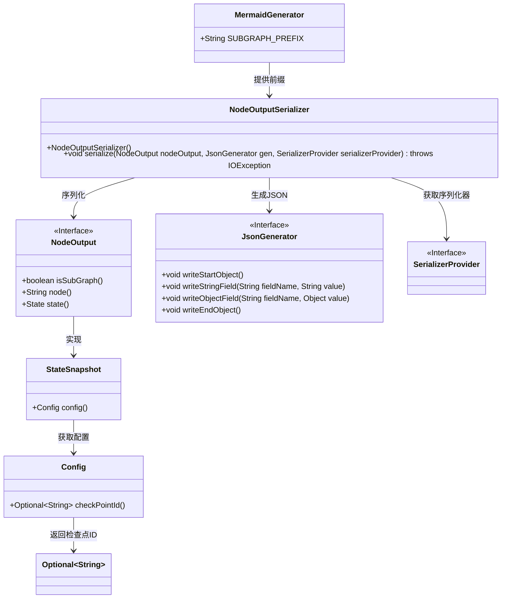
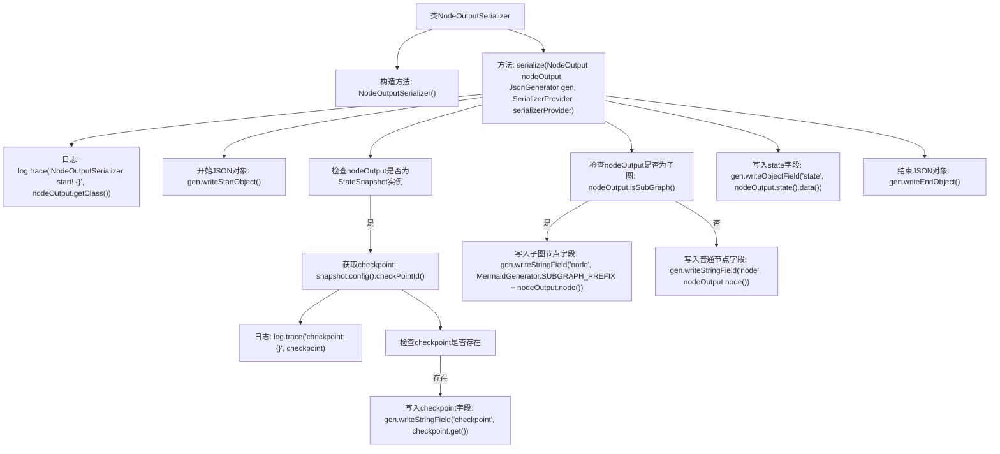

# 基础信息

|      |      |
|------|------|
| 名称 | NodeOutputSerializer |
| 编码语言 | .java |
| 代码路径 | spring-ai-alibaba/spring-ai-alibaba-studio/src/main/java/com/alibaba/cloud/ai/graph/NodeOutputSerializer.java |
| 包名 | com.alibaba.cloud.ai.graph |
| 依赖项 | ['java.io.IOException', 'com.alibaba.cloud.ai.graph.diagram.MermaidGenerator', 'com.alibaba.cloud.ai.graph.state.StateSnapshot', 'com.fasterxml.jackson.core.JsonGenerator', 'com.fasterxml.jackson.databind.SerializerProvider', 'com.fasterxml.jackson.databind.ser.std.StdSerializer', 'lombok.extern.slf4j.Slf4j'] |
| 概述说明 | NodeOutputSerializer类将NodeOutput实例序列化为JSON，处理状态和子图节点。 |

# 说明

NodeOutputSerializer类负责将NodeOutput实例转换为JSON格式，主要功能包括处理状态快照和子图节点的序列化。

# 类列表 Class Summary

| 名称   | 类型  | 说明 |
|-------|------|-------------|
| NodeOutputSerializer | class | NodeOutputSerializer类将NodeOutput实例序列化为JSON，处理状态快照和子图节点。 |

## 类 NodeOutputSerializer

|      |      |
|------|------|
| 访问范围 | @Slf4j;public |
| 类型 | class |
| 名称 | NodeOutputSerializer |
| 说明 | NodeOutputSerializer类将NodeOutput实例序列化为JSON，处理状态快照和子图节点。 |

### UML类图

### 描述
`NodeOutputSerializer` 是一个用于将 `NodeOutput` 对象序列化为 JSON 的类。它依赖于 `JsonGenerator` 和 `SerializerProvider` 来完成序列化过程。`NodeOutput` 是一个接口，`StateSnapshot` 是其实现类，`StateSnapshot` 通过 `Config` 获取检查点 ID。`MermaidGenerator` 提供了用于生成子图的前缀。整个类图展示了序列化过程中各个类之间的依赖关系和层级结构。

### 内部方法调用关系图

这段代码是一个用于序列化`NodeOutput`类的JSON序列化器。它首先记录日志，然后开始生成JSON对象。根据`nodeOutput`的类型和属性，它会写入不同的字段，如`checkpoint`、`node`和`state`。最后，它结束JSON对象并完成序列化。该流程详细展示了序列化过程中各个步骤的逻辑和条件判断。

### 字段列表 Field List

| 名称  | 类型  | 说明 |
|-------|-------|------|

### 方法列表 Method List

| 名称  | 类型  | 说明 |
|-------|-------|------|
| serialize | void | NodeOutput序列化方法，处理checkpoint和子图节点，输出JSON对象。 |

