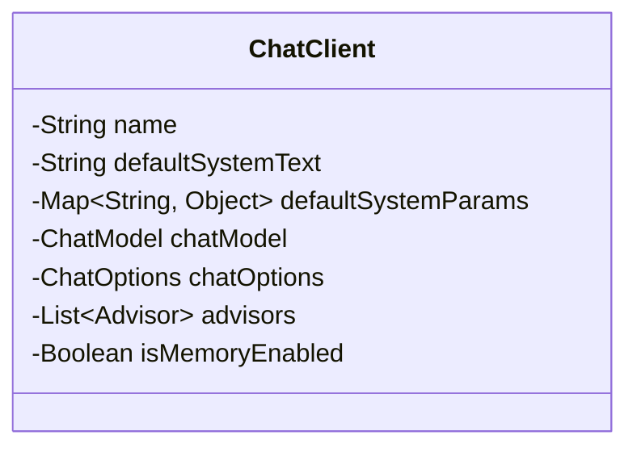
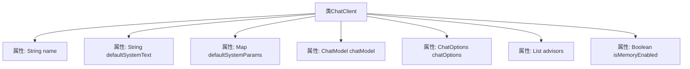

# 基础信息

|      |      |
|------|------|
| 名称 | ChatClient |
| 编码语言 | .java |
| 代码路径 | spring-ai-alibaba/spring-ai-alibaba-studio/src/main/java/com/alibaba/cloud/ai/model/ChatClient.java |
| 包名 | com.alibaba.cloud.ai.model |
| 依赖项 | ['io.swagger.v3.oas.annotations.media.Schema', 'java.util.List', 'java.util.Map', 'lombok.Builder', 'lombok.Data', 'org.springframework.ai.chat.client.advisor.api.Advisor', 'org.springframework.ai.chat.prompt.ChatOptions'] |
| 概述说明 | ChatClient类包含名称、系统文本、参数、模型、选项、顾问列表及内存状态。 |

# 说明

ChatClient类是一个用于管理聊天功能的类，包含多个关键属性。其中包括名称，用于标识该客户端；默认系统文本，用于设置系统默认的提示或消息；参数，用于配置客户端的行为；模型，指定使用的语言模型；选项，提供额外的配置选择；顾问列表，包含可用的顾问或助手信息；以及内存启用状态，用于控制是否启用内存功能以保存对话历史。这些属性共同构成了ChatClient类的核心功能，使其能够灵活地处理和管理聊天交互。

# 类列表 Class Summary

| 名称   | 类型  | 说明 |
|-------|------|-------------|
| ChatClient | class | ChatClient类包含名称、默认系统文本、参数、模型、选项、顾问列表及内存启用状态。 |

## 类 ChatClient

|      |      |
|------|------|
| 访问范围 | @Data;@Builder;public |
| 类型 | class |
| 名称 | ChatClient |
| 说明 | ChatClient类包含名称、默认系统文本、参数、模型、选项、顾问列表及内存启用状态。 |

### UML类图

**描述**：`ChatClient` 类是一个用于表示聊天客户端的实体类，包含了客户端的名称、默认系统文本、默认系统参数、聊天模型、聊天选项、顾问列表以及是否启用内存等属性。这些属性通过注解进行了详细的描述，使得类在序列化和反序列化时能够更好地处理数据。

### 内部方法调用关系图

这段代码定义了一个名为 `ChatClient` 的类，使用了 Lombok 的 `@Data` 和 `@Builder` 注解，自动生成 getter、setter、toString、equals、hashCode 和 builder 方法。类中包含多个属性，如 `name`、`defaultSystemText`、`defaultSystemParams`、`chatModel`、`chatOptions`、`advisors` 和 `isMemoryEnabled`，分别用于存储聊天客户端的名称、默认系统文本、默认系统参数、聊天模型、聊天选项、顾问列表和是否启用内存的布尔值。这些属性通过 `@Schema` 注解进行描述，提供了示例和说明，方便理解和文档化。

### 字段列表 Field List

| 名称  | 类型  | 说明 |
|-------|-------|------|
| isMemoryEnabled | Boolean | 内存启用状态布尔变量。 |
| chatModel | ChatModel | ChatClient的ChatModel实例。 |
| advisors | List<Advisor> | 私有列表变量advisors存储Advisor对象。 |
| defaultSystemText | String | 默认系统文本描述：友好聊天机器人，以指定声音回答问题。 |
| chatOptions | ChatOptions | 私有变量chatOptions用于存储聊天选项。 |
| name | String | ChatClient的Bean名称示例为chatClient和chatClient1。 |
| defaultSystemParams | Map<String, Object> | 默认系统参数存储为键值对映射。 |

### 方法列表 Method List

| 名称  | 类型  | 说明 |
|-------|-------|------|

