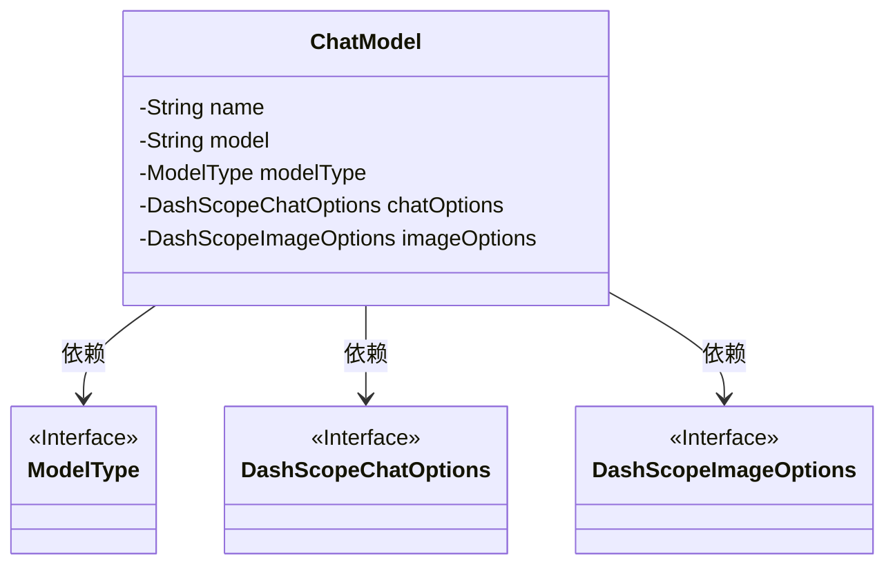
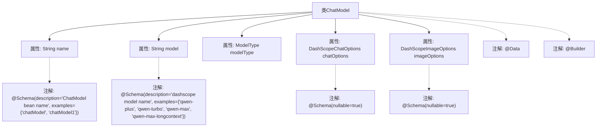

# 基础信息

|      |      |
|------|------|
| 名称 | ChatModel |
| 编码语言 | .java |
| 代码路径 | spring-ai-alibaba/spring-ai-alibaba-studio/src/main/java/com/alibaba/cloud/ai/model/ChatModel.java |
| 包名 | com.alibaba.cloud.ai.model |
| 依赖项 | ['com.alibaba.cloud.ai.common.ModelType', 'com.alibaba.cloud.ai.dashscope.chat.DashScopeChatOptions', 'com.alibaba.cloud.ai.dashscope.image.DashScopeImageOptions', 'io.swagger.v3.oas.annotations.media.Schema', 'lombok.Builder', 'lombok.Data'] |
| 概述说明 | ChatModel类包含名称、模型、类型及可选的聊天和图像配置。 |

# 说明

ChatModel类是一个用于定义聊天模型的类，包含多个关键属性。其中，名称属性用于标识该模型的唯一名称，模型属性指定了所使用的具体模型实例。模型类型属性则用于区分不同类型的模型，如语言模型或图像生成模型。此外，该类还提供了可选的聊天配置选项和图像配置选项，这些选项允许用户根据需求进一步定制模型的行为和输出。通过这些属性，ChatModel类能够灵活地支持多种应用场景，为用户提供个性化的模型配置和使用体验。

# 类列表 Class Summary

| 名称   | 类型  | 说明 |
|-------|------|-------------|
| ChatModel | class | ChatModel类包含名称、模型、模型类型及可选的聊天和图像配置选项。 |

## 类 ChatModel

|      |      |
|------|------|
| 访问范围 | @Data;@Builder;public |
| 类型 | class |
| 名称 | ChatModel |
| 说明 | ChatModel类包含名称、模型、模型类型及可选的聊天和图像配置选项。 |

### UML类图

这段代码定义了一个名为 `ChatModel` 的类，该类包含了聊天模型的基本信息，如名称、模型类型、聊天选项和图像选项。`ChatModel` 类依赖于三个接口：`ModelType`、`DashScopeChatOptions` 和 `DashScopeImageOptions`，这些接口分别表示模型类型、聊天选项和图像选项的具体实现。代码通过 `@Schema` 注解对字段进行了描述和示例说明，确保数据的可读性和可维护性。

### 内部方法调用关系图

这段代码定义了一个名为 `ChatModel` 的类，包含了多个属性和注解。类中定义了五个属性：`name`、`model`、`modelType`、`chatOptions` 和 `imageOptions`，分别用于存储聊天模型的名称、模型名称、模型类型、聊天选项和图像选项。类上使用了 `@Data` 和 `@Builder` 注解，分别用于自动生成 getter、setter、toString 等方法以及构建器模式。属性上使用了 `@Schema` 注解，用于描述属性的元数据信息，包括描述和示例值。

### 字段列表 Field List

| 名称  | 类型  | 说明 |
|-------|-------|------|
| name | String | ChatModel bean名称示例为chatModel和chatModel1。 |
| imageOptions | DashScopeImageOptions | 允许为空的DashScope图像选项私有字段。 |
| modelType | ModelType | 定义私有变量modelType，类型为ModelType。 |
| chatOptions | DashScopeChatOptions | 允许为空值的DashScopeChatOptions私有变量。 |
| model | String | dashscope模型名称示例包括qwen-plus、qwen-turbo、qwen-max和qwen-max-longcontext。 |

### 方法列表 Method List

| 名称  | 类型  | 说明 |
|-------|-------|------|

