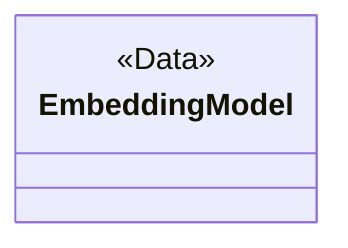
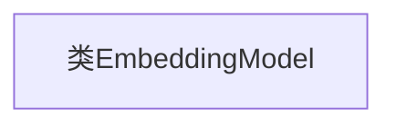

# 基础信息

|      |      |
|------|------|
| 名称 | EmbeddingModel |
| 编码语言 | .java |
| 代码路径 | spring-ai-alibaba/spring-ai-alibaba-studio/src/main/java/com/alibaba/cloud/ai/model/EmbeddingModel.java |
| 包名 | com.alibaba.cloud.ai.model |
| 依赖项 | ['lombok.Data'] |
| 概述说明 | 定义了一个名为EmbeddingModel的公共类。 |

# 说明

定义了一个名为EmbeddingModel的公共类，该类具有公共访问权限，意味着它可以在同一项目或其他引用该项目的代码中被访问和使用。这个类可能用于表示某种嵌入模型，通常用于将数据转换为向量形式，以便于机器学习或其他数据处理任务。EmbeddingModel类的具体功能和属性未在此描述中详细说明，但可以推测它可能包含与嵌入相关的方法和变量，用于处理和操作嵌入数据。

# 类列表 Class Summary

| 名称   | 类型  | 说明 |
|-------|------|-------------|
| EmbeddingModel | class | 定义了一个名为EmbeddingModel的公共类。 |

## 类 EmbeddingModel

|      |      |
|------|------|
| 访问范围 | @Data;public |
| 类型 | class |
| 名称 | EmbeddingModel |
| 说明 | 定义了一个名为EmbeddingModel的公共类。 |

### UML类图

### 描述
`EmbeddingModel` 类是一个带有 `@Data` 注解的简单类，通常用于自动生成 getter、setter、toString、equals 和 hashCode 方法。这个类可能用于表示某种嵌入模型的数据结构，具体功能取决于上下文。由于类本身没有定义任何成员变量或方法，`@Data` 注解的作用将是空白的，除非在类中添加了成员变量。

### 内部方法调用关系图

这段代码定义了一个名为 `EmbeddingModel` 的类，使用了 Lombok 的 `@Data` 注解。`@Data` 注解会自动生成类的 getter、setter、`toString`、`equals` 和 `hashCode` 方法，简化了代码的编写。由于代码中未定义任何属性或方法，流程图仅展示了类的结构。

### 字段列表 Field List

| 名称  | 类型  | 说明 |
|-------|-------|------|

### 方法列表 Method List

| 名称  | 类型  | 说明 |
|-------|-------|------|

