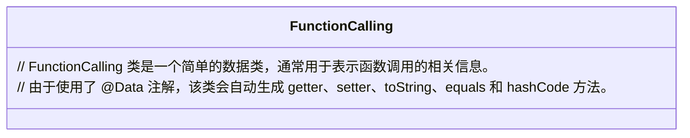
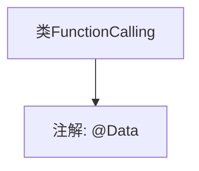

# 基础信息

|      |      |
|------|------|
| 名称 | FunctionCalling |
| 编码语言 | .java |
| 代码路径 | spring-ai-alibaba/spring-ai-alibaba-studio/src/main/java/com/alibaba/cloud/ai/model/FunctionCalling.java |
| 包名 | com.alibaba.cloud.ai.model |
| 依赖项 | ['lombok.Data'] |
| 概述说明 | 定义了一个名为FunctionCalling的公共类。 |

# 说明

定义了一个名为FunctionCalling的公共类。这个类在代码中被声明为公共访问级别，意味着它可以被其他类或模块访问和使用。FunctionCalling类的具体功能和用途未在提供的片段中详细说明，但通常公共类用于封装相关的方法和属性，以提供特定的功能或服务。这个类的定义为进一步的代码实现和功能扩展提供了基础框架。

# 类列表 Class Summary

| 名称   | 类型  | 说明 |
|-------|------|-------------|
| FunctionCalling | class | 定义了一个名为FunctionCalling的公共类。 |

## 类 FunctionCalling

|      |      |
|------|------|
| 访问范围 | @Data;public |
| 类型 | class |
| 名称 | FunctionCalling |
| 说明 | 定义了一个名为FunctionCalling的公共类。 |

### UML类图

**描述**：`FunctionCalling` 类是一个简单的数据类，通常用于表示函数调用的相关信息。由于使用了 `@Data` 注解，该类会自动生成 `getter`、`setter`、`toString`、`equals` 和 `hashCode` 方法，从而简化了代码的编写和维护。

### 内部方法调用关系图

这段代码定义了一个名为 `FunctionCalling` 的类，并使用了 `@Data` 注解。`@Data` 是 Lombok 库中的一个注解，它自动生成类的 getter、setter、toString、equals 和 hashCode 方法，从而简化代码。由于代码中未定义其他方法或属性，流程图仅展示了类与注解之间的关系。

### 字段列表 Field List

| 名称  | 类型  | 说明 |
|-------|-------|------|

### 方法列表 Method List

| 名称  | 类型  | 说明 |
|-------|-------|------|

