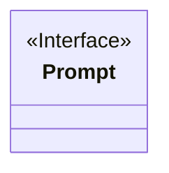
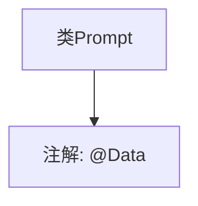

# 基础信息

|      |      |
|------|------|
| 名称 | Prompt |
| 编码语言 | .java |
| 代码路径 | spring-ai-alibaba/spring-ai-alibaba-studio/src/main/java/com/alibaba/cloud/ai/model/Prompt.java |
| 包名 | com.alibaba.cloud.ai.model |
| 依赖项 | ['lombok.Data'] |
| 概述说明 | 定义了一个名为Prompt的公共类。 |

# 说明

定义了一个名为Prompt的公共类，该类具有公共访问权限，意味着它可以被同一项目中的其他类或模块访问和实例化。Prompt类的主要功能和用途未在此处详细说明，但作为公共类，它可能用于封装与提示信息相关的逻辑或数据，以便在其他部分进行调用和使用。此类定义为进一步的属性和方法扩展提供了基础结构。

# 类列表 Class Summary

| 名称   | 类型  | 说明 |
|-------|------|-------------|
| Prompt | class | 定义了一个名为Prompt的公共类。 |

## 类 Prompt

|      |      |
|------|------|
| 访问范围 | @Data;public |
| 类型 | class |
| 名称 | Prompt |
| 说明 | 定义了一个名为Prompt的公共类。 |

### UML类图

该代码定义了一个名为 `Prompt` 的接口，使用了 `@Data` 注解，通常用于自动生成 getter、setter、toString 等方法。由于代码片段中未明确展示接口的具体内容，因此类图中仅表示 `Prompt` 为一个接口，具体方法未列出。

### 内部方法调用关系图

这段代码定义了一个名为`Prompt`的类，并使用`@Data`注解来自动生成`getter`、`setter`、`toString`、`equals`和`hashCode`等方法。`@Data`是Lombok库中的一个注解，用于简化Java类的编写，减少样板代码。通过这个注解，开发者可以避免手动编写这些常见的方法，从而提高代码的简洁性和可维护性。

### 字段列表 Field List

| 名称  | 类型  | 说明 |
|-------|-------|------|

### 方法列表 Method List

| 名称  | 类型  | 说明 |
|-------|-------|------|

