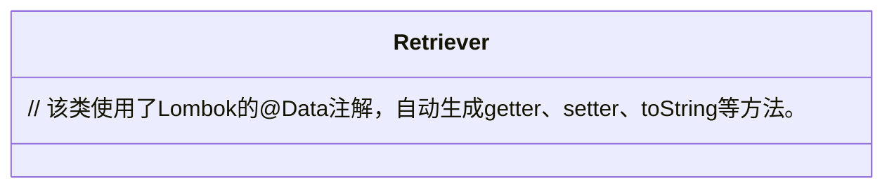
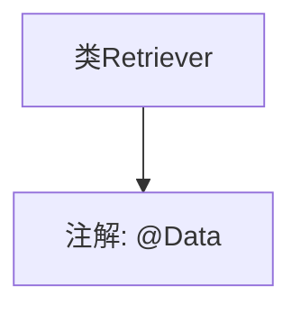

# 基础信息

|      |      |
|------|------|
| 名称 | Retriever |
| 编码语言 | .java |
| 代码路径 | spring-ai-alibaba/spring-ai-alibaba-studio/src/main/java/com/alibaba/cloud/ai/model/Retriever.java |
| 包名 | com.alibaba.cloud.ai.model |
| 依赖项 | ['lombok.Data'] |
| 概述说明 | 定义了一个公共类Retriever。 |

# 说明

定义了一个名为Retriever的公共类。该类的访问修饰符为public，意味着它可以被其他类访问和实例化。类名为Retriever，通常用于表示某种检索或获取数据的实体或功能。由于没有提供更多细节，无法进一步描述该类的具体功能或属性。

# 类列表 Class Summary

| 名称   | 类型  | 说明 |
|-------|------|-------------|
| Retriever | class | 定义了一个名为Retriever的公共类。 |

## 类 Retriever

|      |      |
|------|------|
| 访问范围 | @Data;public |
| 类型 | class |
| 名称 | Retriever |
| 说明 | 定义了一个名为Retriever的公共类。 |

### UML类图

类图描述：`Retriever`类使用了Lombok的`@Data`注解，该注解会自动为类生成getter、setter、toString、equals和hashCode等方法，从而简化代码编写。由于使用了注解，类图中没有显式列出这些方法，但它们在编译时会自动生成。

### 内部方法调用关系图

这段代码定义了一个名为`Retriever`的类，并使用`@Data`注解来自动生成`getter`、`setter`、`toString`、`equals`和`hashCode`等方法。`@Data`是Lombok库中的一个注解，它简化了Java类的编写，减少了样板代码。通过这个注解，开发者无需手动编写这些常见的方法，从而提高了代码的简洁性和可维护性。

### 字段列表 Field List

| 名称  | 类型  | 说明 |
|-------|-------|------|

### 方法列表 Method List

| 名称  | 类型  | 说明 |
|-------|-------|------|

