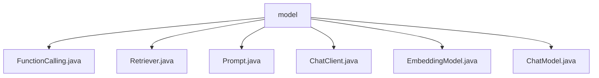

# 基础信息

|      |      |
|------|------|
| 名称 | model |
| 编码语言 | .java |
| 代码路径 | spring-ai-alibaba/spring-ai-alibaba-studio/src/main/java/com/alibaba/cloud/ai/model |
| 包名 | spring-ai-alibaba.spring-ai-alibaba-studio.src.main.java.com.alibaba.cloud.ai.model |
| 概述说明 | 定义了多个公共类，包括FunctionCalling、Retriever、Prompt、ChatClient、EmbeddingModel和ChatModel，用于封装相关功能和方法。 |

# 说明

## 概述
该代码模块主要围绕人工智能（AI）相关的功能和服务展开，包含多个公共类，用于封装不同的功能和数据模型。这些类提供了基础的框架，支持聊天功能、数据检索、提示信息管理、嵌入模型处理等核心业务场景。模块的设计注重灵活性和扩展性，允许用户根据需求定制和配置不同的模型和行为。

## 主要业务场景
1. **聊天功能管理**：通过`ChatClient`类和`ChatModel`类，模块支持灵活的聊天功能管理。`ChatClient`类负责管理客户端的属性，如系统默认文本、参数配置、模型选择等，而`ChatModel`类则用于定义和配置具体的聊天模型，支持多种模型类型和定制选项。

2. **数据检索**：`Retriever`类用于实现数据检索功能，可能用于从数据库或其他数据源中获取所需信息，支持高效的数据查询和获取。

3. **提示信息管理**：`Prompt`类封装了与提示信息相关的逻辑或数据，用于在聊天或其他交互场景中提供上下文或引导信息。

4. **嵌入模型处理**：`EmbeddingModel`类可能用于处理嵌入模型，将数据转换为向量形式，支持机器学习或其他数据处理任务。

5. **函数调用**：`FunctionCalling`类提供了函数调用的基础框架，可能用于封装特定的功能或服务，支持模块化开发和功能扩展。

通过这些类，模块能够支持多样化的AI应用场景，如智能聊天、数据检索、模型处理等，为用户提供灵活且强大的功能支持。

### 包内部结构视图

该流程图展示了 `model` 文件夹下的文件层级关系。`model` 作为根节点，直接包含多个 Java 文件，包括 `FunctionCalling.java`、`Retriever.java`、`Prompt.java`、`ChatClient.java`、`EmbeddingModel.java` 和 `ChatModel.java`。这些文件都属于 `model` 文件夹，且没有进一步的子文件夹嵌套。

# 文件列表 File List

| 名称   | 类型  | 说明 |
|-------|------|-------------|
| [Prompt.java](Prompt.md) | file | 定义了一个名为Prompt的公共类。 |
| [FunctionCalling.java](FunctionCalling.md) | file | 定义了一个名为FunctionCalling的公共类。 |
| [ChatModel.java](ChatModel.md) | file | ChatModel类包含名称、模型、类型及可选的聊天和图像配置。 |
| [EmbeddingModel.java](EmbeddingModel.md) | file | 定义了一个名为EmbeddingModel的公共类。 |
| [ChatClient.java](ChatClient.md) | file | ChatClient类包含名称、系统文本、参数、模型、选项、顾问列表及内存状态。 |
| [Retriever.java](Retriever.md) | file | 定义了一个公共类Retriever。 |

