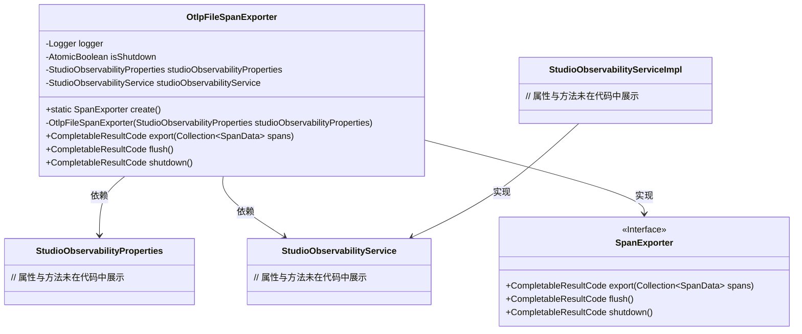

# 基础信息

|      |      |
|------|------|
| 名称 | OtlpFileSpanExporter |
| 编码语言 | .java |
| 代码路径 | spring-ai-alibaba/spring-ai-alibaba-studio/src/main/java/com/alibaba/cloud/ai/oltp/OtlpFileSpanExporter.java |
| 包名 | com.alibaba.cloud.ai.oltp |
| 依赖项 | ['com.alibaba.cloud.ai.service.StudioObservabilityService', 'com.alibaba.cloud.ai.service.impl.StudioObservabilityServiceImpl', 'io.opentelemetry.exporter.internal.otlp.traces.ResourceSpansMarshaler', 'io.opentelemetry.sdk.common.CompletableResultCode', 'io.opentelemetry.sdk.trace.data.SpanData', 'io.opentelemetry.sdk.trace.export.SpanExporter', 'java.util.Collection', 'java.util.List', 'java.util.concurrent.atomic.AtomicBoolean', 'java.util.logging.Level', 'java.util.logging.Logger'] |
| 概述说明 | OtlpFileSpanExporter类负责日志导出、关闭及资源管理。 |

# 说明

OtlpFileSpanExporter类实现了SpanExporter接口，负责管理日志的导出、关闭操作以及相关资源的处理。该类确保日志数据能够有效地导出，并在需要时正确关闭相关资源，以维护系统的稳定性和资源的高效利用。

# 类列表 Class Summary

| 名称   | 类型  | 说明 |
|-------|------|-------------|
| OtlpFileSpanExporter | class | OtlpFileSpanExporter类实现SpanExporter接口，管理日志导出、关闭及资源处理。 |


## 类 OtlpFileSpanExporter

|      |      |
|------|------|
| 访问范围 | public final |
| 类型 | class |
| 名称 | OtlpFileSpanExporter |
| 说明 | OtlpFileSpanExporter类实现SpanExporter接口，管理日志导出、关闭及资源处理。 |


### UML类图



这段代码定义了一个 `OtlpFileSpanExporter` 类，它实现了 `SpanExporter` 接口，用于导出 Span 数据。该类依赖于 `StudioObservabilityProperties` 和 `StudioObservabilityService`，并通过 `create` 方法创建一个实例。`OtlpFileSpanExporter` 提供了 `export`、`flush` 和 `shutdown` 方法，分别用于导出数据、刷新数据和关闭资源。`StudioObservabilityServiceImpl` 是 `StudioObservabilityService` 的具体实现类。


### 内部方法调用关系图

```mermaid
graph TD
    A["类OtlpFileSpanExporter"]
    B["属性: Logger logger"]
    C["属性: AtomicBoolean isShutdown"]
    D["属性: StudioObservabilityProperties studioObservabilityProperties"]
    E["属性: StudioObservabilityService studioObservabilityService"]
    F["方法: static SpanExporter create()"]
    G["构造方法: OtlpFileSpanExporter(StudioObservabilityProperties studioObservabilityProperties)"]
    H["方法: CompletableResultCode export(Collection<SpanData> spans)"]
    I["方法: CompletableResultCode flush()"]
    J["方法: CompletableResultCode shutdown()"]
    K["条件: !studioObservabilityProperties.isEnabled()"]
    L["条件: isShutdown.get()"]
    M["方法: ResourceSpansMarshaler[] ResourceSpansMarshaler.create(spans)"]
    N["方法: studioObservabilityService.export(List.of(allResourceSpans))"]
    O["条件: !isShutdown.compareAndSet(false, true)"]
    P["日志: logger.log(Level.INFO, 'Calling shutdown() multiple times.')"]

    A --> B
    A --> C
    A --> D
    A --> E
    A --> F
    A --> G
    A --> H
    A --> I
    A --> J
    F --> G
    H --> K
    K -->|true| CompletableResultCode.ofSuccess()
    K -->|false| L
    L -->|true| CompletableResultCode.ofFailure()
    L -->|false| M
    M --> N
    J --> O
    O -->|true| P
    O -->|false| CompletableResultCode.ofSuccess()
```

这段代码描述了一个名为`OtlpFileSpanExporter`的类，该类实现了`SpanExporter`接口。该类的主要功能是导出Span数据，提供了创建实例、导出数据、刷新和关闭等方法。流程图展示了类的属性、方法以及方法之间的调用关系，特别是`export`方法中的条件判断和`shutdown`方法中的日志记录。

### 字段列表 Field List

| 名称  | 类型  | 说明 |
|-------|-------|------|
| isShutdown = new AtomicBoolean() | AtomicBoolean | 私有原子布尔变量用于标记关闭状态。 |
| studioObservabilityProperties | StudioObservabilityProperties | 私有不可变的StudioObservabilityProperties对象。 |
| studioObservabilityService | StudioObservabilityService | 私有且不可变的StudioObservabilityService实例。 |
| logger = Logger.getLogger(OtlpFileSpanExporter.class.getName()) | Logger | OtlpFileSpanExporter类中定义了一个私有静态Logger实例。 |

### 方法列表 Method List

| 名称  | 类型  | 说明 |
|-------|-------|------|
| flush | CompletableResultCode | 重写flush方法，返回成功结果。 |
| create | SpanExporter | 创建OtlpFileSpanExporter实例并返回。 |
| export | CompletableResultCode | 检查启用状态，若关闭则返回成功；若已关闭则返回失败；否则创建资源跨度并导出。 |
| shutdown | CompletableResultCode | 方法`shutdown()`检查是否已关闭，未关闭则标记为关闭并返回成功结果。 |


