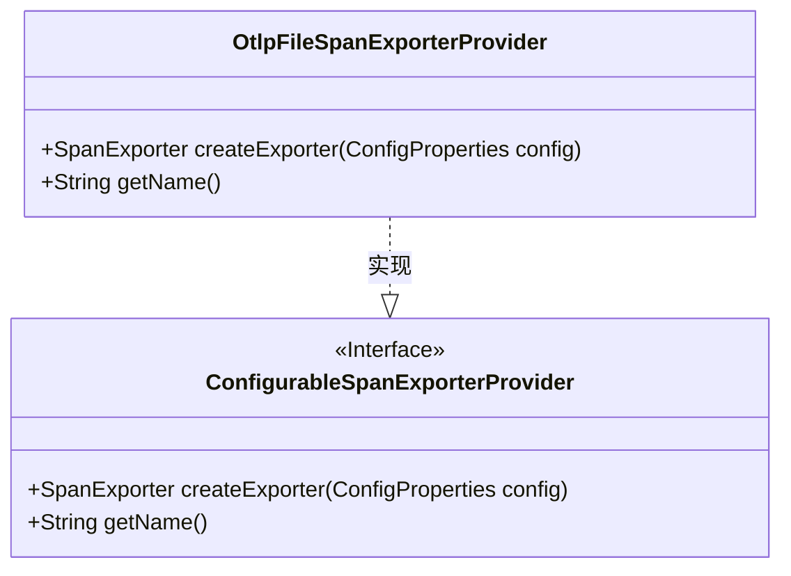
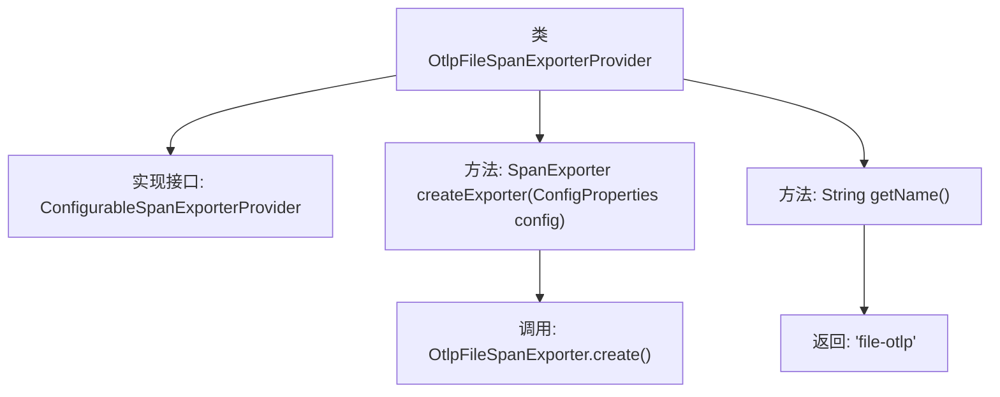

# 基础信息

|      |      |
|------|------|
| 名称 | OtlpFileSpanExporterProvider |
| 编码语言 | .java |
| 代码路径 | spring-ai-alibaba/spring-ai-alibaba-studio/src/main/java/com/alibaba/cloud/ai/oltp/OtlpFileSpanExporterProvider.java |
| 包名 | com.alibaba.cloud.ai.oltp |
| 依赖项 | ['io.opentelemetry.sdk.autoconfigure.spi.ConfigProperties', 'io.opentelemetry.sdk.autoconfigure.spi.traces.ConfigurableSpanExporterProvider', 'io.opentelemetry.sdk.trace.export.SpanExporter'] |
| 概述说明 | OtlpFileSpanExporterProvider实现SpanExporterProvider，提供"file-otlp"文件导出功能。 |

# 说明

OtlpFileSpanExporterProvider类实现了SpanExporterProvider接口，主要用于提供将Span数据导出到文件的功能。该类的名称为"file-otlp"，表明其专为OTLP格式的文件导出而设计。通过实现该接口，该类能够满足Span数据导出需求，支持将监控数据持久化存储到本地文件中，便于后续分析和处理。

# 类列表 Class Summary

| 名称   | 类型  | 说明 |
|-------|------|-------------|
| OtlpFileSpanExporterProvider | class | OtlpFileSpanExporterProvider类实现SpanExporterProvider接口，提供文件导出功能，名称为"file-otlp"。 |

## 类 OtlpFileSpanExporterProvider

|      |      |
|------|------|
| 访问范围 | public |
| 类型 | class |
| 名称 | OtlpFileSpanExporterProvider |
| 说明 | OtlpFileSpanExporterProvider类实现SpanExporterProvider接口，提供文件导出功能，名称为"file-otlp"。 |

### UML类图

**描述**：`OtlpFileSpanExporterProvider` 类实现了 `ConfigurableSpanExporterProvider` 接口，提供了创建 `SpanExporter` 实例的方法 `createExporter` 和获取名称的方法 `getName`。该类通过 `OtlpFileSpanExporter.create()` 方法生成 `SpanExporter` 实例，并返回名称为 "file-otlp"。该设计遵循了接口与实现分离的原则，便于扩展和维护。

### 内部方法调用关系图

这段代码定义了一个名为 `OtlpFileSpanExporterProvider` 的类，该类实现了 `ConfigurableSpanExporterProvider` 接口。类中包含两个方法：`createExporter` 和 `getName`。`createExporter` 方法通过调用 `OtlpFileSpanExporter.create()` 返回一个 `SpanExporter` 实例，而 `getName` 方法返回字符串 `"file-otlp"`。这段代码的主要作用是提供一个文件导出器的创建和名称获取功能。

### 字段列表 Field List

| 名称  | 类型  | 说明 |
|-------|-------|------|

### 方法列表 Method List

| 名称  | 类型  | 说明 |
|-------|-------|------|
| getName | String | 重写getName方法，返回值为"file-otlp"。 |
| createExporter | SpanExporter | 重写方法创建Otlp文件跨度导出器。 |

