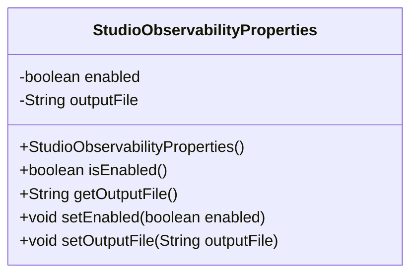
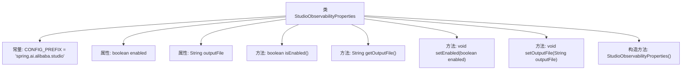

# 基础信息

|      |      |
|------|------|
| 名称 | StudioObservabilityProperties |
| 编码语言 | .java |
| 代码路径 | spring-ai-alibaba/spring-ai-alibaba-studio/src/main/java/com/alibaba/cloud/ai/oltp/StudioObservabilityProperties.java |
| 包名 | com.alibaba.cloud.ai.oltp |
| 依赖项 | ['org.springframework.boot.context.properties.ConfigurationProperties', 'org.springframework.context.annotation.Configuration'] |
| 概述说明 | StudioObservabilityProperties类用于配置Spring AI Alibaba Studio的可观测性属性。 |

# 说明

`StudioObservabilityProperties`类用于配置Spring AI Alibaba Studio的可观测性属性。该类允许开发者通过设置相关参数来监控和优化系统性能，确保应用程序在运行过程中能够提供详细的观测数据，便于进行故障排查和性能分析。通过配置这些属性，开发者可以更好地理解和控制系统的行为，提升整体的可观测性和可维护性。

# 类列表 Class Summary

| 名称   | 类型  | 说明 |
|-------|------|-------------|
| StudioObservabilityProperties | class | StudioObservabilityProperties类配置Spring AI Alibaba Studio的可观测性属性。 |

## 类 StudioObservabilityProperties

|      |      |
|------|------|
| 访问范围 | @Configuration;@ConfigurationProperties(StudioObservabilityProperties.CONFIG_PREFIX);public |
| 类型 | class |
| 名称 | StudioObservabilityProperties |
| 说明 | StudioObservabilityProperties类配置Spring AI Alibaba Studio的可观测性属性。 |

### UML类图

**描述：**  
`StudioObservabilityProperties` 类是一个配置类，用于管理 Alibaba Studio 的可观测性属性。它包含两个私有成员变量 `enabled` 和 `outputFile`，分别表示是否启用可观测性和输出文件的路径。类提供了对这些变量的访问器和修改器方法，并在构造函数中设置了默认值。通过 `@ConfigurationProperties` 注解，该类与配置文件中的属性进行绑定，便于在 Spring 应用中进行配置管理。

### 内部方法调用关系图

这段代码定义了一个名为`StudioObservabilityProperties`的配置类，用于管理观察性相关的属性。类中包含两个属性：`enabled`表示是否启用观察性功能，`outputFile`指定输出文件的路径。类提供了获取和设置这两个属性的方法，并在构造函数中为它们设置了默认值。该类的配置前缀通过常量`CONFIG_PREFIX`定义，用于外部配置的映射。

### 字段列表 Field List

| 名称  | 类型  | 说明 |
|-------|-------|------|
| enabled | boolean | 私有布尔类型变量enabled。 |
| outputFile | String | 定义了一个私有的字符串变量outputFile。 |
| CONFIG_PREFIX = "spring.ai.alibaba.studio" | String | 定义常量CONFIG_PREFIX，值为"spring.ai.alibaba.studio"。 |

### 方法列表 Method List

| 名称  | 类型  | 说明 |
|-------|-------|------|
| setOutputFile | void | 设置输出文件路径的方法。 |
| setEnabled | void | 设置对象启用状态的公共方法。 |
| getOutputFile | String | 获取输出文件路径的方法。 |
| isEnabled | boolean | 该方法返回布尔值，表示当前对象是否启用。 |

