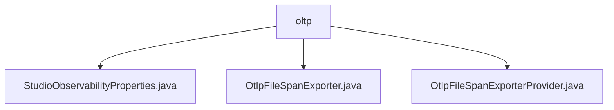

# 基础信息

|      |      |
|------|------|
| 名称 | oltp |
| 编码语言 | .java |
| 代码路径 | spring-ai-alibaba/spring-ai-alibaba-studio/src/main/java/com/alibaba/cloud/ai/oltp |
| 包名 | spring-ai-alibaba.spring-ai-alibaba-studio.src.main.java.com.alibaba.cloud.ai.oltp |
| 概述说明 | StudioObservabilityProperties类配置Spring AI Alibaba Studio的可观测性属性。OtlpFileSpanExporter类管理日志导出和资源关闭。OtlpFileSpanExporterProvider类提供OTLP格式文件导出功能。 |

# 说明

## 概述

该代码模块属于Spring AI Alibaba Studio的可观测性功能部分，主要用于配置和管理系统的监控与日志导出功能。通过提供可观测性属性的配置、Span数据的导出以及相关资源的管理，该模块帮助开发者更好地监控和优化系统性能，确保应用程序在运行过程中能够提供详细的观测数据，便于故障排查和性能分析。

## 主要业务场景

1. **可观测性配置**  
   - `StudioObservabilityProperties`类用于配置Spring AI Alibaba Studio的可观测性属性。开发者可以通过设置相关参数来监控系统性能，确保应用程序在运行过程中能够提供详细的观测数据，便于进行故障排查和性能分析。

2. **Span数据导出**  
   - `OtlpFileSpanExporter`类实现了`SpanExporter`接口，负责管理日志的导出、关闭操作以及相关资源的处理。该类确保日志数据能够有效地导出，并在需要时正确关闭相关资源，以维护系统的稳定性和资源的高效利用。

3. **Span数据导出提供者**  
   - `OtlpFileSpanExporterProvider`类实现了`SpanExporterProvider`接口，主要用于提供将Span数据导出到文件的功能。该类的名称为"file-otlp"，表明其专为OTLP格式的文件导出而设计。通过实现该接口，该类能够满足Span数据导出需求，支持将监控数据持久化存储到本地文件中，便于后续分析和处理。

通过以上功能，该模块为开发者提供了一套完整的可观测性解决方案，帮助其在复杂的应用环境中更好地监控、分析和优化系统性能。

### 包内部结构视图

该流程图展示了 `oltp` 目录下的三个文件：`StudioObservabilityProperties.java`、`OtlpFileSpanExporter.java` 和 `OtlpFileSpanExporterProvider.java`。这些文件都直接位于 `oltp` 目录下，没有进一步的子目录层级。流程图清晰地表示了这些文件与 `oltp` 目录的直接关系，便于理解文件结构。

# 文件列表 File List

| 名称   | 类型  | 说明 |
|-------|------|-------------|
| [OtlpFileSpanExporter.java](OtlpFileSpanExporter.md) | file | OtlpFileSpanExporter类负责日志导出、关闭及资源管理。 |
| [OtlpFileSpanExporterProvider.java](OtlpFileSpanExporterProvider.md) | file | OtlpFileSpanExporterProvider实现SpanExporterProvider，提供"file-otlp"文件导出功能。 |
| [StudioObservabilityProperties.java](StudioObservabilityProperties.md) | file | StudioObservabilityProperties类用于配置Spring AI Alibaba Studio的可观测性属性。 |

